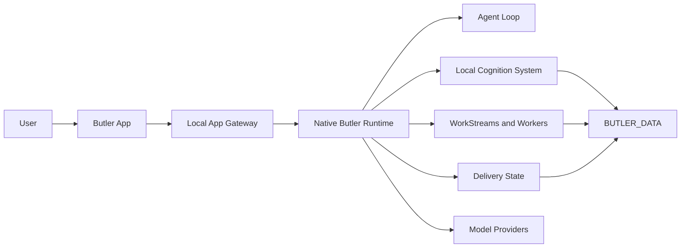

<p align="center">
  
</p>

# Butler

Butler is a local-first AI agent runtime for personal and project work.

It can remember local context, plan work, coordinate tools and workers, and
report after reviewing the outcome.

Not a chatbot. Not a hosted profile. A local operating layer for personal and
project work.

## Core Ideas

**Local memory.** Context and runtime state are stored under your Butler data
directory by default. Local-first does not mean every inference is local: if
you enable profiling or hosted model providers, selected prompt, context, or
profile-candidate text may be sent to the configured provider. Use a local
provider when that processing must stay on your machine.

**Reviewed outcomes.** Tool output and worker results are evidence, not final
answers.

Successful native `list_files` results emit the candidate `workspace_file_list` capability and do not satisfy source verification.

**Real work.** Butler can plan, execute, repair, and report through durable
workstreams.

**App first.** The Butler App is the primary tested product surface.

## Quick Start

The current native Agent bundle is packaged and verified for macOS Apple Silicon
(`darwin-arm64`). Use a release that explicitly includes the native Agent, or
build the local App package using the native release workflow. Earlier release
assets may contain the retired TypeScript/Bun Agent.

Butler Agent is included in the app. On first launch, setup runs inside the
Butler App in this order:

1. Language
2. Safety notice
3. `Butler Agent를 준비합니다`
4. Model setup

On macOS, drag `Butler.app` from the DMG into Applications. The bundled native
Agent runs only while Butler is open. Electron UI code and packaging tooling
for Windows and Linux remain in the repository, but native Agent bundles for
those platforms are not yet supported or verified.

Use the standalone Agent only when you want the headless runtime without the
desktop app.

## Advanced: Butler Agent

Standalone Agent archives currently target Apple Silicon macOS (`darwin-arm64`)
only. Use a release version that publishes the native archive; it does not run
on Linux or Intel Macs. Each archive is an immutable installation package.
Extract each version to a new directory and keep runtime data separate under
`BUTLER_DATA` (default `~/.butler`). Butler does not replace an installed
version or move user data when updating.

```bash
set -euo pipefail
VERSION=0.0.21 # Replace with a release version that has the native Agent archive.
ARCHIVE="butler-agent-${VERSION}-darwin-arm64.tar.gz"
RELEASE_URL="https://github.com/Hexpy-Games/butler/releases/download/v${VERSION}"
DOWNLOAD_DIR="$HOME/Downloads/butler-agent-${VERSION}"
INSTALL_ROOT="$HOME/.local/opt/butler-agent"
INSTALL_DIR="$INSTALL_ROOT/$VERSION"
export BUTLER_DATA="${BUTLER_DATA:-$HOME/.butler}"

mkdir -p "$DOWNLOAD_DIR" "$INSTALL_ROOT" "$BUTLER_DATA"
cd "$DOWNLOAD_DIR"
curl -fL --retry 3 -o "$ARCHIVE" "$RELEASE_URL/$ARCHIVE"
SUMS="butler-${VERSION}-SHA256SUMS"
curl -fL --retry 3 -o "$SUMS" "$RELEASE_URL/$SUMS"
EXPECTED_SHA256="$(awk -v name="$ARCHIVE" '$2 == name { print $1 }' "$SUMS")"
test "${#EXPECTED_SHA256}" -eq 64
printf '%s  %s\n' "$EXPECTED_SHA256" "$ARCHIVE" | shasum -a 256 -c -

if [ -e "$INSTALL_DIR" ]; then
  printf 'Installation already exists; choose a new version directory: %s\n' "$INSTALL_DIR" >&2
  exit 1
fi
mkdir "$INSTALL_DIR"
tar -xzf "$ARCHIVE" -C "$INSTALL_DIR"
"$INSTALL_DIR/butler" --data "$BUTLER_DATA" version --json
"$INSTALL_DIR/butler" --data "$BUTLER_DATA" doctor --check installation --json
```

For an update, repeat with the new release version. It will install beside the
previous version; select the new directory when launching Butler. Keep both
installation folders unchanged and continue using the same `BUTLER_DATA`.

## How Butler Works



The runtime follows a simple product discipline:

1. Understand the request and available context.
2. Plan the work.
3. Execute tools or dispatch workers.
4. Review evidence and repair ordinary failures.
5. Consolidate the result.
6. Report the outcome.

## Main Components

| Component | Purpose |
| --- | --- |
| `packages/butler-agent` | The headless Butler runtime, agent loop, tools, memory, workers, app gateway, and service scripts. |
| `packages/butler-app` | The local desktop app and app-facing client code. |
| `packages/project-ledger` | A portable project ledger used for structured project records and planning. |
| `tools` | Validation, Docker install checks, and release verification. |
| `tests` | Unit, smoke, and product-boundary tests. |

## Models

Butler supports hosted and local model providers: OpenAI/GPT, Anthropic/Claude,
Google/Gemini, xAI/Grok, Alibaba/Qwen, Moonshot/Kimi, Z.AI Coding Plan,
Z.AI API, Codex subscription auth, and local OpenAI-compatible models.

See [`.env.example`](.env.example) for configuration options.

## App And Agent Releases

Butler has two release shapes:

- **Butler App:** the Electron desktop experience.
- **Butler Agent:** the standalone/headless runtime for advanced operators.

## Development

Source checkouts and package scripts are for development, not the normal user
install path. Use a native Butler App release or the standalone Butler Agent
artifact for headless operation.

```bash
git clone https://github.com/Hexpy-Games/butler.git ~/butler
cd ~/butler
bun install
```

```bash
bun run lint
bun run typecheck
bun test tests/unit/*.test.ts
bun run check
```

`bun run check` covers the retained Electron/UI and development TypeScript. The
Rust Agent has its own checks in `packages/butler-agent/rust/README.md`:
`cargo fmt --all -- --check` and
`cargo clippy --workspace --all-targets --locked -- -D warnings` from its
workspace with the documented native dependency environment.

Useful app commands:

```bash
bun run app:client:dev
bun run app:ui:build
bun run app:client
```

## Status

Butler is `v0.0.21` and pre-release. Expect breaking changes before `v1.0.0`.

The intended deployment model is single-user and self-hosted on a machine you
control. Butler can run tools, edit files, dispatch background workers, and
operate unattended services, so install it only in environments where that level
of local agent automation is acceptable.

## Project development records

Specs, plans, decisions, implementation reports, and experimental evidence belong
in the canonical [Project Ledger](packages/project-ledger/README.md), written
through its CLI or native tools. Do not create duplicate project-management
records under `docs/`. Work and Task records should reference canonical record
IDs; package READMEs remain the home for source-owned usage and API guidance.

## License

MIT. See [LICENSE](LICENSE).
