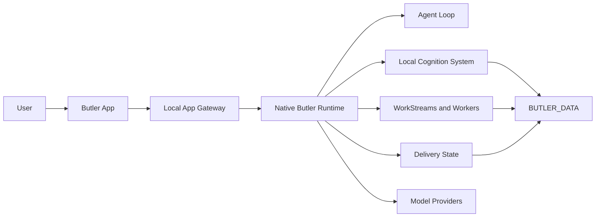

<p align="center">
  
</p>

# Butler

Butler is a local-first AI agent runtime for personal and project work.

It can remember local context, plan work, coordinate tools and workers, and
report after reviewing the outcome.

Not a chatbot. Not a hosted profile. A local operating layer for personal and
project work.

## Core Ideas

**Local memory.** Context and runtime state are stored under your Butler data
directory by default. Local-first does not mean every inference is local: if
you enable profiling or hosted model providers, selected prompt, context, or
profile-candidate text may be sent to the configured provider. Use a local
provider when that processing must stay on your machine.

**Reviewed outcomes.** Tool output and worker results are evidence, not final
answers.

**Real work.** Butler can plan, execute, repair, and report through durable
workstreams.

**App first.** The Butler App is the primary tested product surface.

## Quick Start

Download Butler App from the
[v0.0.19 GitHub Release](https://github.com/Hexpy-Games/butler/releases/tag/v0.0.19).

| Platform | Installer |
| --- | --- |
| macOS Apple Silicon | `butler-app-0.0.19-darwin-arm64.dmg` |
| Linux x64 | `butler-app-0.0.19-linux-x64.deb` |
| Linux ARM64 | `butler-app-0.0.19-linux-arm64.deb` |
| Arch Linux x64 | `butler-app-0.0.19-archlinux-x64.pkg.tar.zst` |

Butler Agent is included in the app. On first launch, setup runs inside the
Butler App in this order:

1. Language
2. Safety notice
3. `Butler Agent를 준비합니다`
4. Model setup

On macOS, drag `Butler.app` from the DMG into Applications. On every supported
desktop platform, the Agent and tray run only while Butler is open; quitting
Butler shuts the complete App-owned Agent process tree down.

### Windows: Microsoft Store and GitHub Releases in parallel

The Microsoft Store is Butler's primary Windows distribution path. During Store
onboarding and review, the GitHub Releases Windows x64 installer remains
available in parallel. Download the canonical
`butler-app-<version>-win32-x64-setup.exe` and its matching `.sha256` sidecar
from the release assets, then run the Setup executable. Installation, first run,
runtime, uninstall, and subsequent in-app updates use the existing Windows
Squirrel package. GitHub-installed Butler users can open Settings to check for
and apply updates from the GitHub Releases channel; Microsoft Store installs
remain Store-managed.

The community signing key is pinned by the repository's public
`WINDOWS_COMMUNITY_CERTIFICATE_SHA256` variable. Rotate the PFX secret only
with an explicit pin update and a bridge release signed by the old key, or ask
users to reinstall; replacing the secret alone must fail before publication.

An ordinary SmartScreen warning can be continued with **More info** and then
**Run anyway**. This community build is not signed by a public-trust publisher,
so a warning is expected. Smart App Control enforcement is different: it can
block the app with no override (there is no user override). On such machines,
do not disable Smart App Control; use the Microsoft Store, a future
SignPath-signed release, or a machine whose policy permits the app instead.

Use the standalone Agent only when you want the headless runtime without the
desktop app.

## Advanced: Butler Agent

```bash
cd ~
wget https://github.com/Hexpy-Games/butler/releases/download/v0.0.18/butler-agent-0.0.18-all.tar.gz
mkdir -p ~/butler
tar -xzf ~/butler-agent-*-all.tar.gz -C ~/butler
cd ~/butler
./install.sh
butler install --home ~/butler --data ~/.butler
```

Default paths:

- `BUTLER_HOME=~/butler`
- `BUTLER_DATA=~/.butler`

Override them when needed:

```bash
./install.sh --home ~/Apps/butler --data ~/.butler
butler install --home ~/butler --data ~/.butler
```

For scripted installs:

```bash
./install.sh --non-interactive --no-register-service
./install.sh --non-interactive --register-service
```

After install:

```bash
butler commands
butler status
butler ps
butler logs --service butler-main --lines 100
butler doctor --check delivery --verbose
butler context prune --json
butler start
butler stop
butler restart
```

For the complete user-facing command list, see
`REF-CLI-REFERENCE - Butler CLI Reference`.

## How Butler Works



The runtime follows a simple product discipline:

1. Understand the request and available context.
2. Plan the work.
3. Execute tools or dispatch workers.
4. Review evidence and repair ordinary failures.
5. Consolidate the result.
6. Report the outcome.

## Main Components

| Component | Purpose |
| --- | --- |
| `packages/butler-agent` | The headless Butler runtime, agent loop, tools, memory, workers, app gateway, and service scripts. |
| `packages/butler-app` | The local desktop app and app-facing client code. |
| `packages/project-ledger` | A portable project ledger used for structured project records and planning. |
| `tools` | Validation, Docker install checks, and release verification. |
| `tests` | Unit, smoke, and product-boundary tests. |

## Models

Butler supports hosted and local model providers: OpenAI/GPT, Anthropic/Claude,
Google/Gemini, xAI/Grok, Alibaba/Qwen, Moonshot/Kimi, Z.AI Coding Plan,
Z.AI API, Codex subscription auth, and local OpenAI-compatible models.

See [`.env.example`](.env.example) for configuration options.

## App And Agent Releases

Butler has two release shapes:

- **Butler App:** the Electron desktop experience.
- **Butler Agent:** the standalone/headless runtime for advanced operators.

## Development

Source checkouts, Docker installer sandboxes, and package scripts are for
development, not the normal user install path. Public installs use Butler App by
default or the standalone Butler Agent artifact for headless operators.

```bash
git clone https://github.com/Hexpy-Games/butler.git ~/butler
cd ~/butler
bun install
```

```bash
bun run lint
bun run typecheck
bun test tests/unit/*.test.ts
bun run check
```

Useful app commands:

```bash
bun run app:client:dev
bun run app:ui:build
bun run app:client
```

Installer sandboxes:

```bash
bun run install:docker
bun run install:docker:readme
docker exec -it butler-readme-install bash -l
```

The Docker installer builds or consumes a Butler Agent release artifact, runs the
interactive `install.sh`, and keeps the container shell open for inspection. The
README sandbox downloads the Agent artifact into `~/Downloads` and opens a
dependency-only Docker container for manually running the Advanced Agent install
commands.

## Status

Butler is `v0.0.18` and pre-release. Expect breaking changes before `v1.0.0`.

The intended deployment model is single-user and self-hosted on a machine you
control. Butler can run tools, edit files, dispatch background workers, and
operate unattended services, so install it only in environments where that level
of local agent automation is acceptable.

## License

MIT. See [LICENSE](LICENSE).
