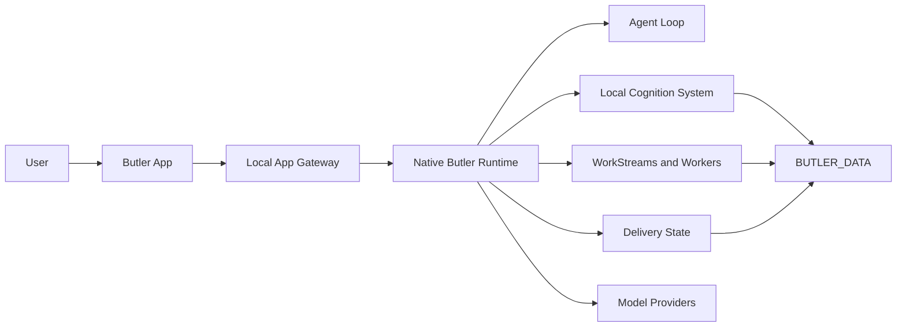

<p align="center">
  
</p>

# Butler

Butler is a local-first AI agent runtime for personal and project work.

It can remember local context, plan work, coordinate tools and workers, and
report after reviewing the outcome.

Not a chatbot. Not a hosted profile. A local operating layer for personal and
project work.

## Core Ideas

**Local memory.** Context and runtime state are stored under your Butler data
directory by default. Local-first does not mean every inference is local: if
you enable profiling or hosted model providers, selected prompt, context, or
profile-candidate text may be sent to the configured provider. Use a local
provider when that processing must stay on your machine.

**Reviewed outcomes.** Tool output and worker results are evidence, not final
answers.

**Real work.** Butler can plan, execute, repair, and report through durable
workstreams.

**App first.** The Butler App is the primary tested product surface.

## Quick Start

Download `butler-service-<version>-all.tar.gz` from the
[GitHub Releases](https://github.com/Hexpy-Games/butler/releases) page for the
tag you want to install. Release artifacts already include the built Butler App
web client that the local app gateway serves.

```bash
cd ~
wget https://github.com/Hexpy-Games/butler/releases/download/v0.0.8/butler-service-0.0.8-all.tar.gz
mkdir -p ~/butler
tar -xzf ~/butler-service-*-all.tar.gz -C ~/butler
cd ~/butler
./install.sh
butler install --home ~/butler --data ~/.butler
```

Default paths:

- `BUTLER_HOME=~/butler`
- `BUTLER_DATA=~/.butler`

Override them when needed:

```bash
./install.sh --home ~/Apps/butler --data ~/.butler
butler install --home ~/butler --data ~/.butler
```

For scripted installs:

```bash
./install.sh --non-interactive --no-register-service
./install.sh --non-interactive --register-service
```

To test the interactive installer in a disposable Docker container:

```bash
bun run install:docker
```

The Docker installer builds or consumes a Butler Agent release artifact, runs the
interactive `install.sh`, then keeps the container shell open. Agent artifacts
include the built app web client served by the app gateway. The container app
gateway stays on `18765`, but the host publish port is selected from the first
free port starting at `18766` so it does not collide with a host Butler already
using `18765`. The script prints the host web and health URLs. Set
`BUTLER_INSTALL_DOCKER_HOST_PORT=18770` to force a specific host port.

To manually follow the README install commands inside a dependency-only Docker
image:

```bash
bun run install:docker:readme
docker exec -it butler-readme-install bash -l
```

The README sandbox downloads the release artifact into the container's
`~/Downloads`, prepares only system dependencies in the Docker image, pre-wires
the app gateway to bind `0.0.0.0:18765`, and publishes it to the first free host
port starting at `18766`. Run the Quick Start commands inside the shell, then
open the printed host URL from your browser.

After install:

```bash
butler commands
butler status
butler ps
butler logs --service butler-main --lines 100
butler doctor --check delivery --verbose
butler context prune --json
butler start
butler stop
butler restart
```

For the complete user-facing command list, see
`REF-CLI-REFERENCE - Butler CLI Reference`.

## How Butler Works



The runtime follows a simple product discipline:

1. Understand the request and available context.
2. Plan the work.
3. Execute tools or dispatch workers.
4. Review evidence and repair ordinary failures.
5. Consolidate the result.
6. Report the outcome.

## Main Components

| Component | Purpose |
| --- | --- |
| `packages/butler-agent` | The headless Butler runtime, agent loop, tools, memory, workers, app gateway, and service scripts. |
| `packages/butler-app` | The local desktop app and app-facing client code. |
| `packages/project-ledger` | A portable project ledger used for structured project records and planning. |
| `tools` | Validation, Docker install checks, and release verification. |
| `tests` | Unit, smoke, and product-boundary tests. |

## Models

Butler supports hosted and local model providers: OpenAI/GPT, Anthropic/Claude,
Google/Gemini, xAI/Grok, Alibaba/Qwen, Moonshot/Kimi, Codex subscription auth,
and local OpenAI-compatible models.

See [`.env.example`](.env.example) for configuration options.

## App And Agent Releases

Butler has two release shapes:

- **Butler App:** the Electron desktop experience.
- **Butler Agent:** the standalone/headless runtime for advanced operators.

## Development

Source checkouts are for development, not the normal user install path. User
installs consume Agent release artifacts so the Butler App web client is
already built before `install.sh` runs.

```bash
git clone https://github.com/Hexpy-Games/butler.git ~/butler
cd ~/butler
bun install
```

```bash
bun run lint
bun run typecheck
bun test tests/unit/*.test.ts
bun run check
```

Useful app commands:

```bash
bun run app:client:dev
bun run app:ui:build
bun run app:client
```

## Status

Butler is `v0.0.8` and pre-release. Expect breaking changes before `v1.0.0`.

The intended deployment model is single-user and self-hosted on a machine you
control. Butler can run tools, edit files, dispatch background workers, and
operate unattended services, so install it only in environments where that level
of local agent automation is acceptable.

## License

MIT. See [LICENSE](LICENSE).
