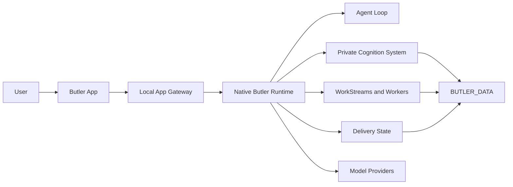

<p align="center">
  
</p>

# Butler

Butler is your private AI butler.

It remembers your context, plans the work, coordinates tools and workers, and
reports only after reviewing the outcome.

Not a chatbot. Not a hosted profile. A local operating layer for personal and
project work.

## Core Ideas

**Private memory.** Context and runtime state stay on your machine.

**Reviewed outcomes.** Tool output and worker results are evidence, not final
answers.

**Real work.** Butler can plan, execute, repair, and report through durable
workstreams.

**App first.** The Butler App is the primary tested product surface.

## Quick Start

```bash
git clone https://github.com/Hexpy-Games/butler.git ~/butler
cd ~/butler
./install.sh
```

Default paths:

- `BUTLER_HOME=~/butler`
- `BUTLER_DATA=~/.butler`

Override them when needed:

```bash
./install.sh --home ~/Apps/butler --data ~/.butler
```

For scripted installs:

```bash
./install.sh --non-interactive --no-register-service
./install.sh --non-interactive --register-service
```

After install:

```bash
butler status
butler ps
butler logs --service butler-main --lines 100
butler doctor --check delivery --verbose
```

## How Butler Works



The runtime follows a simple product discipline:

1. Understand the request and available context.
2. Plan the work.
3. Execute tools or dispatch workers.
4. Review evidence and repair ordinary failures.
5. Consolidate the result.
6. Report the outcome.

## Main Components

| Component | Purpose |
| --- | --- |
| `packages/butler-agent` | The headless Butler runtime, agent loop, tools, memory, workers, app gateway, and service scripts. |
| `packages/butler-app` | The local desktop app and app-facing client code. |
| `packages/project-ledger` | A portable project ledger used for structured project records and planning. |
| `tools` | Validation, Docker install checks, and release verification. |
| `tests` | Unit, smoke, and product-boundary tests. |

## Models

Butler supports hosted and local model providers: OpenAI, Anthropic, Google
Gemini, xAI/Grok, Qwen, Moonshot/Kimi, Codex subscription auth, and local
OpenAI-compatible models.

See [`.env.example`](.env.example) for configuration options.

## App And Service Releases

Butler has two release shapes:

- **Butler App:** the Electron desktop experience.
- **Butler Service:** the local agent runtime that powers clients and workers.

## Development

```bash
bun run lint
bun run typecheck
bun test tests/unit/*.test.ts
bun run check
```

Useful app commands:

```bash
bun run app:client:dev
bun run app:ui:build
bun run app:client
```

## Status

Butler is `v0.0.1` and pre-release. Expect breaking changes before `v1.0.0`.

The intended deployment model is single-user and self-hosted on a machine you
control. Butler can run tools, edit files, dispatch background workers, and
operate unattended services, so install it only in environments where that level
of local automation is acceptable.

## License

MIT. See [LICENSE](LICENSE).
