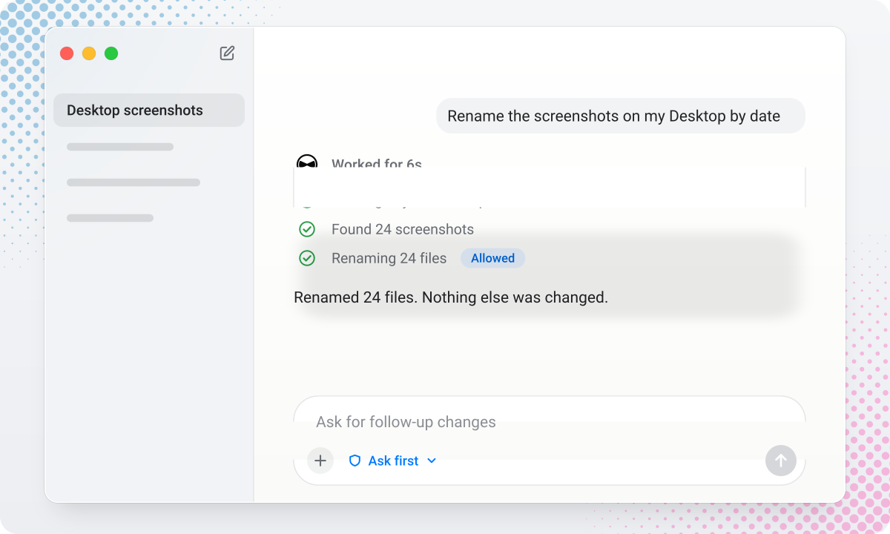

<p align="center">
  <picture>
    <source media="(prefers-color-scheme: dark)" srcset="assets/readme/mark-dark.png">
    
  </picture>
</p>

<h1 align="center">Butler</h1>

<p align="center">
  <strong>At your service, on your machine.</strong>
</p>

<p align="center">
  A personal AI agent that asks before it acts.<br>
  For macOS (Apple silicon) and Linux, with hosted or local models.
</p>

0.1.0 is in preview. The current build is [`0.1.0-preview.4`](https://github.com/Hexpy-Games/butler/releases/tag/v0.1.0-preview.4).

<p align="center">
  <a href="https://github.com/Hexpy-Games/butler/releases/tag/v0.1.0-preview.4"><strong>Download</strong></a>
  &nbsp;·&nbsp;
  <a href="https://butler.hexpy.games/help/"><strong>Manual</strong></a>
  &nbsp;·&nbsp;
  <a href="https://github.com/Hexpy-Games/butler/releases">Releases</a>
</p>

<p align="center">
  <picture>
    <source media="(prefers-color-scheme: dark)" srcset="assets/readme/hero-demo-dark.svg">
    
  </picture>
</p>

## What Butler does

Use Butler through the App, on desktop or in a browser. The Agent is a native Rust service; the TypeScript/Bun Agent is retired.

- **Works on your computer, with permission.** Butler reads and edits files and runs commands. By default, new conversations start in *Ask first*, so it asks before it changes a file or runs a command. Approvals show the full command, and Butler treats commands it doesn't recognize as high risk. When it needs a decision from you, it asks in the chat. You can switch a conversation to *Read only* or *Full access*. [Conversations](https://butler.hexpy.games/help/basics/conversation/)
- **Projects.** A project gives its conversations a shared folder. Butler records plans and progress for the project, and the dashboard summarizes them. [Projects](https://butler.hexpy.games/help/projects/)
- **Schedules.** Butler sends a prompt to a conversation at a fixed interval, or daily, on weekdays or weekly at a set time. [Schedules](https://butler.hexpy.games/help/scheduled-tasks/)
- **Memory and personalization.** Give Butler a name and a persona, and choose how much it learns about you. Learning is off by default. [Personalization](https://butler.hexpy.games/help/personalization/)
- **Your choice of model.** Use OpenAI, Anthropic, Google and other hosted providers, or an OpenAI-compatible server such as Ollama, LM Studio or llama.cpp. Manage saved API keys in **Settings → Models**. When enabled, backup models handle eligible provider failures. [Models](https://butler.hexpy.games/help/models/cloud/)
- **CLI and MCP.** Run the Agent without the desktop App and connect MCP servers for extra tools. Use `butler --help` for service, model, schedule and extension commands. [MCP servers](https://butler.hexpy.games/help/extensions/mcp-servers/), [Agent CLI](https://butler.hexpy.games/help/advanced/agent-cli/)

## Install

Download Butler from the [0.1.0 preview.4 release](https://github.com/Hexpy-Games/butler/releases/tag/v0.1.0-preview.4).

| Platform | Download |
| --- | --- |
| macOS (Apple silicon) | [DMG](https://github.com/Hexpy-Games/butler/releases/download/v0.1.0-preview.4/butler-app-0.1.0-preview.4-darwin-arm64.dmg) |
| Linux (x64) | [DEB](https://github.com/Hexpy-Games/butler/releases/download/v0.1.0-preview.4/butler-app-0.1.0-preview.4-linux-x64.deb) |
| Linux (arm64) | [DEB](https://github.com/Hexpy-Games/butler/releases/download/v0.1.0-preview.4/butler-app-0.1.0-preview.4-linux-arm64.deb) |
| Arch Linux (x64) | [Package](https://github.com/Hexpy-Games/butler/releases/download/v0.1.0-preview.4/butler-app-0.1.0-preview.4-archlinux-x64.pkg.tar.zst) |
| Windows | No installer yet |

Each file has a `.sha256` checksum, and `butler-0.1.0-preview.4-SHA256SUMS` lists them all.

Settings → Updates installs the new App and bundled Agent, then relaunches with the same data directory.
**Receive preview versions** defaults to OFF. Turn it on to receive the newest stable or preview release.
The CLI shares this preference: `butler config set update.previews true` (or `false`); `butler status` shows it.
Release builds identify with their full tag, such as `0.1.0-preview.4`; development builds use `0.1.0-dev`.


On first launch, choose the interface language on the welcome screen, accept the safety notice and connect an AI. Choose Butler's reply language at the end of the AI connection step; you can change it later in **Settings → Personalization**. See [Install](https://butler.hexpy.games/help/getting-started/install/) and [First run](https://butler.hexpy.games/help/getting-started/first-run/).

macOS preview builds are signed but not notarized, so Gatekeeper shows a prompt on first open. Right-click **Butler → Open**, or choose **System Settings → Privacy & Security → Open Anyway** after trying to open it.

### Headless Agent

On Apple silicon macOS or Linux x64 / arm64 with glibc:

```sh
curl -fsSL https://github.com/Hexpy-Games/butler/releases/download/v0.1.0-preview.4/install.sh | sh -s -- --version 0.1.0-preview.4
# Or, with Node.js:
npx @hexpygames/butler install
```

Use `butler open` to open the App in your browser. For another computer on a trusted network, enable access and generate a pairing code in **Settings → Security**, or use `butler remote enable` and `butler remote pair` on the host. Open the displayed address on the other computer and enter the 8-digit one-time pairing code. Remote access is off by default. [Remote access](https://butler.hexpy.games/help/advanced/remote-access/)

## Where your data lives

Conversations, memory and settings stay in a local data folder, `~/.butler` by default. Saved API keys go to the system credential store on Developer ID-signed macOS builds, and otherwise to an owner-only file in that folder. When you use a hosted model, that provider receives the prompt and context for each request. Use a local model to keep inference on your machine too.

## Documentation

The [Butler manual](https://butler.hexpy.games/help/) covers setup, conversations, projects, schedules, models, MCP, settings and troubleshooting. Most pages are in Korean; English guides cover [installation](https://butler.hexpy.games/en/help/getting-started/install/), the [Agent CLI](https://butler.hexpy.games/en/help/advanced/agent-cli/) and [remote access](https://butler.hexpy.games/en/help/advanced/remote-access/).

## Status

Butler is pre-1.0, so expect breaking changes between releases. It edits files and runs commands, so run it on a machine you control.

## Contributing

To build Butler from source, run the checks or work on the Rust agent, see [CONTRIBUTING.md](CONTRIBUTING.md). Report bugs in [Issues](https://github.com/Hexpy-Games/butler/issues).

## License

[MIT](LICENSE)
