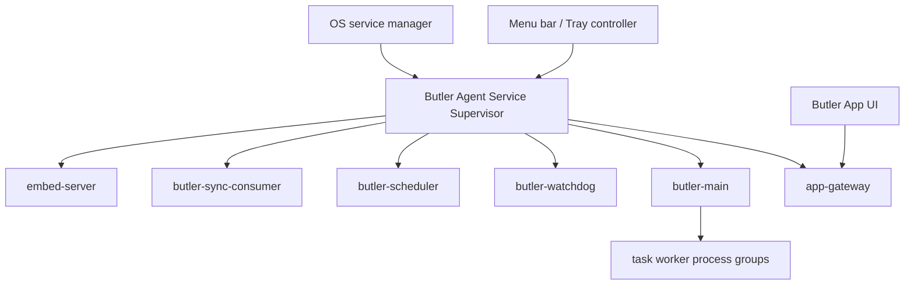

# Butler App Background Service Distribution

## Status

Planning. This spec defines the target architecture for Butler App releases
where the bundled Butler Agent keeps running after the UI window or UI process
is closed.

## Goal

Butler App distribution must behave like a desktop product with a persistent
local assistant service:

- The App installs and controls a bundled Butler Agent background service.
- The Agent service owns the long-running process group.
- Consolidation, scheduler, sync, watchdog, app gateway, and task workers keep
  running when the App UI is closed.
- The menu bar or tray controller reflects service state and lets the user open
  the UI, restart the service, stop background work, or quit the controller.
- The standalone Agent distribution remains a terminal/CLI installation path.

## Non-Goals

- Do not keep production App releases dependent on an Electron-owned child
  gateway process.
- Do not make `curl`, `unzip`, Git, Xcode, Docker, or terminal tooling part of
  the App first-run path.
- Do not merge App and standalone Agent release artifacts into a single public
  product. The App may bundle the Agent payload, but public release channels
  remain Butler App and Butler Agent.
- Do not silently stop the background Agent when the user closes the App window.

## Product Model

### Process Ownership

The OS service manager starts one foreground service entrypoint. That entrypoint
starts and supervises the Butler process group. The App UI never owns the
production Agent process tree.

### User-Facing Lifecycle

- **Open Butler**: shows the App UI and connects to the service-owned app
  gateway.
- **Close window**: hides the UI. The Agent service continues.
- **Quit Butler UI**: quits UI/tray controller only. The Agent service
  continues unless the user chooses a stop action.
- **Stop Butler Agent**: explicitly stops the service process group.
- **Restart Butler Agent**: drains and restarts the service process group.
- **Uninstall Butler**: unregisters the service and removes App-managed runtime
  files according to the uninstall policy.

### First-Run Flow

The App first-run install step changes from "spawn bundled gateway child" to
"install or verify background Agent service".

1. Language
2. Safety notice
3. Butler Agent service setup
4. Model setup

The service setup step must:

- Activate the bundled Agent runtime under App-managed runtime storage.
- Register the user-level service when required.
- Install or repair registration when the current service status is
  `not_installed`, `stopped`, or `needs_permission`, then start or restart the
  service.
- Verify app gateway health, protocol compatibility, local auth, and
  `gateway_profile=electron`.
- Show concise recovery actions when registration or health checks fail.

### Runtime Contract

The Phase 0 source of truth is
`packages/butler-app/scripts/background-service-contract.ts`. Service
implementation, first-run UI, tray/menu status, and updater code must consume or
mirror that contract instead of inventing separate status strings or runtime
field lists.

The service must run with:

- `BUTLER_HOME`: active App-managed Agent runtime home.
- `BUTLER_DATA`: App data root.
- `BUTLER_BUN`: bundled managed runtime executable.
- `BUTLER_APP_MANAGED_RUNTIME_POINTER`: active runtime pointer.
- `BUTLER_APP_MANAGED_RUNTIME_HOME`: active runtime home.
- `BUTLER_APP_SERVER_HOST=127.0.0.1`.
- `BUTLER_APP_SERVER_PORT`: resolved app gateway port.
- `BUTLER_APP_GATEWAY_PID_FILE=off` or a service-owned pid policy.
- `BUTLER_APP_LOCAL_AUTH_REQUIRED=1`.
- `BUTLER_APP_LOCAL_AUTH_FILE`: App-managed local auth file path.

The app gateway is service-owned and must not be detached by the Electron UI.

## Platform Policy

### macOS

Use a per-user LaunchAgent or SMAppService-backed helper for the Agent service.
The first production milestone should prefer a per-user service. A privileged
LaunchDaemon is out of scope unless future features require system-level
privileges.

Packaging implication:

- A simple zipped `.app` is not enough for reliable service registration.
- A `.pkg` installer or an App first-run helper registration flow is required.
- Notarization/signing must cover the App, helper/service payload, and service
  registration artifacts.

Phase 0 gate:

- The v1 implementation must choose `.pkg` installer registration or first-run
  user LaunchAgent registration before service UI work starts.

### Windows

Use a Windows background service model only after the user/security context is
fixed. The service must not default to a broad `LocalSystem` process that reads
per-user Butler data unless a narrow privileged helper design explicitly
separates privileged operations from the user-owned Agent.

The v1 decision gate must choose one of:

- A least-privilege per-user service or agent process launched at sign-in.
- A Windows Service running under a user-scoped account with explicit ACLs for
  `BUTLER_DATA`.
- A split model where only a small elevated helper is a Windows Service and the
  Agent process runs as the signed-in user.

Whichever option is chosen must preserve the per-user `BUTLER_DATA`, local auth,
workspace permissions, and UI session expectations.

Packaging implication:

- A portable Electron zip is not enough.
- MSI/installer work or an equivalent signed installer is required before
  Windows App release can provide persistent background service behavior.
- Installer UX must explain elevation only when it is actually required.

Phase 0 gate:

- The v1 implementation must choose the user/security context before any
  Windows service code ships.

### Linux

Use `systemd --user` for desktop Linux.

Packaging implication:

- `.deb`/`.rpm` packages should own unit placement and first-run enable/start
  behavior.
- AppImage or tarball can be supported later as a manual service-registration
  path, but it is not the primary production target.

Phase 0 gate:

- The v1 implementation should prefer package-owned user units for production
  and keep manual registration as a later path.

## Current Code Reuse

Reusable service components:

- `packages/butler-agent/src/operations/service/native-service-supervisor.ts`
  already models the process group:
  - `embed-server`
  - `butler-sync-consumer`
  - `butler-scheduler`
  - `butler-watchdog`
  - `butler-main`
  - `app-gateway`
  - App-managed specs are emitted by `appManagedNativeServiceSpecs`.
  - Update-safe stop is exposed through `stopServiceBounded`.
- `packages/butler-agent/src/operations/service/os-service-adapter.ts`
  already supports launchd and systemd registration plans.
- `packages/butler-app/client/electron/app-managed-runtime.mjs` already stages
  and activates bundled Agent runtimes.
- `packages/butler-app/client/electron/setup-bridge.mjs` already validates
  first-run readiness.

Required changes:

- Consume `background-service-contract.ts` for service status, platform
  capability, App-managed runtime field names, and unresolved v1 registration
  decisions.
- Move production App first-run readiness from Electron child supervisor to
  OS-service-backed supervisor control.
- Add App-owned service registration bridge APIs. Before OS-specific adapters
  are enabled for a packaged platform, bridge actions must fail closed with
  structured redacted diagnostics.
- Use the packaged-safe Electron native service bridge only for packaged
  macOS/Linux App builds. Development builds and unsupported platforms must not
  register host services.
- Teach native service specs to run from an App-managed runtime pointer.
- Add Windows service support after the user/security context decision is made.
- Add installer packaging that can register or prepare the service.
- App bundle resources must include platform-specific service registration
  metadata for the installer/helper path. This metadata is not a substitute for
  signed `.pkg`, `.deb`, or `.rpm` artifacts; it is the packaged contract those
  installers consume.
- App bundle resources must include service installer render contracts for
  LaunchAgent and `systemd --user` definitions, plus executable package
  post-install hook inputs. Render contracts must require XML/systemd escaping
  and must not rely on raw placeholder substitution.
- App bundle resources must include `service-installer/installer-manifest.json`
  so the signed `.pkg`, `.deb`, or `.rpm` builder can consume the same package
  artifact contract verified by release smoke tests.

## Success Criteria

- Closing the App window does not stop the Agent service.
- Quitting the App UI does not stop the Agent service by default.
- The tray/menu bar can display service status without opening the main window.
- `butler-main`, `app-gateway`, consolidation, scheduler, sync, watchdog, and
  task worker process groups are owned by the Agent service supervisor.
- First-run setup verifies the service-owned app gateway before opening the
  workspace.
- App release artifacts install without host `curl`, `unzip`, Git, or terminal
  dependency prompts.
- App uninstall can unregister the service and report residual runtime/data
  cleanup options.

## Validation Targets

- `bun test tests/unit/app-background-service-contract.test.ts`
- Unit tests for service spec generation from App-managed runtime pointers.
- Unit tests for platform registration capability decisions.
- Unit tests for first-run service install/readiness states.
- Unit tests for tray/menu service actions.
- Release manifest tests proving App artifacts declare service-install
  capability.
- Smoke test for isolated first-run service setup.
- E2E test for "close UI, service remains online".
- E2E test for "stop Agent, service process group terminates".
- Platform package smoke for macOS, Windows, and Linux artifacts as each
  installer target lands.
