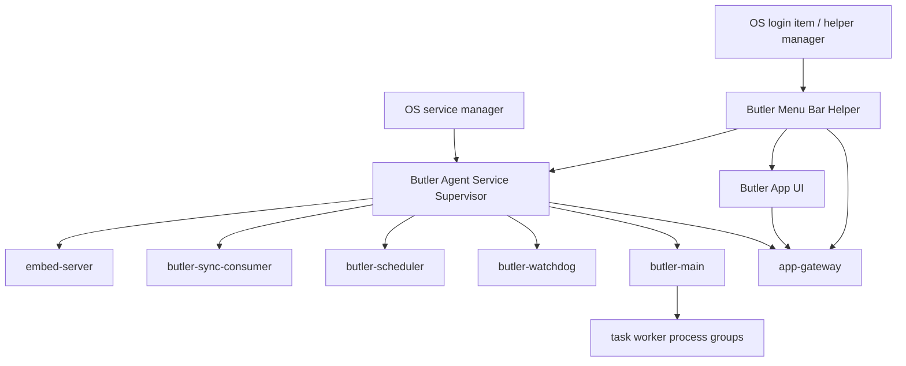

# Butler App Background Service Distribution

## Status

Planning. This spec defines the target architecture for Butler App releases
where the bundled Butler Agent and App-owned menu bar helper keep running after
the main App window or main App UI process is closed.

## Goal

Butler App distribution must behave like a desktop product with a persistent
local assistant service:

- The App installs and controls a bundled Butler Agent background service.
- The Agent service owns the long-running process group.
- The App installs and starts a lightweight menu bar or tray helper that owns the
  desktop status icon independently from the main App UI process.
- Consolidation, scheduler, sync, watchdog, app gateway, and task workers keep
  running when the App UI is closed.
- The menu bar or tray helper reflects service state and lets the user open the
  UI, restart the service, stop background work, or quit the helper.
- The standalone Agent distribution remains a headless terminal/CLI installation
  path by default. A desktop tray companion may be offered as an explicit opt-in
  package or command, but it is not installed implicitly by the standalone Agent.

## Non-Goals

- Do not keep production App releases dependent on an Electron-owned child
  gateway process.
- Do not make `curl`, `unzip`, Git, Xcode, Docker, or terminal tooling part of
  the App first-run path.
- Do not merge App and standalone Agent release artifacts into a single public
  product. The App may bundle the Agent payload, but public release channels
  remain Butler App and Butler Agent.
- Do not silently stop the background Agent when the user closes the App window.
- Do not tie the App product's persistent menu bar or tray icon to the lifetime
  of the main Electron window process.
- Do not make a GUI tray/menu process a default side effect of standalone Agent
  installation.

## Product Model

### Process Ownership

The OS service manager starts one foreground service entrypoint. That entrypoint
starts and supervises the Butler process group. The App UI never owns the
production Agent process tree. The desktop status icon is owned by a small
menu-bar/tray helper, not by the main App UI process, so quitting the main UI can
leave the helper and Agent service online.

### User-Facing Lifecycle

- **Open Butler**: shows the App UI and connects to the service-owned app
  gateway. If the App UI is already running, this action focuses the existing
  window instead of starting a duplicate UI process.
- **Launch Butler App**: reconciles the App-managed Agent service before the UI
  is considered usable. This is not only a first-run responsibility; on every
  packaged App launch, if the App-managed service registration exists but is not
  loaded/running, or if the service projections are offline/stale, the App must
  repair/start the service using the native service bridge.
- A running service is only launch-ready when its App-managed runtime pointer
  matches the bundled Agent version inside the currently launched App. If the
  service is online but still points at an older App-managed runtime, launch
  reconciliation must activate the bundled runtime and restart the service
  before treating the gateway as current.
- **Status icon click**: opens the OS menu only. A plain status icon click must
  not reopen the App UI; reopening is reserved for the explicit **Open Butler**
  menu action.
- **Close window**: hides the UI. The Agent service continues.
- **Quit main App UI**: quits or hides the main App UI only. The Agent service
  and menu bar/tray helper continue unless the user chooses an explicit service
  stop.
- **Stop Butler Agent**: explicitly stops the service process group, removes the
  menu bar/tray icon, and warns that automations and background sessions will
  stop. The warning includes a "do not show again" choice.
- **Restart Butler Agent**: drains and restarts the service process group.
- **Uninstall Butler**: unregisters the service and removes App-managed runtime
  files according to the uninstall policy.

### Menu Bar Helper Contract

The App distribution must provide a persistent desktop controller similar to
Docker Desktop on macOS:

- The helper owns the menu bar/tray icon and survives main App UI quit.
- The helper must run under a background-only helper identity. On macOS, the
  helper launch path must not execute the Dock-visible
  `Butler.app/Contents/MacOS/Butler` binary as a second visible App process.
- Packaged macOS App artifacts must include
  `Butler.app/Contents/Library/LoginItems/Butler Menu Bar Helper.app` with an
  `LSUIElement` Info.plist, its own executable, and the Butler status icon
  resource. The helper executable is the persistent menu bar launch target.
  The helper status icon must be a menu-bar-appropriate PNG/template resource
  bundled inside the helper, not only the Dock/App `.icns` resource, so macOS
  can render the icon correctly in light and dark menu bar appearances.
- The helper starts at login or after first-run registration whenever the App
  background service is enabled.
- The helper must enforce single-instance ownership inside the helper process
  itself, using App-managed runtime state under `BUTLER_DATA`. Main App pid-file
  checks are an optimization only; a direct helper launch, stale App process, or
  race during `Open Butler` must not create multiple simultaneous menu bar
  helper instances.
- The macOS App-managed Agent service registration flow must render and
  bootstrap a user LaunchAgent for the menu bar helper. Service repair may
  rewrite the helper LaunchAgent definition, but normal **Start Butler Agent**
  and **Restart Butler Agent** actions must not boot out or kickstart the helper
  when a helper already owns the menu bar icon.
- If the Agent service is running because App first-run, service repair, or
  login startup started it, the menu bar helper must also be available for that
  user session. The App may satisfy this by the installed helper LaunchAgent or
  by an already-running helper, but must not create multiple simultaneous menu
  bar helper icons.
- The helper is the default entry point for quick Agent status and service
  actions in the App distribution.
- The helper can open or relaunch the main App UI.
- The helper must not host Agent runtime internals. It talks to the service
  control bridge and service-owned app gateway through the same local auth and
  protocol checks used by the App UI.
- The normal helper menu must not expose a helper-only quit action or a
  **Quit Butler UI** action. The menu bar icon is the Agent service controller;
  destructive exit is presented as **Stop Butler Agent** or
  **Stop Butler Service** and stops the Agent service after confirmation.
- On unsupported desktop environments, the App may degrade to service-only
  operation with diagnostics, but macOS App releases must treat helper
  registration as part of the normal product contract.
- If a packaged macOS build does not include a launchable background-only helper
  executable, the App must fail closed to single-process tray ownership instead
  of spawning a second Dock-visible Butler process.
- Release metadata must not imply that every packaged App artifact has a
  default persistent helper. It must list all desktop platforms covered by the
  helper schema separately from platforms where the helper is default-enabled
  and expected to survive main UI quit. Phase 4 enables that default persistent
  helper contract for packaged macOS App releases; Linux App packages remain
  service-capable but service-only until a tray packaging path is implemented.

For the standalone Agent distribution, the default is headless. A standalone tray
companion may be delivered later as an explicit opt-in operator path, such as a
separate package or `butler tray install`, and must use separate naming so it is
not confused with Butler App.

### First-Run Flow

The App first-run install step changes from "spawn bundled gateway child" to
"install or verify background Agent service".

1. Language
2. Safety notice
3. Butler Agent service setup
4. Model setup

The service setup step must:

- Activate the bundled Agent runtime under App-managed runtime storage.
- Register the user-level service when required.
- Install or repair registration when the current service status is
  `not_installed`, `stopped`, or `needs_permission`, then start or restart the
  service.
- Verify app gateway health, protocol compatibility, local auth, and
  `gateway_profile=electron`.
- Show concise recovery actions when registration or health checks fail.

### Runtime Contract

The Phase 0 source of truth is
`packages/butler-app/scripts/background-service-contract.ts`. Service
implementation, first-run UI, tray/menu status, and updater code must consume or
mirror that contract instead of inventing separate status strings or runtime
field lists.

The service must run with:

- `BUTLER_HOME`: active App-managed Agent runtime home.
- `BUTLER_DATA`: App data root.
- `BUTLER_BUN`: bundled managed runtime executable.
- `BUTLER_APP_MANAGED_RUNTIME_POINTER`: active runtime pointer.
- `BUTLER_APP_MANAGED_RUNTIME_HOME`: active runtime home.
- `BUTLER_APP_SERVER_HOST=127.0.0.1`.
- `BUTLER_APP_SERVER_PORT`: resolved app gateway port.
- `BUTLER_APP_GATEWAY_PID_FILE=off` or a service-owned pid policy.
- `BUTLER_APP_LOCAL_AUTH_REQUIRED=1`.
- `BUTLER_APP_LOCAL_AUTH_FILE`: App-managed local auth file path.

The app gateway is service-owned and must not be detached by the Electron UI.

## Platform Policy

### macOS

Use a per-user LaunchAgent or SMAppService-backed helper for the Agent service.
The first production milestone should prefer a per-user service. A privileged
LaunchDaemon is out of scope unless future features require system-level
privileges.

Packaging implication:

- A simple zipped `.app` is not enough for reliable service registration.
- A `.pkg` installer or an App first-run helper registration flow is required.
- Notarization/signing must cover the App, helper/service payload, and service
  registration artifacts.

Phase 0 gate:

- The v1 implementation must choose `.pkg` installer registration or first-run
  user LaunchAgent registration before service UI work starts.

### Windows

Use a Windows background service model only after the user/security context is
fixed. The service must not default to a broad `LocalSystem` process that reads
per-user Butler data unless a narrow privileged helper design explicitly
separates privileged operations from the user-owned Agent.

The v1 decision gate must choose one of:

- A least-privilege per-user service or agent process launched at sign-in.
- A Windows Service running under a user-scoped account with explicit ACLs for
  `BUTLER_DATA`.
- A split model where only a small elevated helper is a Windows Service and the
  Agent process runs as the signed-in user.

Whichever option is chosen must preserve the per-user `BUTLER_DATA`, local auth,
workspace permissions, and UI session expectations.

Packaging implication:

- A portable Electron zip is not enough.
- MSI/installer work or an equivalent signed installer is required before
  Windows App release can provide persistent background service behavior.
- Installer UX must explain elevation only when it is actually required.

Phase 0 gate:

- The v1 implementation must choose the user/security context before any
  Windows service code ships.

### Linux

Use `systemd --user` for desktop Linux.

Packaging implication:

- `.deb`/`.rpm` packages should own installable desktop artifacts, unit
  placement, and first-run enable/start behavior.
- AppImage or tarball can be supported later as a manual service-registration
  path, but it is not the primary production target.

Phase 0 gate:

- The v1 implementation should prefer package-owned user units for production
  and keep manual registration as a later path.

## Current Code Reuse

Reusable service components:

- `packages/butler-agent/src/operations/service/native-service-supervisor.ts`
  already models the process group:
  - `embed-server`
  - `butler-sync-consumer`
  - `butler-scheduler`
  - `butler-watchdog`
  - `butler-main`
  - `app-gateway`
  - App-managed specs are emitted by `appManagedNativeServiceSpecs`.
  - Update-safe stop is exposed through `stopServiceBounded`.
- `packages/butler-agent/src/operations/service/os-service-adapter.ts`
  already supports launchd and systemd registration plans.
- `packages/butler-app/client/electron/app-managed-runtime.mjs` already stages
  and activates bundled Agent runtimes.
- `packages/butler-app/client/electron/setup-bridge.mjs` already validates
  first-run readiness.

Required changes:

- Consume `background-service-contract.ts` for service status, platform
  capability, App-managed runtime field names, and unresolved v1 registration
  decisions.
- Move production App first-run readiness from Electron child supervisor to
  OS-service-backed supervisor control.
- Add App-owned service registration bridge APIs. Before OS-specific adapters
  are enabled for a packaged platform, bridge actions must fail closed with
  structured redacted diagnostics.
- Use the packaged-safe Electron native service bridge only for packaged
  macOS/Linux App builds. Development builds and unsupported platforms must not
  register host services.
- Teach native service specs to run from an App-managed runtime pointer.
- Add Windows service support after the user/security context decision is made.
- Add installer packaging that can register or prepare the service.
- App bundle resources must include platform-specific service registration
  metadata for the installer/helper path. This metadata is not a substitute for
  signed `.pkg`, `.deb`, or `.rpm` artifacts; it is the packaged contract those
  installers consume.
- App bundle resources must include only the bundled Agent archive and CLI
  launcher payload for that App artifact platform. A macOS App package must not
  carry Linux launcher payloads, and a Linux App package must not carry macOS
  launcher payloads.
- App bundle resources must include service installer render contracts for
  LaunchAgent and `systemd --user` definitions, plus executable package
  post-install hook inputs. Render contracts must require XML/systemd escaping
  and must not rely on raw placeholder substitution.
- App bundle resources must include the packaged helper registration contract
  required to keep the menu bar/tray icon alive after the main UI exits.
- App bundle resources must include `service-installer/installer-manifest.json`
  so the signed `.pkg`, `.deb`, or `.rpm` builder can consume the same package
  artifact contract verified by release smoke tests.
- App release and update manifests must expose service installer bundle
  metadata so release consumers can discover the packaged installer contract
  without extracting the App artifact first.
- macOS App release artifacts must be `.pkg` installers instead of zipped
  `.app` bundles so service registration payloads can travel through the
  installer path. Production release signing and notarization are configured by
  release credentials.
- macOS App `.pkg` installers must mark the `Butler.app` bundle as
  non-relocatable and install it at `/Applications/Butler.app`. A same-bundle-id
  development build under the repository or another user-selected path must not
  cause Installer to relocate the production App payload away from
  `/Applications`.
- Linux App release packaging must publish installable `.deb` artifacts for
  supported Linux architectures. The package installs the Electron App, bundled
  Agent payload, desktop launcher, and App launcher command.
- Linux App service installer packaging must be able to turn the bundled
  service-installer resources into `.deb` and `.rpm` artifacts with
  package-owned user units, without adding host dependency prompts to the App
  first-run UI. The release runner, not the user desktop, owns `dpkg-deb` and
  `rpmbuild` availability.
- Published Linux App service installer artifacts must include checksum files
  beside the `.deb` and `.rpm` packages.
- App release and update manifests must expose the published service installer
  package asset names and checksum asset names for every package format.
- Manual first-run service testing must use a test-only service namespace
  (`com.hexpy.butler.test.*` on launchd and `butler-test-*.service` on
  systemd), a non-production app gateway port, and a non-production
  `BUTLER_DATA`. Test mode must refuse the production service label, production
  unit, production port, and real `~/.butler` data root.
- Manual installer testing must not install the production App package into
  `/Applications` or register the production service namespace. Local installer
  E2E uses a test-only `.pkg`, test-only bundle identifier, user-home install
  target, isolated Electron profile, isolated `BUTLER_DATA`, non-production
  gateway port, and test-only service label/unit. If the test menu-bar helper
  reopens the App UI through **Open Butler**, that relaunched UI must keep the
  isolated Electron profile instead of falling back to the normal Butler profile.
  Cleanup must remove the installed test App and test service by default.

## Success Criteria

- Closing the App window does not stop the Agent service.
- Quitting the App UI does not stop the Agent service or remove the default
  menu bar/tray helper.
- The tray/menu bar can display service status without opening the main window
  and without keeping the main UI process alive.
- Opening the packaged macOS App must leave only one Dock-visible Butler App
  process. A menu bar helper process, when present, must be background-only and
  must not appear as a second Dock icon.
- Opening a newly installed or upgraded packaged App on Linux must not continue
  using an older App-managed Agent runtime just because the existing
  `systemd --user` service is already online.
- Packaged macOS normalization must build and sign a launchable
  `Contents/Library/LoginItems/Butler Menu Bar Helper.app`; the main App must
  discover that bundled helper path by default and fail closed if it is missing.
- App-managed macOS Agent install must register and bootstrap the helper
  LaunchAgent in the same user launchd domain as the Agent service. Later
  service start/restart actions may repair the helper plist definition but must
  not restart helper ownership of the menu bar icon as a side effect.
- The menu bar/tray menu must not expose **Quit Butler UI** or
  **Quit Menu Bar Helper**. The destructive exit path is **Stop Butler Agent** or
  **Stop Butler Service**, guarded by a warning with a "do not show again"
  checkbox.
- Standalone Agent install stays headless by default, with any tray companion
  exposed only as an opt-in desktop add-on.
- `butler-main`, `app-gateway`, consolidation, scheduler, sync, watchdog, and
  task worker process groups are owned by the Agent service supervisor.
- First-run setup verifies the service-owned app gateway before opening the
  workspace.
- The language step is local-only and must not call the Agent gateway or App
  settings API before the user reaches Agent installation.
- First-run and renderer API bootstrap must treat native service startup as
  asynchronous. After service registration/start succeeds, gateway health and
  Electron profile readiness are polled within the readiness window instead of
  failing on the first transient `service_gateway_unhealthy` result.
- App-managed Agent services must not share the standalone Agent embed socket
  or fixed embed health port. Each App-managed service receives an
  `EMBED_SOCKET` under its isolated `BUTLER_DATA` and uses an ephemeral
  `EMBED_HEALTH_PORT`.
- Watchdog singleton ownership is delegated to the native service supervisor for
  service-owned watchdog children, so an App-managed Agent service and a
  standalone Agent service do not block each other through a machine-global
  watchdog `pgrep`.
- App release artifacts install without host `curl`, `unzip`, Git, or terminal
  dependency prompts.
- App uninstall can unregister the service and report residual runtime/data
  cleanup options.

## Validation Targets

- `bun test tests/unit/app-background-service-contract.test.ts`
- Unit tests for service spec generation from App-managed runtime pointers.
- Unit tests for platform registration capability decisions.
- Unit tests for first-run service install/readiness states.
- Unit tests for tray/menu service actions.
- Unit tests for helper lifecycle semantics: close UI, quit UI, quit helper, and
  stop Agent are distinct actions.
- Unit tests for helper launch safety: packaged macOS must not mark persistent
  helper support available unless the helper executable is background-only and
  distinct from the Dock-visible App executable.
- Release manifest tests proving App artifacts declare service-install
  capability.
- Release packaging tests proving Linux App service installer staging can be
  built through `.deb` and `.rpm` package toolchains.
- Release packaging tests proving the nested bundled Agent archive is
  platform-specific and omits CLI launchers for other App artifact platforms.
- Smoke test for isolated first-run service setup.
- Smoke/manual test for isolated macOS `.pkg` installation followed by the
  installed App first-run service setup.
- E2E test for "close UI, service remains online".
- E2E test for "quit UI, helper and service remain online".
- E2E test for "quit helper, service remains online".
- E2E test for "stop Agent, service process group terminates".
- Platform package smoke for macOS, Windows, and Linux artifacts as each
  installer target lands.
