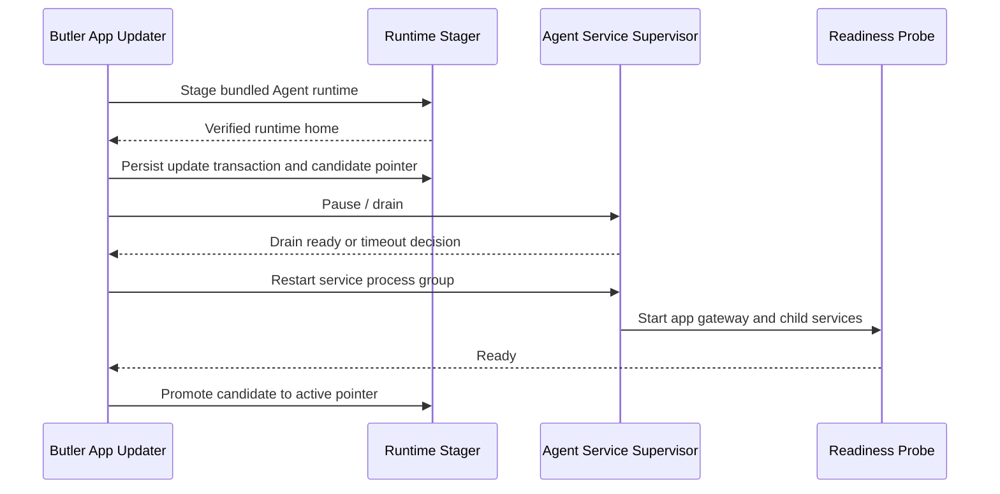

# Butler App Background Service Update And Restart

## Status

Planning. This spec defines how Butler App updates affect the background Agent
service process group.

## Goal

When Butler App bundles a new Agent runtime, update must stage the runtime,
switch the active pointer safely, restart the Agent service process group, and
roll back if readiness fails.

## Update Classes

### UI-Only Update

Use when the App UI changes but the bundled Agent runtime and gateway protocol
remain compatible.

- Install new App UI.
- Do not restart the Agent service by default.
- Reconnect the UI to the existing app gateway.
- Show compatibility failure if the existing service is outside supported
  protocol bounds.

### Agent Runtime Update

Use when the bundled Agent payload changes.

- Stage new App-managed Agent runtime without mutating the active pointer.
- Verify manifest, archive, dependency closure, and checksum.
- Pause or drain service-owned work.
- Write a crash-safe update transaction and candidate pointer.
- Restart the Agent service process group.
- Verify service readiness.
- Promote the candidate pointer to the active pointer only after readiness
  succeeds.
- Roll back the transaction and restart the previous service if readiness
  fails.

### Protocol Update

Use when the UI/app gateway protocol changes.

- Enforce protocol compatibility before opening the workspace.
- If the old service is incompatible, update and restart the Agent service
  before the UI enters the workspace.
- If rollback is required, the App UI must show the rollback state and service
  version.

## Restart Contract

Restart must target the service supervisor, not individual child processes,
because child processes must agree on Agent version, runtime, environment, and
gateway protocol.

Restart must also be bounded and observable:

- Stop must wait until the previous service process group exits.
- Stop must verify child pids are dead or no longer owned by the service state.
- Stop must verify the app gateway port has been released before start.
- Stop must escalate from `SIGTERM` to `SIGKILL` after a bounded timeout.
- Restart must fail closed if the previous process group cannot be stopped.
- Service state must not be removed before stop outcome is known.

## Runtime Pointer Transaction

The Phase 0 source of truth for update status names, transaction fields, and
candidate boot token fields is
`packages/butler-app/scripts/background-service-contract.ts`.

The active runtime pointer and staged candidate pointer must be separate files.
The App must persist an update transaction before service restart:

- `active`: the last readiness-confirmed runtime.
- `candidate`: the staged runtime being tested.
- `transaction`: update generation, previous active pointer, candidate pointer,
  update status, started timestamp, and last error.

Crash recovery rules:

- If the App dies before candidate readiness succeeds, the next service start
  must use the active pointer, not the candidate pointer.
- If the App dies after candidate readiness succeeds but before cleanup, the
  transaction may be resumed and promoted only when readiness proof exists.
- If readiness fails, rollback restores active pointer and removes candidate
  selection from service boot.
- Transactions must be generation-locked so stale updater instances cannot
  overwrite a newer active pointer.

## Service Runtime Resolver

Normal service boot must resolve only the active pointer. Candidate runtime boot
is allowed only during an update transaction and only with a one-shot,
generation-locked candidate boot token.

Candidate boot rules:

- The updater writes a transaction containing the candidate pointer and a
  single-use boot token.
- The service-control layer passes that token to the service restart request.
- The service runtime resolver may use the candidate pointer only when the
  token, transaction generation, and candidate digest all match.
- The token is consumed when the candidate service start is attempted.
- If the App, updater, or service dies before readiness proof is persisted, the
  next normal service boot must ignore the candidate and use the active pointer.
- Candidate readiness proof is required before candidate promotion to active.
- A consumed token cannot be replayed by an older updater instance.

## Drain Policy

The service supervisor needs an explicit update state:

- `idle`: normal operation.
- `update_available`: update can be staged.
- `staging`: candidate runtime is being verified without pointer mutation.
- `draining`: new work is blocked; existing critical work may finish.
- `restart_required`: runtime pointer is staged and service restart is required.
- `restarting`: process group is being restarted.
- `candidate_ready`: candidate runtime has passed service readiness and can be
  promoted.
- `promoting`: active pointer promotion is being committed.
- `ready`: update complete.
- `rollback`: new runtime failed and previous runtime is being restored.
- `failed`: update requires user recovery.

Critical work should get a bounded drain window. Non-critical background work
can be interrupted and retried after restart.

## Rollback Policy

The App-managed active pointer must preserve the previous runtime. On failure:

1. Mark failed activation.
2. Discard the candidate pointer and keep or restore the previous active
   pointer.
3. Restart the Agent service process group from previous runtime.
4. Verify previous readiness.
5. Report rollback result to the UI/tray.

If rollback readiness also fails, the UI must keep the workspace gated and show
service diagnostics.

## Service Control API

Electron should not shell out ad hoc from product UI components. It should call
a narrow service-control bridge owned by the Electron main process:

- `getAgentServiceStatus`
- `installAgentService`
- `startAgentService`
- `stopAgentService`
- `restartAgentService`
- `prepareAgentRuntimeUpdate`
- `applyAgentRuntimeUpdate`
- `rollbackAgentRuntimeUpdate`
- `readAgentServiceDiagnostics`

The bridge must return structured, redacted status objects.

## Success Criteria

- Agent runtime update restarts the whole service process group exactly once.
- Agent runtime update never boots from an unverified candidate after an App
  crash.
- Candidate runtime boot is possible only through a generation-locked one-shot
  token during an active update transaction.
- Restart waits for old process group exit and app gateway port release before
  starting the new runtime.
- UI-only update does not restart the service unless protocol compatibility
  requires it.
- Failed Agent runtime update restores the previous runtime pointer.
- App gateway readiness is checked after restart before the workspace opens.
- Update status survives App UI restart.
- The tray/menu bar can show `updating`, `restarting`, `rollback`, or `failed`.

## Validation Targets

- `bun test tests/unit/app-background-service-contract.test.ts`
- Unit test for runtime staging without pointer mutation.
- Unit test for active/candidate pointer transaction recovery.
- Unit test that normal service boot ignores candidate pointer.
- Unit test that candidate boot requires and consumes a generation-locked
  one-shot token.
- Unit test for pointer promotion and service restart ordering.
- Unit test for bounded stop wait, pid death verification, port release, and
  kill escalation.
- Unit test for rollback when readiness fails.
- Unit test that UI-only update does not restart the service.
- Unit test that protocol update blocks workspace until service readiness.
- E2E update smoke with a fake previous runtime and fake next runtime.
- Release smoke proving App artifact contains service-capable Agent runtime
  metadata.
