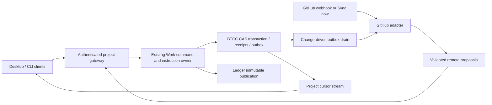

# Shared Project Ledger and GitHub Projects sync

Status: research/design proposal; no product implementation. Date: **2026-10-03**.
Issue: [#478](https://github.com/Hexpy-Games/butler/issues/478). Branch: `codex/ledger-sync-research`.
Code baseline: `10b68356da71fafdd3c5551ef7cb62d51ee35da3`; paths below use that commit.
Required architecture: [approved work model](https://github.com/Hexpy-Games/butler/blob/0df4b6203b82922fc77cadd2cd41e7fac79d0b35/plans/work-model/work-model-design.md), especially lines 69–79, 104–124, 166–190, 206–289. This proposal adds remote collaboration; it does not claim the approved model already ships.

## 1. Request, scope and recommendation

> work ledger에 remote ledger 기능을 추가할까 해. 오픈소스 프로젝트나 모두가 같이 접근해서 사용하는 프로그램의 경우에는 원장 상태를 모두가 같게 유지해야 할 수도 있잖아. 그래서 ledger를 외부의 Jira나 GitHub, Obsidian과 같은 기능과 동기화해서 쓸 수 있는 기능이 있으면 좋을 것 같아. 그 일환으로 특정 프로젝트의 ledger를 GitHub Project와 동기화해서 사용하는 기능도 검토해줘.

Provide opt-in, per-project shared work state with GitHub Projects v2 + Issues first; reuse the same reconciliation contract for Jira, Obsidian and Markdown/git later.

**Recommend one designated Butler project authority, with local drafts and offline reads.** The authority is an ordinary agent hosting that project's Ledger and BTCC transaction lane, initially the owner's machine. Other users connect to that authority; they do not synchronize SQLite files. GitHub is the collaboration surface and source of external requests, not a second executor. This is **remote-authoritative for participating clients' executable state**, not unrestricted local-first multi-master execution. The authority itself remains usable when GitHub is unavailable, with an explicit remote freshness state.

Two-way means remote edits become revision-checked instructions and accepted Butler revisions are published back. **MVP outbound updates append revision/proposal comments; they do not automatically replace existing shared issue bodies or board fields.** GitHub does not document CAS for those updates (§3). Thus native board Status and Butler execution status may differ, visibly. Do not market the MVP as an automatically identical board. Native automatic mirroring requires a stronger write contract and is an owner scope decision (§11), not an implementation shortcut.

Goals: converge admitted changes from several users/agents; preserve exact Specs and completion evidence; disclose conflicts/offline lag; zero sync activity when unchanged; complete, bounded replay.
Non-goals: SQLite/WAL file replication, CRDT execution graphs, arbitrary plugin execution, automatic conflict wins, GitHub Actions as the scheduler, cross-Plan execution dependencies, transcript/memory sync, or live owner-data migration in this task.

## 2. Current code and required seam

Notation: `L/` = `packages/project-ledger/`; `R/` = `packages/butler-agent/rust/`; `UI/` = `packages/butler-app/client/ui/src/`. These are inspected source references, not runtime measurements.

| Finding | Evidence and implication |
|---|---|
| Ledger resolves configured external storage and project identity; fallback can be repo-local. | `L/src/fs.js:32`, `:96`, `:116`, `:135`: use resolved project ID; never infer shared identity from checkout basename. |
| Markdown/frontmatter source records, derived index/views, and event log already exist. | `L/src/constants.js:3`, `:5`, `:20`; `L/src/fs.js:247`; `L/src/records.js:14`. Kinds: initiative, work, task, attempt, decision, risk, spec, report, plan, handoff, reference, roadmap. |
| CLI includes generic record CRUD and Work/Task lifecycle aliases. | `L/src/cli.js:18`, `:38`, `:156`; `L/src/record-commands.js:186`, `:223`. All managed state commands must route through the approved work service; raw Markdown updates cannot remain a bypass. |
| Publication has expected hashes, sparse before/candidate records, claim/journal recovery, and no-op comparisons. | `L/src/transactions/record-publication.js:9`, `:55`, `:71`, `:85`; `R/crates/butler-ledger/src/project_ledger/publication.rs:29`, `:46`, `:70`. Reuse publication/recovery, then add retained immutable Spec revision refs; current generic updates are not proof of immutable Spec history. |
| A whole-project source-head computation walks and hashes source/storage entries. | `L/src/transactions/source-head.js:14`; `L/src/storage-authority.js:3` explicitly excludes `github-issues.json`. Neither that export nor repeated root hashing is a sync authority/change detector. |
| Current project Work publication and session Work storage differ. | `R/crates/butler-agent/src/host/guided/scope_selected_work.rs:49`; `R/crates/butler-ledger/src/project_ledger/work/start.rs:16`; `R/crates/butler-turn/src/btcc/storage/schema/work.rs:3`, `:54`. Do not copy the current actions JSON as the future Task model. |
| BTCC already serializes SQLite work; project runtime uses immediate transactions. | `R/crates/butler-turn/src/btcc/storage.rs:132`; `R/crates/butler-turn/src/btcc/storage/project_work_runtime.rs:57`. Place admitted sync receipts/outbox in this lane, never network I/O inside its transaction. |
| Queue settings and event streams exist, but approved Task-boundary instruction semantics are a dependency. | `R/crates/butler-gateway/src/gateway/application/settings/update/patch/sanitize.rs:127`; `gateway/application/queue_dispatcher.rs:268`; `gateway/http/read_routes.rs:94`, `:112`. Cursor transport can be reused, with new project-scoped authorization. |
| Platform credential stores already cover all target OSes, with a file backend too. | `R/crates/butler-platform/src/secrets.rs:1`, `:40`, `:50`, `:132`, `:167`. Sync production policy explicitly requires a system backend; do not inherit the file default. |
| DS has the needed settings, list, diff and status building blocks. | `UI/libs/design-system/index.ts:93`, `:113`, `:123`, `:149`; DS skill catalog recipes. No new CSS/component system is needed. |

Work-model prerequisite: publish immutable Spec body first; verify Ledger revision ID + SHA-256; activate its pointer/tree and Plan/Work/Task deltas atomically in `agent-runtime/btcc.sqlite`. Published-but-inactive revisions survive failure. Sync sends typed operations and exact revision refs, never overwrites the files behind an executing Task.

## 3. Primary-source findings and option comparison

All external sources below were accessed **2026-10-03**. They describe the public GitHub.com/Jira Cloud surface on that date, not proof of availability on every enterprise installation. Recheck capability fixtures at implementation time.

| Source | Verified fact; design consequence |
|---|---|
| G1: [Projects API guide](https://docs.github.com/en/issues/planning-and-tracking-with-projects/automating-your-project/using-the-api-to-manage-projects) | GraphQL supports project items and custom fields. Adding an existing content item returns its item ID; adding and updating require separate calls. Assignees/labels/milestones belong to Issues, not project field mutation. `REDACTED` items exist. |
| G2: [Sub-issue REST API](https://docs.github.com/en/rest/issues/sub-issues), [limits](https://docs.github.com/en/issues/tracking-your-work-with-issues/using-issues/adding-sub-issues) | Parent/sub-issue listing, adding, removing and reprioritizing are public APIs. Native hierarchy is finite (100 children per parent, eight levels); do not truncate larger Ledger trees. |
| G3: [Issue dependencies REST API](https://docs.github.com/en/rest/issues/issue-dependencies) | `blocked_by` and `blocking` reads, add/remove dependency writes exist; IDs in write bodies are numeric issue IDs. Read/write Issues permissions apply. A sub-issue is containment, not a prerequisite. |
| G4: [GraphQL Issues schema](https://docs.github.com/en/graphql/reference/issues#updateissueinput), [Projects schema](https://docs.github.com/en/graphql/reference/projects#updateprojectv2itemfieldvalueinput), [REST best practices](https://docs.github.com/en/rest/using-the-rest-api/best-practices-for-using-the-rest-api) | Update inputs expose no expected revision; conditional unsafe REST methods are unsupported unless an endpoint says otherwise. GET ETags and `clientMutationId` are not write CAS/idempotency guarantees. Read-before-write plus read-after-write cannot close the human-edit race. |
| G5: [Webhook events](https://docs.github.com/en/webhooks/webhook-events-and-payloads#projects_v2_item), [webhook types](https://docs.github.com/en/webhooks/types-of-webhooks) | Project v2 item events are organization-level and documented as public preview; no user-account webhooks. Personal Projects require on-demand reconciliation. Repo Issues hooks alone cannot observe every board-field edit. |
| G6: [Failed deliveries](https://docs.github.com/en/webhooks/using-webhooks/handling-failed-webhook-deliveries), [signature validation](https://docs.github.com/en/webhooks/using-webhooks/validating-webhook-deliveries) | Failed deliveries are not automatically redelivered. Verify raw-body HMAC-SHA256 before accepting a webhook. A Butler event cursor is our durable log, not a GitHub global change cursor. |
| G7: [GraphQL rate/query limits](https://docs.github.com/en/graphql/overview/rate-limits-and-query-limits-for-the-graphql-api) | Primary cost and secondary limits both apply; connections require pagination and queries have a node limit. Use returned cost/remaining/reset, not request count alone. |
| G8: [GraphQL authentication](https://docs.github.com/en/graphql/guides/forming-calls-with-graphql), [fine-grained permissions](https://docs.github.com/en/rest/authentication/permissions-required-for-fine-grained-personal-access-tokens), [installation tokens](https://docs.github.com/en/apps/creating-github-apps/authenticating-with-a-github-app/generating-an-installation-access-token-for-a-github-app) | Fine-grained tokens are supported by GraphQL and relevant REST endpoints, including organization Projects. Installation tokens can be restricted to repositories/permissions and expire after one hour. Probe the chosen owner/API combination; do not claim all PATs lack Projects support. |
| G9: [Projects REST](https://docs.github.com/en/rest/projects/projects), [Project fields REST](https://docs.github.com/en/rest/projects/fields) | Current REST also exposes Projects v2 and fields. GraphQL is a batching choice, not the sole Projects API; REST is an adapter fallback after capability validation. |
| J1: [Jira issues v3](https://developer.atlassian.com/cloud/jira/platform/rest/v3/api-group-issues/), [webhooks](https://developer.atlassian.com/cloud/jira/platform/rest/v3/api-group-webhooks/), [rate limiting](https://developer.atlassian.com/cloud/jira/platform/rate-limiting/) | Issue fields/transitions, ADF text and webhook contracts differ. REST-registered hooks expire after 30 days; event-driven renewal/explicit reconnect must expose expiry, not introduce polling. Honor returned retry/rate headers. |
| O1: [Obsidian Vault API](https://docs.obsidian.md/Plugins/Vault) | A vault is a local folder; `Vault.process` provides a synchronous read/modify/write boundary. This is not a shared server or a cross-device execution lock. |
| V1: [Git push](https://git-scm.com/docs/git-push) | Ref update rejection/explicit expected-ref leases support publication conflict detection. A git commit records a document snapshot, not live Task execution ownership. |

| Option | Benefit | Cost / decision |
|---|---|---|
| Copy Ledger folder / git-only | Familiar offline Markdown and review history. | Cannot coordinate SQLite Tasks, effect leases or private fields. Use later for document exchange only. |
| GitHub is all-record authority | Users already collaborate there. | Mutable issue text cannot pin immutable Spec acceptance; close/Done cannot prove reviewed completion; no general CAS. Reject for execution truth. |
| Peer local-first state + CRDT/LWW | Every machine can edit and execute offline. | Text convergence does not preserve DAG, grants, single Task leases or completed evidence. LWW loses intent. Reject for MVP. |
| One Butler authority + local proposals + adapters | Reuses approved CAS/queue/fencing and gives clients one ordered result. | Authority must be reachable for admitted state changes; local drafts remain available. **Selected.** |
| GitHub App / fine-grained PAT | App: scoped installation, webhook identity, short-lived token. PAT: simple owner setup, useful on-demand mode. | App needs a controlled signer/webhook endpoint; PAT has user coupling, expiry/SSO/organization approval. Prefer self-hosted App for org projects; PAT fallback after permission probe. |

## 4. Authority, convergence and offline semantics

`project_id` identifies shared scope independent of local directories. Binding names `authority_id`, endpoint, public identity and epoch. The authority owns its **local** Ledger + BTCC; all other Butler installations treat accepted snapshots as remote-authoritative and cache only authorized projections.

| Record / field | Authoritative owner in remote-synced mode | Other representations |
|---|---|---|
| Spec revision body, parts, criteria, lineage | Authority's immutable Project Ledger publication | Hash-verified replica; optional explicit public revision artifact. GitHub/Obsidian edits are candidate revisions, never in-place mutations. |
| Spec active pointer, tree membership, lifecycle/grant | Authority's `btcc.sqlite` | Read-only project snapshot; no auto-activation from a watcher/webhook. |
| Plan order/dependencies/milestones and Work/Task structure/state | Authority's `btcc.sqlite`, existing domain commands | Markdown and GitHub revision comments are exports. Remote state changes are requests checked against current revisions and evidence. |
| Attempts, reviews, leases, instruction receipts | Authority's BTCC; private by default | Only deliberately selected outcome summaries may leave Butler; never copy the database. |
| Decision, risk, initiative, report, handoff, reference, roadmap | Existing Ledger owner on the authority; explicit per-kind opt-in revision publication | Default off. Decision/supersession history retained; roadmap prose can be linked from Plan without duplicating its mutable state. |
| GitHub title/body, assignees, labels, milestone, native Status | GitHub owns its editable collaboration fields | Stored as an observed remote shadow. Mapped desired changes become Butler proposals; shadow is not executable state. Butler proposals back to these fields are append-only comments in MVP. |
| Remote mappings, sync receipts/outbox/cursors | Authority's BTCC transaction lane | Per-client read cursor/cache only; no client can elect itself writer on disconnection. |

Convergence example: Alice and Bob edit Task T at revision 12. Authority admits Alice's command at sequence 101 → revision 13. Bob's expected revision 12 yields conflict with base/local/remote refs; disjoint text edits can produce a fresh, validated three-way merge operation at revision 13. Overlapping text, status, edges, assignee and activation changes require explicit resolution. After replay through sequence 102, all authorized clients see the same graph/hash or the same unresolved conflict, regardless of delivery order or duplicate messages. Remote arrival time never substitutes for a CAS revision.

Only the designated authority runs managed shared Tasks in MVP; several users/agents/sessions on it share existing exclusive Task leases. Remote worker execution is a later work-model transport feature, not quietly enabled here. Authority restart retains identity/epoch and settles active plus queued work. Moving the authority requires explicit quiesce/export/import, old host revocation and epoch advancement; no automatic takeover while the old host may still execute.

Offline clients may read cached state, author unactivated Spec candidates and queue local proposals with base revision. They cannot start shared effects, complete Tasks, activate Specs or report queued proposals as applied. Reconnect uploads exact proposals, fetches missing immutable bodies and revalidates grant/base. Authority can execute its accepted graph during GitHub downtime; missing remote information is shown as “Last synced …”, not current remote truth. External edits do not have immediate stopping power while disconnected; projects needing that guarantee must require a successful on-demand refresh before new Work admission, and still cannot claim instantaneous remote cancellation during an outage.

## 5. Architecture and data/API contracts



Implementation ownership: provider-neutral contracts in existing Work domain/ports; sync orchestration composed by `butler-agent`; adapters in a small `butler-sync` crate depending on contracts, never on UI/gateway. BTCC retains SQL ownership; `butler-ledger` retains publication. Gateway authenticates and projects. OS credentials, file notifications, path safety and process/resource measurement belong **only in `R/crates/butler-platform`**. Use safe crates; no `unsafe`; files ≤500 lines, production functions ≤80. Blocking Ledger/vault/credential operations use the existing blocking lane/`spawn_blocking`.

Proposed persisted contracts (schema `ledger-sync.v1`; additive migrations, not a new database):

```text
Binding {id, project_id, revision, authority_id, authority_epoch,
 adapter, host, owner_node_id, repo_node_ids[], remote_project_id,
 mode: on_demand|webhook, credential_ref, mapping_version,
 field_map, identity_policy, export_allowlist, inbound_grants, state}
RemoteIdentity {binding_id, entity_kind, ledger_id, remote_node_id,
 numeric_issue_id?, issue_number?, project_item_id?, remote_url}
Shadow {binding_id, remote_node_id, observed_hash, etag?, updated_at?,
 field_values, base_local_revision, base_text_ref, visibility, deleted?}
SyncOperation {id, binding_id, authority_epoch, entity_id, instruction_id,
 expected_local_revision, base_remote_hash, payload_hash, direction,
 state: prepared|sent|confirmed|unknown|conflict|rejected, remote_receipt?}
Inbox {binding_id, delivery_id, resource_ids, payload_hash, received_seq}
Conflict {id, binding_id, entity_id, fields, base_ref, local_ref, remote_ref,
 expected_revision, resolution_operation_id?}
Cursor {binding_id, stream_generation, contiguous_sequence, recovery_state}
```

Unique keys: `(binding_id, remote_node_id)`, `(binding_id, entity_kind, ledger_id)`, `(binding_id, delivery_id)`, operation ID + payload hash. IDs are immutable; URLs/numbers/logins are aliases. Keep issue node ID, numeric ID and item ID distinct. Permission-filtered cursor sequence must not reveal another project's IDs/counts. Account mappings key on provider + immutable account ID, never email/display name; explicit mapping grants project role, not global Butler owner rights. Session assignment stays private and separate from public human assignee.

Adapter port: `capabilities`, `discover`, `read_snapshot(cursor)`, `read_resources(ids)`, `decode_event`, `plan_export`, `execute_operation`, `reconcile_unknown`. Capabilities declare scope, paging, conditional-write guarantees, hierarchy/dependency support and webhook coverage; unsupported fields yield a visible incompatibility, never lossy success. GitHub/Jira network JSON is untrusted input. Adapters cannot write domain SQL or choose scheduler transitions.

Gateway proposal: `GET /projects/{id}/sync`, `POST .../sync/preview`, `POST .../sync/bind`, `POST .../sync/run`, `POST .../sync/conflicts/{id}/resolve`, `POST .../sync/disconnect`; project stream uses generation + sequence. Every mutation requires binding revision, operation ID, payload hash and actor scope; preview returns exact destination/visibility/counts/fields plus expiring content-hash token; bind revalidates that token and revisions. Pagination includes counts and completeness; `partial`, `permission_blocked`, `conflict`, `waiting_remote`, `current_through` differ from success.

CLI proposal: `project-ledger remote preview|bind|status|sync|conflicts|resolve|disconnect --project ... --json`, forwarding to the same service. No credentials in argv. Generic record import/update must consult project binding and route managed mutations through Work APIs. A disconnected service allows Spec drafting/publication only; activation waits.

Persist accepted domain mutation, receipt, affected resource IDs and outbox in one BTCC transaction. Publish Spec bodies before that transaction. Drain on commit notification/startup pending-row lookup; page by `(binding_id, sequence)` and serialize writes per binding. Persist each external step receipt, then continue dependent steps. Crash after remote acceptance before local receipt yields `unknown`: query its recorded marker/ID before resending; `clientMutationId` alone does not make a create safe. If exhaustive addressed reconciliation cannot decide, stop that operation with a recoverable ambiguity instead of creating duplicates. Other unrelated operations continue.

## 6. GitHub first deliverable: one repository + one project

Start with one selected organization Project v2 and one repository; personal Projects support on-demand only. Import PR/draft/redacted items as reference/inbox entries, not executable Tasks. Users choose exact items; additions outside the bound subset are suggestions until explicitly admitted. Do not configure project automation or repo permissions behind the user's back.

### 6.1 Exact mapping

`IN` means desired change → validated Butler instruction. `OUT` means a complete allowed revision/proposal → new immutable-by-policy comment, after initial issue creation. Shared native-field overwrites are disabled (§6.2).

| Butler entity/field | GitHub representation | Rule |
|---|---|---|
| Project binding | Project v2 node ID + repository node ID | One binding per project/remote tuple; repository and Project visibility checked independently. |
| Spec node/revision | Optional issue labeled `butler:spec`; each shared revision in a new comment with exact ID/revision/hash and criteria IDs | Off by default. Never store canonical Spec solely in issue body; edits propose a new Ledger revision. Private Spec means no body/title/hash/link export. |
| Plan | Issue labeled `butler:plan`, project item; body contains initial roadmap, pinned shared Spec refs | One Plan can contain multiple Works. Issue/milestone is not executable authority. Later roadmap revisions via OUT. |
| Work | Issue labeled `butler:work`, sub-issue of Plan issue, project item | Parent change IN requires explicit linked replacement across Plans; no automatic reparent of live/completed work. |
| Task | Issue labeled `butler:task`, sub-issue of Work issue, project item | Initial body: description + stable parts/acceptance refs. Imported bare issue stays proposal until valid Spec/criterion binding exists. |
| Record identity/kind | Initial issue body marker `butler-sync:v1` + kind label; optional `Butler ID` text and `Butler Kind` single-select fields | DB node-ID map is truth; markers are untrusted hints. Never identify by title. Existing labels preserved. |
| Status | Native project Status = requested state; revision comment = accepted Butler state | Explicit option-ID map; remote Done/closed is completion request, never sufficient evidence. Unknown option pauses mapping. |
| Exact execution state | Revision comment `state`, entity revision, blocked reason safe summary | Plan/Work `draft,ready,running,blocked,paused,stopped,needs_replan,needs_revalidation,completed,cancelled`; Task uses `pending,awaiting_review` and preserves completed history. |
| Dependencies | Native issue `blocked_by` edges where both ends are mapped; complete edge list in revision comment | IN validates same-Plan DAG and revision; unknown/cross-Plan refs remain external blockers, not executable edges. Work prerequisites expand to Task edges per work model. |
| Assignee | Native issue assignees ↔ public responsible-person IDs | IN requires identity mapping/grant. Never map GitHub bot assignment to automatic agent/session creation. Preserve all remote assignees; incompatible local cardinality is explicit conflict. |
| Acceptance criteria | Body checklist with stable `criterion_id`, exact public Spec revision refs; revision comments retain changed criteria | Checkbox ticks are desired/reported results, not accepted review evidence. Without exported private refs, use explicitly authored public criteria, never partial/private Spec excerpts. |
| Rank | Sub-issue priority within siblings / project item order as display | Mapping selects one rank source; does not infer dependencies or reorder completed history. OUT proposes rank change. |
| Milestone | Repository milestone ID mapped to Plan milestone ID | Selected explicitly; no automatic milestone creation/closing. Cross-repo milestones need later explicit maps. |
| Labels/custom fields | Allowlisted label IDs; optional selected fields keyed by field/option IDs, not names | No labels encode secrets or permission. Renames retain identity; deletion/type change requires remap. No blanket replacement. |
| Decision/risk/report/etc. | Optional separate labeled issue/revision artifact with links | Off for MVP; never include handoff/report automatically because it may contain private context. |

Default Status mapping: Todo → `ready` (Plan/Work) or `pending` (Task); In Progress → start/resume request; Review → `awaiting_review` request for Task; Done → complete request; Blocked → block request. New fields/options are never invented without preview. Reopen of a completed Task proposes a corrective Task linked by `supersedes_task_id`; historical completion remains. `cancelled` is never displayed as completed. Strict mode shows both requested and accepted states whenever different.

API plan (G1–G4/G9): GraphQL `node/projectV2`, paginated `items/fieldValues`, `addProjectV2ItemById`; REST `POST /repos/{owner}/{repo}/issues` and `.../issues/{number}/comments`. Hierarchy reads `GET .../issues/{number}/parent` and `/sub_issues`; writes `POST .../sub_issues {sub_issue_id}`, `DELETE .../sub_issue`, `PATCH .../sub_issues/priority`. Dependencies read `/dependencies/blocked_by` and `/blocking`, add `POST .../dependencies/blocked_by {issue_id}`, remove `DELETE .../dependencies/blocked_by/{issue_id}`. Pin REST version `2026-03-10` from accessed docs; save schema/query versions in fixtures. GraphQL field mutations require item ID + field ID + option ID; they are not safe conditional updates.

### 6.2 Initial import/export and two-way rules

1. Authenticate; probe selected project/repo permissions and fields; page the full selected membership and all nested lists. `REDACTED`, inaccessible references, unsupported hierarchy size and unknown statuses block affected imports; never silently drop them. Map native hierarchy only within its limits; larger trees retain all links in complete paginated revision artifacts and show native hierarchy as unavailable.
2. Preview exact records, outgoing content, public/private destinations, identity/status maps and proposed creations. Existing local and remote data are matched by saved IDs or explicit user pairing; no fuzzy title joins. Imported issues lacking Specs enter an inbox. An authorized request can author/activate a brief/full Spec using normal tier rules without a redundant approval.
3. Import into staging, then commit a validated graph revision atomically. Export first persists operation markers, creates issues with initial allowlisted content, adds project items, and records receipts. No “synced” claim until all required steps finish. Native field/hierarchy initialization is only allowed in a freshly created staging project whose sole writer is the authority; otherwise emit proposals for the user to apply in GitHub. The binding preview discloses this distinction.
4. Remote fetch compares shadow/base hashes. Unchanged resources produce zero domain/outbox writes. A changed native field is a proposed delta, checked against current local revision, scope, Spec coverage and grant. Issue deletion/archive/removal detaches its remote representation; it never deletes Specs or completes/cancels Tasks. Transfers follow stable identity only after new destination permission/visibility validation.
5. Local accepted changes publish a new revision comment with operation ID, base revision, changed fields, full allowed values and exact public refs. Comments are append-only by Butler policy, but GitHub moderators can edit/delete them: verify hash/author/identity and flag tampering; authority retains canonical history. Imported bodies and comments never become executable instructions merely by containing a marker or mentioning Butler.
6. Text reconciliation uses retained base/local/remote text and a deterministic three-way merge. Nonoverlap may propose a merged revision, with provenance; overlaps present all three versions. Structured criteria, dependencies, activation and status use domain validation/CAS even if prose merges. Resolving a conflict requires current revision; stale resolution returns a new conflict, not a retry loop.
7. No shared native-field PATCH occurs in strict MVP, including updates to a “Butler-only” field that GitHub permissions cannot actually protect. A fresh GET followed by PATCH still races a human, and readback cannot recover an unseen overwritten edit. OUT comments carry requested changes and a GitHub deep link; user-applied remote changes return through IN. Automatic existing-field mirroring stays unavailable until an adapter proves conditional writes or an enforceable exclusive writer contract. This limitation is visible in setup and is tested, not hidden behind last-writer-wins.

This is a deliberately narrower, safe two-way exchange. It does **not** guarantee byte-for-byte equality with every GitHub display field or retain every intermediate GitHub edit while offline; the guarantee covers admitted Butler revisions, retained proposals and conflict visibility.

### 6.3 Remote changes during running Work

Authenticated provider actor maps to a narrowly scoped project principal. Under configured grants, a remote request enters the existing Instruction envelope as that **user principal**, with `origin_message_id=provider event/proposal ID`, scope, expected graph/entity/control revisions, idempotency key and pinned Spec refs. It is never an impersonated parent or privileged new sender. If actor attribution/permission is unavailable, retain an observation requiring an authorized project member's adoption.

Default imported request uses **Queue**: capture the current Task boundary at Tiers 1/2, current Turn at Tier 0; deliver FIFO before successor claim. A blocked/paused/stopped anchor retains the queue; cancellation returns `anchor_cancelled` for explicit redirection. Remote item deletion cannot release or discard it.

Explicit authorized **Steer** wakes/fences at safe points: before model request, after model response/before tools, after tool result, before wait/final/completion, on resume. Do not mutate an active Task underneath its current tool. Settle/cancel supported effects through the work model, then apply the delta. A remotely proposed Spec stays inactive until validated activation; activation invokes existing subtree/reverse-consumer invalidation and revalidation Tasks, preserving completed evidence. No extra model call merely to classify a webhook. Receipt states distinguish admitted, waiting, delivered, applied, rejected and needs-input.

## 7. Change detection, rate limits and storage

Triggers only: local committed outbox, authenticated webhook, explicit Sync now, or one resume/reconnect catch-up. No interval GET, filesystem scan timer, token refresh timer while idle, periodic heartbeat DB write or idle checkpoint. Local source edits are drafts until explicit publication; publication emits a changed-ID event. File notifications for future vault adapters are platform-owned.

Organization App mode: receive selected `issues`, `issue_comment`, supported sub-issue/dependency events and `projects_v2*` events as invalidation hints. Persist verified relevant delivery ID/resource IDs before 2xx; fetch current addressed state, not payload order. Subscribe to installation/permission changes. Missing event coverage is shown in capabilities; an on-demand snapshot remains the repair path. Personal Projects/PAT without organization hooks are on-demand, with honest last-sync state.

A self-hosted authority can expose a separate TLS webhook ingress; never expose the local control listener or embed a common App private key in desktop builds. A future relay stores tenant-scoped deliveries and streams cursor events to the authority; it is not an execution authority. Cursor gaps/expired history trigger one bounded resumable snapshot, not a polling loop. Reconnect reconciles membership, field definitions and all bound resource hashes, because GitHub cursors paginate lists rather than represent durable changes. G6 means missed webhooks may remain undetected until this explicit repair; no claim of guaranteed immediate convergence under lost delivery.

Serialize mutations; cap concurrent reads at 2, writes at 1 per installation; max 100 nodes/page, smaller pages for large bodies. Honor `Retry-After`, rate reset and GraphQL cost. One retry timer may exist only for pending work; after three failed transport attempts mark deferred and wait for connectivity/user input, never spin indefinitely. Mutation unknown-outcome reconciliation precedes resend. A 401/403 pauses affected binding; 404 is permission-or-missing until checked, never proof of deletion. GraphQL partial errors prevent cursor/completeness advancement for failed resources.

Storage: changed bodies stored once; indexed heads/shadows; immutable revision refs plus sparse outbox deltas, no 7 GB database export. Paginate long comments/criteria/edges; if provider size limit prevents a complete representation, use an explicitly allowed full revision artifact or block that export—never truncate. Tombstones/dedupe retained until all registered consumers acknowledge; expired offline consumers receive a new stream generation + snapshot. Compact receipts only after replay horizon and unresolved references permit it; no periodic vacuum.

Proposed acceptance budgets (targets, **not measured implementation results**):

| Scenario | Budget and mandatory correctness assertion |
|---|---|
| Quiescent 10 minutes, open/closed project UI, connected webhook stream | **0 sync HTTP requests, 0 source reads, 0 SQL write statements, 0 sync-attributable disk bytes** after startup settles. Compare against sync-disabled baseline; assert no outstanding operations were suppressed. Transport keepalive cannot write DB/files or call provider APIs. |
| Owner-scale background fixture | 7 GB BTCC, 1.3 GB app DB, 600+ chats/~300k events, 2,440 transcripts/1.5 GB (largest 290 MB), metrics >300 MB; sync touches none of those transcript/metrics bodies. Add 10k mapped entities, 50k edges, 1k Spec revisions. |
| Project sync status / first 100 rows | p95 ≤50 ms service time, ≤100 ms UI acknowledgement, 0 network calls, indexed reads; verify full total count, stable order, revision and explicit freshness. Remaining pages must be retrievable. |
| One changed entity, ≤16 KiB text, no nested overflow | ≤3 provider reads + 1 append-comment write after credential setup; local reconcile p95 ≤100 ms; webhook-receipt→projection ≤2 s with 100 ms fixture RTT and no backoff; complete values/refs and latest sequence asserted. |
| Explicit unchanged 10k-item snapshot | ≤102 GraphQL requests for fixture with ≤8 mapped fields/item and no nested overflow (2 discovery + 100 pages); **0 domain/outbox writes**. Nested overflow uses exactly its additional pages; never skip long assignee/edge/comment lists. |
| Changed publication SSD budget | For the 16 KiB single-entity fixture, ≤512 KiB incremental durable write bytes including WAL/receipt/artifact at authority, bounded memory ≤64 MiB above baseline; assert hash/readback, pending receipts and counts. Fix amplification, not durability. |
| 1,000-item export with initial staging fields | Request bound `setup + N create + N add-item + F field writes + E edge writes + P verification pages`; print measured N/F/E/P and GraphQL points. Max 500 requests or 1,000 points per run, then resumable continuation with exact remaining count. Never call a partial export complete. |

Initial hydration is an explicit streaming background job; no full scan on UI/request path. Timed scenarios assert counts, field equality, DAG/order, latest revisions and privacy exclusions before passing. Measure writes/resource counters through `butler-platform`; no platform-specific `/proc` code outside it. No latency budget relaxations or retries to make performance tests pass.

## 8. Security and privacy

- Disabled by default, enabled per project and destination. Preview actual issue/comment content, titles, labels, assignees, acceptance text and visibility; default only selected Work/Task public descriptions/results. Specs and all other record kinds default private. A private repo does not imply a private Project or vice versa. Scope expansion/destination change requires a new preview; ordinary in-scope revisions use the stored grant.
- Never export transcripts, memory, prompts, hidden reasoning, raw tool output, credentials, session IDs, local filesystem paths, private Spec names/hashes/links or implicit attachments. Explicit public summaries are separately authored content, not secret redaction by regex. Current `L/src/constants.js:70` patterns are supplementary detection only. Fail closed on mixed private dependencies/criteria rather than dropping them; show exactly which record needs a public contract or must remain unsynced.
- App minimum: selected-repository Metadata read and Issues read/write, organization Projects read/write when exporting items; read-only import uses read permissions. No Contents/Actions/Administration permission by default. Artifact git export requests Contents write separately. Organization-level Projects permission can exceed one project; Butler enforces the binding allowlist on every call. PAT capabilities/SSO approval are probed; no automatic classic-token escalation.
- Production tokens, refresh material, App signer secrets and webhook secrets use `butler-platform::secrets` system Keychain/Secret Service/Credential Manager; DB stores opaque `credential_ref` only. Unavailable/locked OS store → “Unlock credentials”, no file fallback. Short-lived installation token stays in memory and refreshes on actual work. Never print tokens, put them in URLs/argv, sync them, or return them to renderer/model. Tests use isolated fake/file backend only.
- One dedicated integration identity signs outbound operations. Pair clients through existing authenticated transport plus project ACL, with viewer/editor/Spec-author/operator rights; repo write access alone does not grant shell/tool effects. Verify provider actor per admitted request; events without trustworthy actor are observations. Revocation blocks new admissions, invalidates cached grants and fences affected active authority at its next safe point.
- Verify webhook raw-body HMAC with constant-time comparison; dedupe delivery IDs; reject wrong installation/project/host. TLS only; allowlist provider hosts; no credential forwarding across redirects. Limit ingress memory and durable queues; reject overload for redelivery/reconciliation, do not acknowledge dropped data. Authenticate cursors and prevent cross-project subscriptions.
- Provider prose is untrusted data: no command execution, automatic URL fetching, HTML execution or remote “system prompt”. Structured requests are validated against role, Spec and effect grants. Disconnect stops transport/exports and revokes integration credentials where appropriate; local history stays, already shared remote content cannot be recalled by pretending disconnect deletes it.

## 9. UI and later adapters

Project page → **Sync**; global Settings contains account/credential management only. Use public `@/butler-ds` APIs from the read skill/catalog: `SettingsPage` → `SettingsSection` → `SettingsField`, `Select`/`FilteredSelectPopover`, `Input`, `Switch`, `DialogForm`, `ListRow`, `StatusCapsule`, `ChangedLineDiff`, `Typo`, `Button` + matching `ButtonContainer`, `Toaster`. Containers own commands and mapping; DS owns presentation. No raw controls, new CSS, `className`/inline styles, banner or implementation jargon.

Flow: “Connect GitHub” → choose repository/Project → Import / Export / Link existing → map fields/people → choose exact shared records → preview → “Connect”. Preview discloses “Updates posted as comments” and exact native writes if staging. Default Specs off; private dependency incompatibility has a disabled action + tooltip. Show “Synced”, “Pending 3”, “Conflict 1”, “Offline”, “Partial 20/100” with last observation time, and distinguish remote requested Status from accepted Butler progress. “Sync now”, “Review changes”, “Disconnect” are explicit actions.

Conflict dialog uses base/local/remote text and actor/revision; actions “Use local”, “Use remote”, “Merge” produce revision-checked proposals. They do not silently enable unsafe GitHub field replacement. Current Work shows queued request at its Task boundary and offers authorized “Apply now” (Steer); remote sync never adds a second todo list or editable graph contrary to work-model design. Announce pending/applied via accessible status/brief toast; keyboard navigation/focus restore, light/dark and 320/375/390/430px + desktop smoke coverage.

| Later adapter | Mapping and trigger | Trade-off / acceptance boundary |
|---|---|---|
| Jira Cloud | Spec/Plan as linked requirement/epic conventions, Work issue, Task subtask; issue links for blockers; project-specific field/transition IDs; accountId identity; ADF conversion; webhook or on-demand | Discover issue types/workflows; do not assume every hierarchy/custom field or conditional update exists. Lossless ADF/Markdown conversion or explicit unsupported-content conflict. Renewal only for configured subscriptions; expose expired hooks and repair on demand. |
| Obsidian vault | Explicit folder, Markdown frontmatter IDs/spec refs; `Vault` events/plugin or platform file notifications; new revision files and proposals | Local document adapter, not Obsidian Sync protocol integration. `Vault.process` guards cooperating plugin writes; external writers still need hash check/conflict copies. Never sync `.obsidian`, attachments or whole vault implicitly. Watch overflow → one on-demand rescan. |
| Plain git Markdown | Dedicated directory/ref; immutable revision files + manifest/proposals; fetch/push on request or push webhook | Expected ref/non-fast-forward conflict → merge proposals with retained base; no force overwrite. No commits of SQLite, transcripts or secrets. Repo review is good for Specs; not a distributed Task scheduler. |

## 10. Phased branches and acceptance

Each branch starts from the coordinator's integrated dependency tip; no merging of research branches in this task. Implementation is gated on the approved work-model publication/activation, canonical Task DAG, instruction protocol and recovery being implemented; do not build a second legacy state owner first.

| Branch | Deliverable / acceptance / E2E or smoke |
|---|---|
| `codex/ledger-sync-contracts` | Schema, authority binding/epoch, indexed projections, privacy exporter, operation/conflict contracts. **LS-01:** two clients same-base mutation → one accepted, one explicit conflict; replay identical; no Spec-less Task and no mutable completed history. **LS-02:** publish-before-activate crash retains inactive revision. |
| `codex/ledger-sync-github-on-demand` | First vertical deliverable: one repo + Project preview/import/export, mappings, strict append-only OUT, typed IN, CLI and project UI, OS-store auth. **LS-03:** import → publish/activate → Work result OUT → authorized remote change IN → both clients converge. **LS-04:** full pagination/redacted/unknown maps/overflow, no hidden partial success. UI setup/conflict/offline smokes. |
| `codex/ledger-sync-recovery` | Production-safe continuation/three-way conflict resolution/unknown effects. **LS-05:** crash at each external step and before/after SQLite receipt; no duplicate issue/comment or silently resent unknown operation. **LS-06:** concurrent remote human edit during fetch/export preserved; zero PATCH to shared native fields; same-field conflict visible. **LS-07:** disconnect/reconnect, duplicate/out-of-order events, permission loss and private-data negative assertions. Required before broad rollout. |
| `codex/ledger-sync-github-events` | Self-hosted App ingress, durable cursor stream, capability/gap repair and bounded rate handling. **LS-08:** signature/replay/cross-tenant denial, missed delivery→explicit reconcile, personal Project on-demand fallback; no idle API traffic or writes. **LS-09:** all numeric §7 budgets with completeness assertions. |
| `codex/ledger-sync-work-control` | End-to-end remote Queue/Steer integration under grants, no new supervisor. **LS-10:** active A + queued B/C, remote Spec revision, safe-point Steer, shutdown/restart, blocked/cancelled anchor, late completion race; every receipt resolved/retained, no lost follow-ups/stale effects. Basic safe admission is required in the on-demand branch; this branch completes stress coverage. |
| `codex/ledger-sync-jira`, then `codex/ledger-sync-vault`, then `codex/ledger-sync-git` | Capability-specific adapters after shared conformance suite; one real vertical replay/local-temp-vault/temp-git E2E each. ADF fidelity, vault rename/overflow/symlink boundaries, git ref conflict; same privacy/CAS/no-idle-write guarantees. |

Fixtures: record sanitized GitHub REST/GraphQL HTTP + webhook traces from a dedicated disposable test repo/Project during implementation; preserve bodies, multi-page cursors, headers, actor IDs, ordering, errors and cost. Store request method/path/query/variables, API/schema version and expected complete semantic state. Strip credentials/signatures and synthesize test HMAC; replace names/IDs consistently without reducing relationships. CI uses a local fixture server, fixed clock and stub model, external egress disabled; no live GitHub or model calls. Capture is a separate explicit developer action, never an automatic missing-fixture fallback. Any model recording, if needed, uses only `openai/gpt-6-luna`.

Primary tests live in `R/crates/butler-e2e` on stub/replay; ≤8 threads. Non-E2E only `race`, `security`, `pure-logic`, `format-pin`, tagged and within shrink-only ratchet. Existing regression paths to run when implemented: `tests/unit/project-ledger-record-publication.test.ts`, `project-ledger-source-head.test.ts`, `project-ledger-cli.test.ts`, `project-ledger-state-machine.test.ts`; `R/crates/butler-ledger/tests/wire_formats/project_work.rs`; E2E `credential_store.rs`, `cli_surface.rs`, `queue_admission_shutdown.rs`, `queue_shutdown.rs`, `queue_pause.rs`, plus work-model tests at integrated tip. UI gets harness/smoke, no new unit tests/screen recordings.

Every test/check uses fresh temp HOME/BUTLER_DATA (and test credential backend), preserving real build cache paths only; clean created temp/target dirs. One cargo build, `-j 8`. Before implementation push: fetch main as delivery permits, fmt, clippy `-D warnings` on touched crates, source-check, and frozen Bun install/check for TS/UI. No owner home/data, live services or reserved ports.

## 11. Risks, owner decisions and self-review

Risks: authority outage limits shared editing/execution; GitHub notification loss delays convergence; webhook preview/enterprise capability differences; initial export needs many rate-limited calls; accidental public visibility and permissions are independent of graph correctness. Immutable authority history cannot recover remote content never observed. Human-edited board status is a request, not evidence. These limitations remain visible in setup/status and replay fixtures.

Real owner decisions before implementation:
1. **MVP interaction:** accept safe two-way proposals/revision comments with native board fields edited in GitHub (recommended), or require automatic native-field mirroring? The latter needs a proven exclusive-write/CAS design and expands scope; “never silent overwrite” cannot be relaxed implicitly.
2. **Shared host:** start with an owner/team-hosted Butler authority and self-hosted App/webhook ingress (recommended), or fund a hosted multi-tenant service/relay? Specify who operates it and may access shared data. On-demand mode needs no public ingress.
3. **Publication policy:** keep Specs private by default with explicitly authored public contracts (recommended), or adopt a project-wide public Spec policy for selected open-source projects? Both require an explicit per-project binding and exact preview.

Self-review completed for this proposal: preserves Ledger/BTCC owners and request-as-authoring-grant; no raw remote state activates Specs/completes Tasks; one Task/queue owner; CAS and immutable history; explicit GitHub CAS limitation; authenticated actor mapping; no background polling; quantified complete-response/SSD budgets; OS-only platform code; DS-only UI; stub/replay E2E with active + queued shutdown; phased acceptance and no unapproved product/owner-data mutation. Designs/targets are not presented as measured performance. No canonical Ledger publication: task authorizes repository design only, and owner data remains untouched.

Research closeout: searched open/closed issues for `ledger`, sync titles, `GitHub Project`, `remote ledger`, `Jira`, `Obsidian`; created one enhancement issue #478. Product implementation, recorded fixtures and LS-01–LS-10 measurements remain intentionally future work in §10; source inspection and design-rule checks are this branch's evidence.

Branch validation (isolated temporary HOME/BUTLER_DATA): `cargo fmt --all` passed (2.585 s); `cargo run -j 8 -p butler-source-check -- .` from `R/` passed (28.031 s including build, 2,181 Rust files, zero reported violations). A document audit resolved 19 explicit source file:line references and all ten LS acceptance IDs; `git diff --check` passed. No product/TS/UI crate changed, so runtime tests, clippy on touched crates and Bun/UI gates are not applicable to this design-only diff. The task-owned temporary target and check directories were removed; performance budgets above remain unmeasured until implementation.
