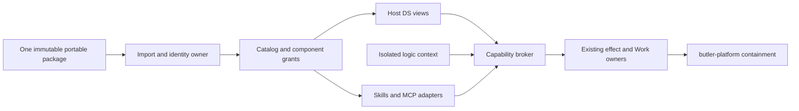

# Butler plugins: shared packages, separate execution boundaries

Status: research and proposed design; no product implementation. Date: **2026-10-03**.
Branch: `codex/plugins-research`. Issues: [#471 desktop](https://github.com/Hexpy-Games/butler/issues/471), [#472 agent](https://github.com/Hexpy-Games/butler/issues/472).
Owner requests, verbatim: **“버틀러 데스크탑앱 플러그인”**, **“버틀러 에이전트 플러그인”**.
English restatement: extend designated desktop UI surfaces and support existing agent plugin ecosystems.

## 1. Decision and scope

Recommend **one portable package and installation identity, with independently enabled app and agent components**. Adopt published **Agent Plugins 1.0.0** (`plugin.json`, `skills/`, `mcp.json`), adding a Butler client namespace for DS views, permissions and adapters. Do not invent a competing skills/MCP archive format. One package does not mean one process, one permission grant, or mandatory desktop execution.

Native first: Agent Plugins, Agent Skills and MCP. Import Claude/Codex packages into an explicit compatibility profile; preserve originals and report every unsupported component. AGENTS.md is scoped guidance, not executable packaging. MCP Apps/OpenAI UI is a separate HTML-hosting capability and cannot be advertised as supported under Butler's DS-only UI rule.

Goals: useful panels/settings/actions/renderers/themes; headless agent parity; auditable import/update/revoke; no extension-induced idle writes or polling; complete data at owner scale; versioned APIs with deterministic failure. Preserve the approved Work model and existing effect authority.
Non-goals: arbitrary DOM/CSS patches, third-party React/native library loading into Butler, full Claude/Codex runtime emulation, a new agent scheduler, automatic remote code installation from instructions, public marketplace operations in v1, or publishing this design into the owner's live Ledger.

| Arrangement | Benefit | Cost / decision |
|---|---|---|
| Two package managers | Each team can evolve independently | Duplicate identity, secrets, updates and revocation; coupled app/tool versions drift. Reject. |
| One package, one trusted module runtime | Simple API and broad customization | UI compromise reaches chat/auth; headless agent tied to Electron; signatures do not contain code. Reject. |
| One package, capability-separated components | One provenance/update flow; app-only, agent-only and combined installs | Requires component negotiation and cross-host identity. **Choose.** |

Example: a notes plugin provides an MCP search tool, a summarization skill and a DS inspector panel. Installing its panel never grants transcript export or starts its local MCP executable. Disabling the agent component disables tool-backed panel actions with a tooltip; static panel content remains usable. Uninstalling removes both registrations but retains user data unless deletion is explicitly selected.

## 2. Evidence from Butler

Baseline: `10b68356da71fafdd3c5551ef7cb62d51ee35da3` (`origin/main`). `R/` below means `packages/butler-agent/rust/`; `UI/` means `packages/butler-app/client/ui/src/`; `E/` means `packages/butler-app/client/electron/`. These are source observations, not executed security or performance findings.

| Observation | Verified file:line; implication |
|---|---|
| Desktop is Electron; its primary renderer enables context isolation/sandbox and disables Node. Preload exposes a large first-party bridge. | `E/main.mjs:2100`, `:2121`; `E/preload.cjs:1319`. Never give a plugin `window.butlerApp` or import it into that renderer. |
| Settings and inspector destinations are compiled lists. | `UI/components/settings/settingsSections.tsx:41`, `:98`; `UI/components/inspector/Inspector.tsx:46`. Add typed contribution slots, not source patching. |
| Composer owns draft/session/authority state; message content selects built-in renderers. | `UI/components/conversation/Composer.tsx:28`, `:71`; `UI/components/conversation/MessageContent.tsx:54`. Extensions receive narrow snapshots and submit actions through the host. |
| Appearance already uses controlled settings and DS themes. | `UI/app/types.ts:568`; `UI/app/utils.ts:3`. Themes need a DS-owned token contract, not plugin CSS. |
| MCP supports stdio, Streamable HTTP and legacy SSE; each operation creates a session. | `R/crates/butler-models/src/mcp_client.rs:1`; `mcp_client/transport.rs:46`; `mcp_client/session.rs:88`. Preserve existing transports while adding explicit version profiles. |
| MCP subprocess environment is cleared; process groups are isolated, but this launch path does not invoke a capability sandbox. | `R/crates/butler-models/src/mcp_client/transport.rs:95`, `:103`, `:113`. Process lifetime containment is not filesystem/network confinement. |
| MCP tools use the existing effect adapter and accepted-plan binding. | `R/crates/butler-agent/src/host/guided/tools/effect/mcp.rs:18`, `:60`. Extend this path; do not let UI callbacks bypass it. |
| MCP registry already guards data paths and resolves separate env/header secrets. | `R/crates/butler-agent/src/host/runtime/mcp_owner.rs:25`; `R/crates/butler-models/src/mcp_client/registry.rs:13`, `:47`. Reuse secret handling and data/install separation. |
| Skills have scoped catalogs, two blocking jobs and fingerprint caching. Metadata parsing is line-based; `allowed-tools` splits commas. | `R/crates/butler-runtime/src/skills.rs:26`, `:113`; `skills/catalog.rs:293`, `:320`, `:338`. This is not proof of full YAML/Agent Skills conformance. |
| Skill bodies load on demand; archive installation is already staged. | `R/crates/butler-runtime/src/capabilities/skill_tools.rs:57`; `R/crates/butler-runtime/src/skills/archive.rs:10`. Reuse owners, add package identity and transactional activation. |
| Existing discovery has completeness hazards. | `R/crates/butler-models/src/mcp_client/session.rs:22`, `:207` returns after at most 8 pages; `R/crates/butler-runtime/src/capabilities/skill_tools.rs:97` caps resource enumeration at 256. New package paths must page completely or return an explicit incomplete/error result; these caps cannot become plugin performance shortcuts. |
| Linux/Windows read-only command sandbox is explicitly unavailable; macOS has seatbelt-based read-only/write protection. | `R/crates/butler-platform/src/command_sandbox.rs:3`, `:32`, `:88`. None proves the proposed cross-platform capability sandbox. |
| Existing event stream and dedicated SQLite owner are reusable. | `R/crates/butler-gateway/src/gateway/http/read_routes.rs:112`; `R/crates/butler-turn/src/btcc/storage.rs:286`. No plugin polling daemon or independent Work state store. |

`R/Cargo.toml:58` pins `rmcp=3.4.0`. The locally cached dependency's `src/service/client.rs:637` distinguishes legacy `Initialize` from `Discover`/`Auto`; Butler calls `serve_client_with_ct`, not the explicit lifecycle API. Thus an SDK upgrade alone is not a demonstrated 2026-07-28 migration. Pin and test actual wire behavior before claiming support.

Searches across Rust crates found no `AGENTS.md` loader literal. This is a scoped absence finding, not proof that no model/tool can read that file. No generic plugin registry was found in the examined settings, inspector, composer, skill or MCP owners. The editor's `ComposerEditorPlugin` is a first-party editor integration, not a distribution mechanism.

Architecture authority: [approved Work-model design](https://github.com/Hexpy-Games/butler/blob/0df4b6203b82922fc77cadd2cd41e7fac79d0b35/plans/work-model/work-model-design.md), from `origin/codex/work-model-design`. At that commit, `plans/work-model/work-model-design.md:69`, `:192`, `:206`, `:291` (§2.1, §2.6, §3, §4) bind this proposal: immutable Ledger Spec revisions; mutable Plan/Work/Task/control in BTCC SQLite; Tier 0/1/2 via the existing router; request grants in-scope authoring, not new effects; all-depth Queue/Steer and Task-bound delegation. This design does not reopen those owner-approved decisions.

## 3. External research and compatibility choices

All primary sources in this section were **accessed 2026-10-03**. Published version labels are distinguished from moving documentation. Re-pin fixtures and source revisions on implementation branches; a vendor's published format does not imply runtime parity.

| Source and observed contract | Butler support / trade-off |
|---|---|
| [Agent Plugins 1.0.0 specification](https://agent-plugins.org/specification): published portable skills/MCP package, fixed discovery, client namespaces; permissions/distribution are host concerns. | Native package floor. Namespace `io.github.hexpy-games.butler` is proposed for Butler-specific data/files. Less bespoke tooling; conformance must follow normative failure boundaries, not just JSON Schema validation. |
| [Manifest schema](https://agent-plugins.org/schemas/1.0.0/plugin.schema.json), [MCP schema](https://agent-plugins.org/schemas/1.0.0/mcp.schema.json) and [client extensions](https://agent-plugins.org/plugin-authors/client-extensions): version-selected schemas and namespaced client objects/directories. | Bundle supported schemas locally; never fetch schemas at load. Butler API version is independent of package schema, package version and MCP protocol version. Unknown vendor namespaces are inert. |
| [Portable MCP runtime](https://agent-plugins.org/client-implementers/mcp-runtime): executable token plus argv; root/data variables; per-server failure isolation; credentials remain client-managed. | Normalize into existing MCP owner. Portable path containment is not a process sandbox. Preserve valid siblings when an individual server is invalid, while showing the failure. |
| [MCP 2026-07-28 specification](https://modelcontextprotocol.io/specification/2026-07-28), [maintainer release notes](https://blog.modelcontextprotocol.io/posts/2026-07-28/): stateless requests replace initialization/session IDs; discovery, routing headers, MRTR, list cache hints and extensions. Legacy HTTP+SSE is deprecated. | Native tools/resources first, explicit legacy and modern profiles. Rust wrapper migration/conformance needed. MRTR cannot silently retry a side effect; requests for elicitation re-enter authority. Poll-based Tasks extension is deferred under Butler's no-polling rule. |
| [Agent Skills](https://agentskills.io/specification): YAML frontmatter with name/description, Markdown body and optional scripts/references/assets; progressive disclosure; experimental space-separated `allowed-tools`. | Native. Use bounded, real YAML parsing; no YAML tags/aliases executing code. Preserve full bodies/resources through paging. `allowed-tools` constrains a granted set; it does not issue grants. Existing Butler comma syntax stays a named legacy profile. |
| [Claude manifest](https://code.claude.com/docs/en/plugins-reference), [components](https://code.claude.com/docs/en/plugins/components): `.claude-plugin/plugin.json`, commands/agents/skills/MCP/hooks and additional client features. | Import skills/MCP natively; commands become namespaced invocable instruction templates; agent profiles map to existing Task-bound delegation. Report model/tool substitutions. LSP, channels, monitors, output styles and in-process mods stay unsupported, not silently reinterpreted. |
| [Claude hooks](https://code.claude.com/docs/en/hooks): event-specific payloads, matchers, decisions and command/HTTP/MCP/prompt/agent execution. [Marketplaces](https://code.claude.com/docs/en/plugin-marketplaces): `.claude-plugin/marketplace.json` is a source catalog. | Hooks require explicit adapter/event mappings and execution grants; never promise drop-in semantics. Catalog import is discovery, not trust or consent. Pin resolved package commits/digests. |
| [OpenAI plugin packaging](https://developers.openai.com/plugins/build/plugins): portable root manifest plus `extensions.com.openai`; `.codex-plugin/plugin.json` fallback; portable root skills/MCP remain canonical. | Native portable core; Codex compatibility importer for legacy skills/MCP. Parse OpenAI overlay precedence, never union conflicting manifests. `.app.json` managed connector IDs need Butler endpoint/auth configuration, not copied OpenAI access. Hooks are separately adapted. |
| [Codex plugins](https://learn.chatgpt.com/docs/plugins), [skills](https://learn.chatgpt.com/docs/build-skills): plugins and skills exist; local hook support depends on execution surface. | Do not describe Codex as “skills only.” Preserve `agents/openai.yaml` as vendor metadata; report unsupported UI/dependency hints. No automatic reading/import of the owner's global Codex/Claude directories. |
| [AGENTS.md convention](https://agents.md/), [Codex discovery](https://learn.chatgpt.com/docs/agent-configuration/agents-md): repository instructions with nested scope; Codex adds override and global discovery conventions. | Implement repository-root-to-target scoped guidance natively; optional explicit Codex precedence profile. Do not turn repository text into package installation, permission changes or global instruction overwrite. |
| [OpenAI Apps SDK successor UI docs](https://developers.openai.com/plugins/build/chatgpt-ui), [MCP Apps SDK/spec index](https://apps.extensions.modelcontextprotocol.io/api/): tool-linked UI resources and JSON-RPC `postMessage`; OpenAI-specific aliases/extensions coexist. Apps index labels 2026-01-26 stable. | Support underlying MCP tool data. Defer arbitrary HTML UI and `window.openai` emulation. Authors can supply a Butler DS view adapter; that is a distinct profile, not full MCP Apps conformance. |
| [VS Code extension hosts](https://code.visualstudio.com/api/advanced-topics/extension-host), [webviews](https://code.visualstudio.com/api/extension-guides/webview): separate Node/worker hosts and message-based web content. | Adopt host separation and lazy activation. Do not copy unrestricted Node privileges or treat a webview as permission enforcement. Declarative DS views sacrifice arbitrary markup for consistent accessibility/security. |
| [Electron security](https://www.electronjs.org/docs/latest/tutorial/security): sandbox, context isolation, CSP and sender validation are distinct controls. | Retain all; a browser worker alone is not a security boundary. First-party bridge is unavailable to plugin contexts. |
| [TUF specification](https://theupdateframework.github.io/specification/latest/): signed role-separated metadata, expiration and rollback/freeze resistance. | Use for a later curated catalog. Hash pins/local signatures suffice for explicit local installs but are not a secure automatic-update framework. |
| [A2A specification](https://a2a-protocol.org/latest/specification/): discovery and interaction with remote agents, not a skills/plugin archive. | Future tool-backed remote-agent adapter only; do not import remote authority or replace Butler Work/Task control. No v1 A2A runtime claim. |

### Import contract and fidelity

An import preview records `source_format`, pinned upstream version/commit/digest, original manifest hash, normalized component IDs and `supported|adapted|unsupported|invalid|needs_configuration` per component, with reasons and source paths. Nothing executes during inspection. Missing required dependencies leave dependent components unavailable, not the whole portable package silently broken. A user can enable independent supported parts after seeing the complete inventory.

Portable root recognition wins. Follow Agent Plugins' normative handling: report/ignore unknown root fields; isolate malformed component types/entries; ignore unimplemented namespaces; reject unsupported root schema/fatal identity errors. Invalid known Butler namespace disables Butler-specific parts only. Archive integrity or malicious extraction failures reject the archive before discovery. Do not accidentally reject all siblings by applying the full MCP schema as one runtime verdict.

Claude commands preserve argument boundaries and namespace (`plugin:command`); unsupported dynamic shell interpolation is reported and cannot execute during prompt expansion. Agent persona/model/tool hints are proposals limited by session policy. Hook v1 adapter proposal supports only pre-tool veto and post-tool observation, with typed payload mapping; no permission-allow override, session-start shell injection, prompt/agent hooks, or nested hook dispatch. Unsupported event/return fields block that hook with a precise reason. Full compatibility would require separate event-by-event tests.

AGENTS.md is resolved for the actual authorized target path, with deepest directory guidance scoped to that subtree. Retain content/hash/source attribution; do not execute fences or obey claims to override user/security policy. Pin guidance per action; file-change events invalidate it before later actions. Rebind on cwd/target changes; no periodic tree scans. Excessive input receives an explicit size error and a visible resolution path, never silently truncated instructions. Package-bundled AGENTS.md stays package documentation unless selected as scoped guidance.

## 4. Desktop contract and isolation

| Extension point | User-visible behavior / host contract | DS selection |
|---|---|---|
| Panel | Namespaced inspector tab; mounts only when opened, selection/context provided by explicit grant. Host owns placement and focus. | `InspectorShell`, `InspectorPanel`, `Stack`, `Typo` |
| Settings | Plugin detail inside Settings; fields persist under that plugin/scope only. No replacing security or core settings pages. | `SettingsPage`, `SettingsSection`, `SettingsField`, `Input`, `Switch`, `Select` |
| Composer action | Label/icon in host action menu; on click gets selected draft only if granted, returns revision-checked draft edit or instruction proposal. Sending requires the normal user action. | `ComposerControl`, `OptionMenu`, `ButtonContainer` |
| Message renderer | Matches exact plugin content type/schema; renders that block, never approval chrome or another plugin's messages. Raw text/data and attachments remain reachable on failure/disable. | `MessageRow`, `MarkdownContent`, `ArtifactList`, `Notice` |
| Theme | User-selectable DS preset data; host validates permitted semantic colors and light/dark contrast. Host fonts, focus, spacing, motion and permission tones stay authoritative. | DS-owned theme adapter; existing theme props/tokens |

All product UI imports `@/butler-ds`. Package views are JSON component trees, not JSX, HTML or CSS. The host maps a versioned allowlist of component/prop/event names into DS presenters. Only the host knows React components; strings cannot resolve module names, URLs, event code, `className`, `style`, DS-private slots or arbitrary properties. Missing capability is added inside DS with guidance/showcase and behavior smoke coverage, never plugin CSS or a product workaround. Theme data enters a DS-owned validator, not inline styles in product containers.

Static actions bind an event to a declared host operation (own-setting edit, draft proposal, authorized MCP call); expressions cannot execute code. Required action parameters come from typed form/context fields. The host supplies the principal and authority, displays required effect approval and validates the result before rendering. Complex transformations need the later isolated-logic profile.

| Runtime choice | Trade-off | Decision |
|---|---|---|
| Trusted React/JS/native modules | Maximum UI reach, minimal serialization; share DOM/preload/fault domain | No third-party modules in main or first-party renderer, even signed. |
| Sandboxed iframe rendering arbitrary HTML | Rich MCP Apps compatibility; CSP/origin/message bridge needed; no DS guarantee | Defer. Would need an explicit separate content policy decision beyond this task's DS rule. |
| Worker in app origin | Responsive logic but still ambient network/origin access; no DOM is insufficient | Reject as standalone isolation. |
| Host-rendered DS schema, isolated logic worker | Versioned UI, no foreign DOM; less expressive and bridge cost | Choose static schema first; worker later behind proven isolation. |

For dynamic logic, a plugin gets a separate sandboxed Electron execution context with no preload, Node or first-party origin/session storage; it owns a dedicated worker. Host-controlled code loads immutable package bytes, no remote imports/eval. Deny network at session policy and CSP (`connect-src 'none'`), navigation/popups/downloads, device APIs and persistent browser storage. Communicate over a host-created MessagePort bound to package digest, activation nonce, view ID and principal; validate source and schema on every message. No origin-string-only authentication for opaque contexts. A tight loop can terminate its own worker/context without the main UI losing responsiveness.

Workers are lazy, terminate on view close or explicit completion, and have no background timer grant. Their heap/time/message budgets are enforced by the host; allocation bombs require process containment, not just JSON validation. Until this isolation is demonstrated on each supported platform, dynamic logic remains unavailable there; static DS views and remote tools still work. OS-specific process/resource/watch/secure-file primitives belong only in `crates/butler-platform`; Electron uses portable host APIs, with no new `process.platform` policy branches.

Use concise Korean labels (`플러그인`, `사용`, `사용 안 함`, `권한`, `업데이트`); failures use disabled state plus tooltip or brief toast, no banners. Keyboard navigation, focus restoration, localization, reduced motion and widths 320/375/390/430px, tablet and desktop are acceptance requirements. Management UI lists app/agent availability without exposing manifest syntax in everyday flows.

## 5. Ownership, authority and data



`butler-runtime::plugins` owns import, inventory, activation and catalogs; reuse its Skills owner. `butler-models::mcp_client` remains the protocol owner. `butler-turn` owns effect/Work invariants; agent composition supplies plugin ports, gateway authenticates/projects, UI renders disposable views. Domain work code does not depend on Electron or vendor manifests. Avoid a generic plugin framework crate until a real ownership boundary demands one. Files ≤500 lines; production functions ≤80; no unsafe; no forwarding-wrapper fragmentation.

Package catalog, activation pointers, grants, receipts and outbox use additive tables in the existing BTCC SQLite transaction lane, exposed through a narrow registry port. Package files live under `BUTLER_DATA/plugins/store/<sha256>/`; mutable private plugin data under `plugins/data/<installation-id>/`. No DB for a second Work/Task authority. Hash/extract/file operations use the existing blocking lane or `spawn_blocking`; no blocking I/O on Tokio workers. Secrets use platform secret references through existing owners, never manifest literals in API projections/logs.

Broker effective authority is the intersection of installation component grants, principal/project/session scope, current access/effect policy, and current Task/Spec/control fence where managed. A skill, AGENTS.md, signed package or hook cannot enlarge it. Every effect records package digest/component/grant revision with the existing receipt. Pre-effect admission and revocation serialize through the authority owner; an in-flight external effect may be uncancellable and is reported truthfully, never replayed just because a plugin restarted.

Skill/tool context provenance is attached by the host to the invocation/session context, not accepted from model-supplied plugin IDs. Follow-on effects remain subject to that scope; claiming a different tool name or omitting attribution cannot launder a plugin-originated request into broader authority. Ambiguous mixed-origin actions keep the narrower grant or require an exact new user authorization.

Tier 0 one-step calls do not create Work records; Tier 1 uses its one brief Spec; delegation and substantial plugin workflows require Tier 2, assigned Tasks and exact Spec revisions. Imported agent definitions never create independent root Works. Hooks cannot mark Task completion, alter acceptance or create a second todo list. Parent/user Queue and Steer use existing unified ingress; stop/revoke fences nested plugin effects and preserves **active turn plus every queued follow-up**. Routine in-scope Spec authoring keeps the approved request-as-grant behavior.

| Capability | Default and enforcement |
|---|---|
| `ui.contribute` / own settings | Only registered slots and namespaced settings; no ambient chat data. |
| `conversation.read` | Explicit session/content scope; selected messages only when selected scope was granted. No unrestricted transcript DB or filesystem access. |
| `composer.read` / `composer.edit` | View/session-bound snapshot and expected draft revision; no silent send. |
| `mcp.call` / `resource.read` | Exact installation/server/tool or resource scope; schema and endpoint bound to approved grant. Tool annotations are hints, not authority. |
| `workspace.read|write` / process | Explicit approved roots and executable/argv profile; OS confinement required for third-party local code. Symlink/TOCTOU-safe host handles. |
| `network.connect` | Approved origins through broker; revalidate DNS/redirect targets; no credential forwarding across origins. Loopback/private endpoints require explicit configuration, not default access. |
| `secret.use` | Opaque handle bound to plugin, server, origin and principal; worker never receives raw values. Local server receives only approved credentials inside its confinement. |
| `hook.run` | Declared event + matcher + executable digest + effects; default off; cannot approve its own effects or intercept another principal. |

Threats: malicious archive/update, prompt injection, dependency substitution, spoofed UI, broker confused-deputy calls, secret exfiltration and denial of service. Approval cards display the exact install/enable/update action and requested roots/origins/commands; do not show secrets. Grants bind to immutable content, and updates with new privileges/code authority require renewed review. Revocation removes admission authority immediately, cancels owned operations where possible and records unresolved effects. Logs keep redacted error codes/digests/receipts, not plugin-supplied raw diagnostics by default.

Native stdio/hook execution is **off when the required sandbox cannot be enforced**. Existing explicitly configured standalone MCP servers retain their current behavior and identity; installing a package cannot grandfather itself into that trust. A process group, cleared env, signature, read-only package directory or “trusted” label alone is not confinement. A future explicitly trusted local-code lane is an owner decision (§10), not a silent Linux/Windows fallback.

## 6. Versioned contracts

Proposed package example (Butler namespace schema is designed here, not an existing implementation):

```json
{
  "$schema": "https://agent-plugins.org/schemas/1.0.0/plugin.schema.json",
  "name": "notes-helper",
  "version": "1.0.0",
  "description": "Search notes and show a notes panel",
  "extensions": {
    "io.github.hexpy-games.butler": {
      "api": "1.0",
      "requires": { "agentApi": "^1.0", "appApi": "^1.0", "dsSchema": "1" },
      "app": {
        "panels": [{ "id": "notes", "view": "./io.github.hexpy-games.butler/notes.json" }]
      },
      "permissions": [{ "component": "panel:notes", "capability": "ui.contribute" }]
    }
  }
}
```

Portable `skills/` and `mcp.json` are discovered independently; Butler fields cannot replace them. MCP example uses schema 1.0.0 and `mcpServers.notes={type:"streamable-http",url:"https://notes.example/mcp"}`. Credentials are attached during host setup, not shipped. Publisher identity comes from verified distribution metadata/key binding; `name` or `author` text alone never establishes trust.

API major changes require explicit compatibility; minor changes are additive and negotiated. Handshake returns supported component/method/schema versions, never silently strips a required feature. Old component renders a full text/data fallback when its view API is unsupported. Maintain a tested current + previous major bridge during a published deprecation window; no promise of indefinite arbitrary DS prop compatibility. Native package authors use semver for Butler releases; imported upstream versions remain opaque source metadata plus digest.

| Record / message | Required contract |
|---|---|
| Installation | `id`, source identity, publisher/key status, source digest, normalized digest, adapter version, scope, monotonic revision; source URL is not identity alone. |
| Component | Namespaced `installation_id/kind/local_id`, source path, API requirements, state/reason, explicit dependencies, content hash; no global short-name overwrite. |
| Grant | Principal + installation + component + capability + resource scope + approved content/permission digest + revision + expiry/revocation; secrets referenced separately. |
| Invocation | Broker sets principal/session/Task, package digest, grant/control epochs and activation nonce; plugin supplies only method/params/request ID. Mutations include expected revision and idempotency key. |
| UI tree | `schema`, view ID, revision, stable node IDs, allowlisted DS nodes/props and event IDs. Collections use complete cursor pages with exact totals; message content is not arbitrary HTML. |
| UI event | View/node/event ID, invocation ID, observed revision and typed value. Host validates active mount, scope and revision; disposed views cannot call tools. |
| Result | `ok`, complete data or typed error, current revision, continuation cursor/total where paged, operation receipt. Errors: `permission_denied`, `unsupported_component`, `sandbox_unavailable`, `revision_conflict`, `quota_exceeded`, `effect_unknown`. |

Gateway proposal: `POST /plugins/inspect` stages a user-selected upload/source; `POST /plugins/install` commits its digest-bound preview; `GET /plugins?scope=&cursor=` returns revisioned inventory; `GET /plugins/{id}` returns complete compatibility/grant details. `POST /plugins/{id}/enable|disable|update|uninstall` takes expected revision and idempotency key. CLI mirrors these via the gateway, not direct store edits. Existing authenticated local-admin policy applies; plugin contexts cannot call these management endpoints.

Use existing `/events/live` with `plugins.changed{revision,ids,event_seq}` and component-state deltas from transactional outbox. Snapshot includes cursor; subscribe/replay after it. Expired cursor triggers one explicit snapshot reset; slow consumers receive resumable cursors, not discarded events. No persistent heartbeat rows or last-viewed writes. Worker bridge is a separate narrow RPC endpoint, not generic gateway URL forwarding.

Headless install activates only supported agent components. Desktop connecting to a remote agent compares package/adapter digests and component/API versions; never downloads/runs UI bytes automatically from the remote host. User explicitly installs the verified app part locally. Endpoint/principal is part of a grant, so a remote agent cannot inherit local filesystem authority. Cross-host upgrades stage independently and expose “update required” until digests match; no false distributed atomicity.

## 7. Install, lifecycle, update and trust

Lifecycle: `discovered → staged → verified → installed_disabled → enabled_idle → active → draining → disabled`; faults enter `failed` with explicit retry, integrity/trust failures enter `quarantined`. App and agent components have separate states beneath one package. Static contributions cost no worker; activation occurs on view open, user action, selected skill/tool invocation or an authorized hook event. No activate-at-startup wildcard, background polling or implicit model call. Disable fences new work, disposes views/subscriptions and drains/cancels owned execution; shutdown recovery retains pending effects and the complete instruction queue.

1. V1 accepts an explicitly selected local directory/archive or HTTPS/repository source pinned to commit/content. Copy into private staging; mutable developer folders require explicit refresh and a new digest. No automatic clone hooks, package-manager install scripts, `npx -y` latest resolution, or dependency execution. A dependency is a separately pinned/approved package or external runtime prerequisite; never transitively enabled by trust inheritance.
2. Reject traversal, absolute paths, escaping links/reparse points, duplicate normalized paths/case collisions and archive bombs before publication. Stream hashing/extraction, enforce advertised expansion/entry limits and local resource quotas with explicit errors. Package symlinks inside a root require containment-safe resolution; do not follow workspace links into owner data. Signature/inventory covers manifest and every file's path/mode/digest.
3. Preview exact source, publisher verification, component inventory, permissions, unsupported parts and update differences. “Unsigned” is an accurate provenance state, not an execution grant. Explicit local unsigned installs may provide static views/instructions; executable parts still need confinement and grants. Verified signature proves origin/integrity, never safety.
4. Fsync verified immutable files through platform primitives, then CAS the catalog transaction with activation pointers/grants/receipt/outbox. Before commit, crash leaves unreachable staging; after commit, replay returns the same receipt. Startup recovery visits recorded intents only, not a full store/transcript scan. Missing/corrupt blobs quarantine affected components.
5. Update checks are user-triggered or driven by a verified catalog change notification while subscribed; never periodic. Download/stage first; active invocations pin old digest and grant epoch. Switch app+agent pointers atomically on one host only when compatible; required dependent parts switch together. Permission expansion, signer/key change or new executable authority remains pending approval. Old calls settle under their original receipt; no mid-call code swap.
6. Keep prior verified version for explicit rollback; do not rollback grants automatically. Plugin data is separate and persistent. V1 forbids install/update migration scripts; a later data migration must be versioned, separately authorized and recoverable, with downgrade refusal when old code cannot read new state. Disable/uninstall never runs plugin cleanup code; data deletion is a separate exact action.
7. Later curated distribution uses TUF roots/targets/snapshot/timestamp roles, pinned publisher policy, expiry/rollback protection and signed revocation/key rotation. Revocation is checked when online updates/activation are requested; offline state shows last verified trust status and cannot promise fresh revocation. Auto-update is off initially. Marketplace JSON alone is untrusted catalog input.

Existing manually installed skills/MCP configs remain separate sources. Import is explicit, preserves source IDs/settings/secrets and reports duplicate names; users choose aliases or replacement. Package uninstall cannot remove a standalone server. No startup migration of the owner's files and no new writes to refused legacy data directories. Old clients reject unsupported plugin writer/API versions rather than rewrite them.

## 8. Performance budgets and verification

**Targets, not measurements.** Existing stricter budgets/ratchets remain binding. Measure release builds on a fixed CI host (record CPU/RAM/OS), at ≤8 E2E threads and one cargo build (`-j 8`). Fixture: 1.3 GB App DB, 600+ chats/300k events, 7 GB BTCC, 2,440 transcripts/1.5 GB total/largest 290 MB, metrics >300 MB; add 100 installed packages, 1,000 skills, 10,000 tools, 50,000 resource entries, 10 visible contributions and 8 concurrent invocations. Synthetic/stub data only.

| Path | Proposed acceptance budget and correctness assertion |
|---|---|
| Idle after settling, three 60 s windows | **0 plugin-attributable disk write bytes, 0 polling queries/network requests, 0 wakeups from plugin timers**; read bytes ≤64 KiB/window attributable to plugin infrastructure. Assert unchanged durable state, complete enabled inventory and no hidden pending work; include post-work drain/checkpoint before windows. Report whole-process writes/reads too; unavailable counters are not a pass. |
| Startup with 100 disabled/idle packages | Added p95 ≤50 ms warm / ≤150 ms cold, ≤10 MiB resident catalog memory; 0 worker/process launches and 0 network requests. Complete registration/status count equals fixture. No reading skill bodies, transcripts or all tool schemas on startup. |
| Catalog query (100 rows/page) | p95 ≤50 ms warm / ≤150 ms cold; entire 10k-tool listing ≤1 s local processing, ≤32 MiB transient memory. Assert exact count/order/schema hashes across every page at one revision, including >8 MCP pages and >256 skill resources. Network time separately reported, not hidden. |
| DS static panel open | p95 ≤100 ms warm / ≤200 ms cold; incremental UI work ≤4 ms/frame at 60 Hz, no extension main-thread task >50 ms. Complete visible fields/current revision; all remaining rows accessible by cursor and keyboard. |
| Dynamic worker + bridge | p95 worker-ready ≤300 ms warm / ≤750 ms cold; ≤32 MiB heap/worker, ≤128 MiB total incremental plugin runtime RSS with four active workers. Broker dispatch overhead p95 ≤5 ms; measure end-to-end tool latency separately. Admit/queue further work explicitly; never drop messages to satisfy budgets. |
| Revoke and update | New effect admission fenced p95 ≤50 ms after commit; visible state p95 ≤200 ms local. Verify old nonce rejection and every in-flight/queued invocation accounted for. No universal claim that remote effects can stop in 50 ms. |
| Install fixture (10 MiB, 1,000 files) | Verify/extract/commit p95 ≤2 s excluding network, peak transient RSS ≤64 MiB; measure actual download plus installation totals too. Disk writes ≤2× expanded content +1 MiB metadata excluding explicit retained versions; verify every file hash and crash recovery. |
| Agent context | Disabled plugins add 0 prompt tokens/model calls. Discovery adds ≤1 KiB fixed routing/schema overhead, not all plugin definitions. Full requested skill/tool content remains available; report dynamic tokens separately, no silent shortened bodies/catalog responses. |

Use indexed registration/lookup by `(scope,component_id)` and grants by principal/resource; maintain counts/revisions transactionally. Import scans only the new package; catalog reads never scan package trees. Dev mode uses platform change events with explicit refresh fallback if watches are unavailable, never a timer. Bound concurrent extraction to 2 blocking jobs. Stream large assets outside RPC (256 KiB frame maximum); explicit cursor/chunk handles retain full bytes and hashes. Oversized single views fail visibly with raw-content fallback, not truncated rendering.

Initial admission limits: archive ≤100 MiB compressed / 1 GiB expanded, ≤20,000 entries, depth ≤32; manifest ≤1 MiB, view page ≤1,000 nodes. Enforce both declared and actual streamed size, reject duplicate paths and cycles. These are explicit input quotas, not permission to truncate accepted content; tests cover each boundary and ensure refusal leaves no partial install. Larger packages require a separately designed streaming/quota profile, not raising limits to pass tests.

Remote catalogs without revision/invalidation support cannot be served as current indefinitely: refresh on demand and disclose snapshot time, or keep a scoped notification subscription while actively used. Honor protocol cache semantics without promising latest state beyond what the server supplies; tests that require current data invalidate/refresh before timing. No stale-cache pass, full-history scans, idle sweeps or tree-wide prompt injection.

## 9. Phased implementation and acceptance

These are separate future branches, starting from integrated predecessors. P1/P2 need the approved Work/effect ports where managed effects apply; until integrated, dependent execution remains disabled rather than creating a second Work model. Every branch delivers public-path stub E2E first, with existing regression suites below. Coordinator batches integration; this research branch opens no PR and merges nothing.

| Phase / branch | Deliverable and required acceptance |
|---|---|
| P1 `codex/plugins-package-core` | Portable inventory, identity, import preview, grants/catalog, crash-safe activation, management CLI/API and legacy coexistence. PL-01/02/03/07/08/11; Agent Plugins loading conformance including narrow failure boundaries; install/catalog/idle budgets. Static content only, no code on install. |
| P2 `codex/plugins-agent-standards` / P1 | Real Agent Skills parser/disclosure, scoped AGENTS.md, complete MCP paging and explicit legacy/2026-07-28 profiles; remote auth/broker. PL-04/05/06/08/10/11; no prompt/schema ratchet growth beyond accepted contract. Unsupported extensions explicitly absent. |
| P3 `codex/plugins-desktop-slots` / P1 + P2 for tool actions | DS registry and all five static extension points, settings/grants, draft CAS and renderer fallback. PL-06/07/09/11 plus responsive DS smokes. Zero third-party JS in the app renderer. |
| P4 `codex/plugins-isolated-execution` / P2 + P3 | Confined worker/process capability broker, resource ceilings, stop/recovery and platform availability reporting. PL-03/06/08/10/11, hostile CPU/memory/network fixtures on macOS/Linux/Windows. Native execution remains unavailable on any unproven platform. |
| P5 `codex/plugins-vendor-import` / P2 + P4 for executable hooks | Claude/Codex manifest/marketplace import, commands/agent adapters and narrow hook profile; exact compatibility report, dependencies and provenance. PL-04/05/06/08/10; one fixture per supported field/event and every rejected semantic. No claim of full vendor parity. |
| P6 `codex/plugins-distribution` / P1–P5 | Curated signed catalog, rotation/revocation/update/rollback, remote desktop-agent matching. PL-02/03/07/08/11, all budgets and platform smokes. Public marketplace/default-on rollout requires separate authorization. |

| E2E / smoke ID | Observable acceptance through production gateway/tool/UI paths |
|---|---|
| PL-01 format | Portable app-only/agent-only/combined packages; invalid sibling isolation; unknown namespace inert; duplicate name aliases; unsupported schema; full inventory counts and source hashes. No executable startup during preview/install. |
| PL-02 durability | Fault after extraction/fsync/before CAS/after CAS-before-reply; replay same intent; competing updates; missing blob quarantine; rollback data-version refusal. Legacy config/skill data remains byte-identical on refusal. |
| PL-03 security | Traversal, symlink/reparse/TOCTOU, archive expansion bomb, forged signer/digest, downgrade/frozen catalog; reject without escape or partial activation. Empty env, no leaked credentials, origin redirect and private-address denial. |
| PL-04 skills/guidance | YAML multiline/Unicode/CRLF, namespaced duplicates, optional metadata, explicit/implicit invocation, nested AGENTS scope/cwd change, hostile instructions and >256 resources. Full body/hash/order and all resource pages retained; instructions never grant tools. |
| PL-05 protocol/import | Stub stdio/HTTP/legacy SSE and modern discovery/MRTR peers; >8 pages, prompt/resource capability reporting, invalid cursors, server errors and auth rotation. Vendor precedence, paths/variables, commands/agents/hooks and unsupported fields appear truthfully. No automatic side-effect replay. |
| PL-06 authority | App panel requests tool outside grant; forged invocation/nonce/Task/principal; stale draft; hook attempts allow override or recursion. Deny consistently across UI/CLI/model, legitimate exact action succeeds once. Tier 0 unchanged; managed/delegated work obeys Spec/Task/Queue/Steer. |
| PL-07 lifecycle | App/agent toggles independent; dependencies disable only their consumers; update waits for pinned active invocation; renderer uninstall shows full fallback; uninstall retains private data until explicit deletion. Remote digest mismatch cannot auto-install code. |
| PL-08 restart/control | Active turn + two queued follow-ups + plugin call/hook; disable/revoke/stop/crash at effect admission/result/ack. Recover all receipts/Task IDs/queue order, no duplicate effect or stranded follow-up. Non-cancellable effect becomes explicit unknown/pending settlement. |
| PL-09 UI | Panels/settings/composer/renderer/theme at all specified widths, keyboard, dark/light, Korean/English and reduced motion. Block CSS/raw HTML/preload escape; error boundaries preserve conversation and approval chrome. Screenshots/recordings and UI unit tests are not required. |
| PL-10 sandbox | Worker tight loop/allocation flood, malformed/oversized bridge messages, fetch/WebSocket/worker-import/navigation/device attempts; native child tries forbidden root/network/descendant escape. Main app remains usable, owned children cleaned up; unavailable platform fails closed. |
| PL-11 performance | Every §8 budget with count/order/latest-revision/content-hash assertions, cold/warm p50/p95, CPU/RSS and logical/OS I/O; include idle reads/writes after install, ordinary use, update and reconnect. Snapshot+SSE race/replay returns all changes with no polling. |

Reuse existing `R/crates/butler-e2e/tests/{mcp,skills_disclosure,settings,cli_surface,durable_configuration,durable_files,queue_shutdown,queue_admission_shutdown,shutdown_order}.rs` when those paths change; UI settings harness and `app:design-system:smoke`/`app:layout:smoke` cover slot work. Do not run only new tests. Pure parser/schema/security/race tests use only the four allowed test categories and existing count ratchets; UI gets behavior smoke/harness coverage, not new unit tests.

All runs use fresh temp HOME/BUTLER_DATA under TMPDIR and clean up; stub/replay only, no live owner files/services/ports. Build only touched crates, cargo `-j 8`, no concurrent cargo builds, E2E ≤8 threads. Before pushing implementation: fmt, touched-crate clippy `-D warnings`, source-check, and frozen Bun install/check for TS/UI. Never raise timeouts/budgets, retry to green, truncate results or widen baselines. Search matching open issues before reporting pre-existing failures.

## 10. Risks, owner decisions and self-review

Risks: vendor contracts evolve faster than adapters; arbitrary HTML and DS-only cannot both be promised; native confinement differs across OSes; remote tools remain external trust boundaries; one package can create coupled dependencies; slow/broken plugins must fail visibly without corrupting Work state. Mitigation is explicit version/profile negotiation, immutable provenance, per-component grants/failure, host-rendered UI, fail-closed local execution and public-path fault/performance tests above.

Two real owner decisions, with defaults that let P1–P3 proceed:

1. **Distribution audience:** private/team sources first (recommended), or operate a public curated directory in the first release? The latter adds publisher onboarding, moderation, signing-key/revocation operations and support obligations; it does not change the package architecture.
2. **Trusted local code:** retain strict sandbox-required native/hook execution (recommended), or later expose an advanced, explicitly unsandboxed local-code mode for personally audited packages? This materially changes the security promise. It must not be inferred from signatures, existing MCP settings or developer mode.

Self-review: one format with separate app/agent authority; all five UI points; lifecycle/update/signing/versioning; native/adapted/deferred standards; DS-only enforcement; OS code only in platform; approved Work ownership/tiers/control; indexed change-driven reads; numerical budgets plus complete-content assertions; full shutdown queue; no unsafe or oversized production modules; stub-first E2E and existing regressions; no owner data access or product code change. No unresolved technical decision is disguised as an owner question.

**Left for implementation:** P1–P6 and all PL-01–11 runtime/platform/performance evidence. Numerical targets above have not been measured on this documentation branch. Canonical Ledger publication is intentionally unperformed because this task authorizes a repository design and forbids touching the live owner data. Static design/reference/check evidence and delivery results are recorded in the issue comments and branch history.

Documentation-branch validation (2026-10-03, isolated temp HOME/BUTLER_DATA): `cargo fmt --all` passed (2 s); `cargo clippy -j 8 -p butler-source-check -- -D warnings` passed (3 s); `cargo run -j 8 -p butler-source-check -- .` passed (25 s), architecture reported 1,768 modules / 48 domains / 0 violations and E2E gate 0 violations. Cargo commands ran from `R/`; no product crate was changed or built.
Static audit passed: 22 explicit source locations, all 9 named existing E2E files, valid example JSON, 11 acceptance IDs, balanced fences and the 400-line limit; `git diff --check` passed. These are documentation checks, not PL-01–11 execution.
The DS skill's closeout `project-ledger check --project "$PWD" --silent` was attempted with isolated data and returned exit 1: project not initialized there. No live Ledger access or substitute initialization was performed. Bun/UI/runtime tests are not run for this documentation-only change; those implementation checks remain §9 acceptance work.
