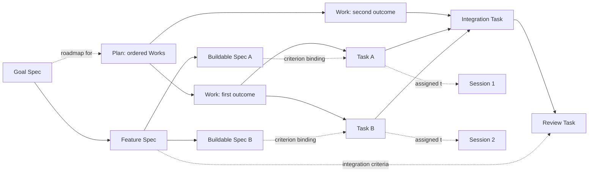

# Work model and session control

Status: **design revision; hybrid storage, three tiers and request-as-authoring-grant are owner-approved; implementation remains separate**.
Authority: owner's task dated 2026-10-03; source baseline `10b68356da71fafdd3c5551ef7cb62d51ee35da3` (`origin/main`); document starts from `1c9576d7f` (`origin/codex/work-model-design`).
Deliverable: this document only. No runtime, UI, data migration, live installation or canonical Ledger publication is authorized by this branch.

## 1. Contract and evidence

**The Spec tree is the goal's design blueprint; Plan is its execution roadmap.** Tier 0 has neither; Tier 1 uses one brief Spec; Tier 2 splits feature/sub-feature or research-question nodes recursively into buildable/testable units with detailed design/method and criteria (§2.6). Plan orders Works without copying design; each Work contains its concrete Tasks, which are exactly the todo list. Tasks implement named parts/criteria of a specific Spec revision and are reviewed against them. Sessions execute assigned Tasks; nesting creates no second Work hierarchy. Every managed structural/lifecycle mutation names its Spec revision and instruction. No Work/Task without Spec; Tier 0 creates none. The user's request grants in-scope Spec authoring and activation without another approval prompt; effect policy remains unchanged.

Queue means after the **current Task** at Tiers 1/2, and after the **current answer (Turn)** at Tier 0. Steer means at the next safe point without waiting for that boundary. Both apply to user messages and parent instructions at every delegation depth. Parents can redirect, pause, stop and resume children through the same control protocol.

Evidence notation: `R/` = `packages/butler-agent/rust/`; `TS/` = `packages/butler-agent/src/`; `UI/` = `packages/butler-app/client/ui/src/`. Paths and line numbers below are source evidence, not claims of runtime reproduction. Historical references use `commit:path:line`; current references use the baseline above. The owner's live data and private conversation history were not read.

| Current observation | Verified source |
|---|---|
| Work owns a revisioned Plan containing actions and dependency keys; progress is keyed by action, not Ledger Task identity. | `R/crates/butler-turn/src/btcc/work/contracts/view.rs:49`, `:83`, `:113`; `work/policy.rs:13` |
| Work creation requires scope, mutation ID and objective, with no required Spec. Plan governing references are optional; dependency validation rejects missing/self references but has no general cycle check here. | `R/crates/butler-turn/src/btcc/work/validation.rs:26`, `:36`, `:65` |
| Six Work tools address the bound durable Work: start, continue, replace plan, checkpoint, review, disposition. | `R/crates/butler-agent/src/host/guided/work_tools.rs:25`, `:130` |
| Runtime todo JSON and WorkStream JSON are separate from durable Work. Updates materialize the submitted item array; existing ordinals are reused. | `R/crates/butler-agent/src/host/guided/work_streams/storage.rs:20`, `:114`; `work_streams/support.rs:61`; `work_streams/todo_view.rs:53` |
| Ledger Task template has a Work parent but no plan-action identity or required Spec revision; Work template has a textual Spec path. These are not one runtime Task list. | `packages/project-ledger/templates/task.md:1`; `packages/project-ledger/templates/work.md:1` |
| Ledger already supports `spec`, `plan`, `work`, `task`, `parentId`, acceptance/review/evidence and versioned publication. Active missing Spec is a warning with an exemption; completion gates apply to Work, not Task. Spec CLI updates generic records; no typed recursive feature/criterion schema in these paths. | `packages/project-ledger/src/constants.js:20`; `records.js:89`, `:150`; `state-machine.js:153`; `record-commands.js:116`; `lifecycle-commands.js:152`, `:181` |
| Storage already varies by scope: session repository versus Project Ledger repository. Project Work start publishes a manifest and binding records. | `R/crates/butler-agent/src/host/guided/scope_selected_work.rs:49`; `R/crates/butler-ledger/src/project_ledger/work/start.rs:16` |
| Delegation creates/binds a child root Work; it does not merely assign a Task in its parent's graph. | `R/crates/butler-turn/src/btcc/subsessions/service/lifecycle.rs:45` |
| Parent direction is stored and consumed before a model round; parent cancellation enqueues a turn cancellation. | `R/crates/butler-turn/src/btcc/subsessions/service/control.rs:115`, `:152`, `:214`; `R/crates/butler-agent/src/host/guided/steering.rs:43`, `:74` |
| User follow-ups are claimed FIFO, wait for no active Turn, then start a Turn. | `R/crates/butler-gateway/src/gateway/application/send.rs:224`, `:241`; `application/queue_dispatcher.rs:268`, `:314` |
| `follow_up_behavior` accepts/stores/projects queue or steer, but no execution consumer was found by repository-wide symbol search. | `R/crates/butler-gateway/src/gateway/application/settings/update/patch/sanitize.rs:127`; `settings/view.rs:227`; dispatch paths above |
| Summary currently renders safe progress rows, not canonical Tasks. Cursor-based SSE already exists. | `UI/components/inspector/SummaryPanel.tsx:28`; `R/crates/butler-gateway/src/gateway/http/read_routes.rs:112` |

### 1.1 History: distinguish removal before Rust from porting loss

Searched reachable local/remote Git refs, `plans/`, Project Ledger templates, TS planning/work/work-ledger/subsession/queue/settings code, and the Rust cutover. Pre-cutover snapshot `37a530825ea1f623184c52a99e6b735edc0da038` is `f1173515c^`; the cited TS files also match archive branch snapshot `e4d0cb40a49e49df31a70366f9c5682c53bf7b2e`. Git evidence cannot establish every prior owner discussion or uncommitted/private Spec.

| Period / commit | What existed; what happened; decision to reuse |
|---|---|
| `5af5d1f3a` (2026-07-24, R20) | Reviewed planning generated **Plan → Works → Tasks**, governing Spec revision refs, ordered dependency edges and acceptance refs. `TS/agent/btcc/planning/plan-graph/author-plan-candidate.ts:47–144`; `TS/agent/btcc/work-ledger/contracts.ts:16–84`. Required governing Spec was conditional on `requireGoverningSpec` (`:58`), so this is substantial prior implementation, not proof of the owner's universal invariant. Reuse revision-bound authority and Task graph semantics. |
| Same R20 | Publication checked observed manifest revision, accepted review, exact available Spec revisions and reviewed Work/Task refs: `TS/agent/btcc/work-ledger/program-authority.ts:51–120`. Reuse atomic revision checks; do not resurrect its entire program/frontier framework. |
| Same R20: Spec hierarchy | **The earlier implementation already authored hierarchical Specs.** `TS/agent/btcc/planning/plan-graph/author-governing-specs.ts:39–56`, `:68–129` recorded `logicalId`, `parentId`, `concernId`, title/body, checked parents, concern collisions and authored-parent cycles. `TS/agent/adapters/btcc/project-ledger/canonical-spec-resolver.ts:4–11`, `:40–63`, `:80–90` resolved canonical Ledger revisions/supersession and hydrated bodies. `tests/unit/btcc-spec-authority-hierarchy.test.ts:67` covered persistence of reviewed parent/concern metadata. Reuse stable logical identity, single concern ownership, exact revision and canonical discovery. This source evidence does not prove current runtime enforcement, universal leaf-criterion coverage or automatic invalidation. |
| `74458781a` (before Guided cutover) | Replanning preserved unaffected accepted Tasks and their placement: `TS/agent/btcc/planning/plan-revision/preserve-unaffected-tasks.ts:10–43`. Reuse stable identity and retained completion/evidence. |
| `e349c1192` (2026-07-31) | Deleted the above `planning/`, `work-ledger/`, SQLite reviewed-graph installer and canonical-spec resolver. Introduced the Guided model. **The Spec-bound Plan/Work/Task graph was removed before the Rust port**, not first lost in Rust. |
| `fa25be794`, `0ad1c1998` (2026-08-25) | Re-established scoped Work Ledger operations and enabled the session-ledger binding path (`TS/interfaces/gateway/btcc/queued-inbound-session-binder.ts`, commit diff). This restored durable Work continuity, not R20's hierarchy. The Rust scope-selected repository above retains this split. |
| `018ffe33a` (2026-08-21), TS cutover parent | Stored parent steering and same-Work continuation existed. `TS/agent/btcc/subsessions/control.ts`; `TS/agent/btcc/agent-loop/guided-steward-direction.ts:19–38` checked **before model, before final acceptance, and before entering wait**. `TS/agent/btcc/subsessions/agent-hook.ts:38–55` handled both delegated roles. |
| `f1173515c8f4309ffb9fbe75153861705ce787cf` (2026-09-26, Rust cutover) | Ported Work-with-Plan-actions, scope-selected durability, separate todos, child root Work, durable user queue and parent direction. At this commit: `R/agent/src/host/guided_steering.rs:37–78`; `R/agent/src/btcc/agent_loop/guided_policy.rs:170–199`. **Source-level porting loss:** final/wait direction checks were absent from those hooks. Current `R/crates/butler-turn/src/btcc/agent_loop/guided_policy.rs:146–175` and `R/crates/butler-agent/src/host/guided/work.rs:142–149`, `:169–185` still route final/wait without that direction check. A late instruction can miss that boundary; this branch does not claim an executed race reproduction. Restore these checks with durable acknowledgement. |
| TS cutover parent, queue/settings | `TS/gateways/app/domain/sessions/session-queue-dispatcher.ts:116–142` already waited for a Turn. `TS/gateways/app/domain/settings/preferences-store.ts:187` stored `follow_up_behavior`; TS symbol search found settings/UI consumers, not routing. Unified user/parent Task-boundary Queue/Steer was **not found implemented**. It must be added, not described as a proven Rust regression. |
| `65b57977d` (2026-07-11), `11510ec62` (2026-07-12) | Runtime todos were explicitly distinguished from Ledger Tasks; sparse WorkStream amendments preserved completed items. At TS cutover parent: `TS/agent/work/work-stream-plan-store.ts:105–137`. Reuse preservation, replace the separate-list model. This is evidence for that amendment path, not universal preservation in every old todo update. |

Result: the owner remembers a real earlier Spec/Plan/Work/Task implementation. Its main removal was the TS Guided cutover. Rust carried forward much of the later model and narrowed parent-steering boundaries. No evidence found proves that the full owner model, especially universal Queue/Steer, ever shipped end to end.

The repository Ledger templates, docs, schema/validation, CLI and reachable historical adapters were checked before choosing the model. `packages/project-ledger/SKILL.md:97–108` locates the governing Ledger spec outside the repository. Its private canonical body was **not read**: this task does not authorize reading the real `~/.butler`. Consequently, “no typed support found in these code paths” does not mean the owner's full prior design never existed in Ledger records. Existing Spec exemptions and older no-nested-worker policies do not override this task's mandatory Spec and all-depth control requirements.

### 1.2 Established practice selected for Butler

Primary sources checked on 2026-10-03; these practices inform the design, not claims that any one standard defines Butler's entire model.

| Practice / source | Adopt / boundary |
|---|---|
| [Atlassian PRD guidance](https://www.atlassian.com/agile/product-management/requirements) | Feature purpose, scope, assumptions and success criteria at the parent node; child nodes supply buildable detail. Do not make one product-sized PRD or equate a PRD with an execution Plan. |
| [Rust RFC process](https://github.com/rust-lang/rfcs/blob/master/README.md) | Review concrete design, rationale and alternatives before significant implementation. Architecture, interfaces and implementation approach belong in the responsible Spec node; no separate mandatory RFC for every Task. |
| [Cucumber Gherkin reference](https://cucumber.io/docs/gherkin/reference/) | Stable observable acceptance examples: Given context / When action / Then outcome; include failure and boundary cases. No requirement to add a Gherkin runner or translate every criterion into that syntax. |
| [NASA bidirectional traceability](https://swehb.nasa.gov/spaces/SWEHBVC/pages/50888903/SWE-052+-+Bidirectional+Traceability) | Derive a two-way matrix from Spec criterion → Task → result/test → review, including parent-child coverage. No independently edited spreadsheet or NASA process adoption. |
| [Nygard ADRs](https://cognitect.com/blog/2011/11/15/documenting-architecture-decisions) | Link small decisions with context, chosen option, consequences and supersession. Ledger `decision` records explain design choices; they do not replace behaviour or acceptance. |
| [Agile Alliance INVEST](https://agilealliance.org/glossary/invest/) | Split around independently meaningful, small, estimable, testable outcomes; keep real dependencies explicit. A file/function or time box alone is not a feature boundary. |
| [GitHub Spec Kit](https://github.com/github/spec-kit/blob/main/spec-driven.md) | Maintain Spec as an evolving implementation authority with traceable Tasks and validation. Butler deliberately keeps detailed technical design in Spec; its Plan is ordering/Work allocation, regardless of other tools' terminology. No new framework dependency. |

Chosen synthesis: recursive feature design nodes + criterion-based review + generated traceability, retaining Ledger identities and decisions. Split until a node has one responsibility, an explicit architecture/behaviour/method, observable criteria and a bounded implementable outcome. Stop when splitting again would only describe code mechanics rather than a smaller behaviour/question. Cross-cutting constraints live once on the appropriate ancestor and are inherited by reference. Leaf Tasks can still span files; parent integration criteria remain necessary even when every leaf passes.

## 2. Domain and authority by data kind

### 2.1 Storage decision

**Owner-approved hybrid:** Project Ledger owns immutable, versioned, content-hashed Spec node bodies; the owner reads and refines Specs there. Reuse its versioned publication and recovery, not a second body store (`R/crates/butler-ledger/src/project_ledger/publication.rs:29`, `:46`, `:70`; `packages/project-ledger/src/transactions/record-publication.js:10`, `:55`, `:85`). The new contract pins each retained revision by Ledger revision ID + SHA-256; existing mutable record-update paths must publish new versions, never overwrite a pinned body.

**All mutable Work-model state lives in `agent-runtime/btcc.sqlite`:** current revision pointer per Spec node, selected tree version/membership, lifecycle and grants, Plan/Work/Task, dependency edges, instructions/receipts, attempts, reviews, audit and outbox. Use the existing transaction lane and indexed WAL readers. Plan roadmap prose may also be a Ledger document referenced by revision; Plan/Work/Task state is always SQLite. Work/Task Markdown is an export, not another writer. Keep Ledger IDs, catalog/CLI vocabulary and unrelated record owners; repository `plans/` is a review artifact, and this branch publishes nothing to the real Ledger.

**Publish first, activate second.** Publish/verify exact immutable revisions and receive durable Ledger IDs/hashes. Then one SQLite CAS transaction validates the instruction grant, expected node/tree heads and verified publication refs, switches pointers/tree membership, updates graph/lease fences, and commits receipt/audit/outbox. Unpublished or hash-mismatched revisions cannot activate. A split publishes all candidate bodies before one activation transaction. No Ledger write occurs inside that transaction: an extra immutable revision is harmless, whereas only SQLite selects executable authority. Thus no cross-store transaction or dual mutable head is needed.

Publication and activation share an idempotency key/payload hash; replay returns the same refs/receipt, differing payload conflicts. After publish-without-activate, retain the revision as **published, inactive**, keep old pointers/effects unchanged, and resume a recorded activation intent only after rechecking grant, hash and expected heads. Missing intent stays inactive; stale heads return a conflict for replan, never overwrite. After activation-before-reply, SQLite receipt/outbox replays without republishing. Referenced bodies remain retained; missing/corrupt content blocks dependent execution with an explicit integrity error, not fallback to latest. Offline Ledger edits produce new immutable revisions (raw file edits must be published first); they need explicit activation through the same service, automatic within an admitted in-scope request, never by a filesystem watcher. Service outage prevents activation/state edits, not Ledger drafting/publication.

Ownership: `butler-turn::btcc::work` owns invariants and typed commands/queries; BTCC owns SQL. `butler-ledger` publishes/resolves immutable bodies through a required domain port and adapts CLI state commands; agent composition sequences publication then activation, gateway authenticates/projects. Generic record updates/imports obey the same boundary. Domain code does not depend on ledger/gateway/UI. Cancellation/resource measurements cross `butler-platform` only. Extend existing execution/queue owners, with no parallel supervisor or scheduler.



Containment and Task dependency edges are distinct relations. Review/integration are real Tasks when they are concrete work; a phase label is not a second checklist. Delegating a Task binds a child session to that identity, never creates a child root Work automatically.

### 2.2 Records

Entity identities are immutable `(scope_id, id)` keys; retain Ledger IDs/case and existing kind prefixes. Source namespaces disambiguate aliases; hashes never replace user-facing IDs. SQLite entities have `id`, monotonic CAS `revision`, timestamps, `origin_instruction_id`, author, title and `scope={project_id|session_id}`. Audit/revisions are append-only; heads are transactional. `spec_ref={node_id,node_revision,ledger_revision_id,content_hash}` pins immutable Ledger content; `acceptance_ref={spec_ref,criterion_id}` and stable `part_id` identify criteria/sections, never line numbers.

| Record | Required fields beyond common fields |
|---|---|
| SpecRevision (Ledger) | `node_id`, `node_revision`, `concern_id`, `responsibility`, `kind=brief\|software\|research`, `parts`, `criteria`, `child_coverage`, source/decision refs, authoring instruction, supersession; immutable body and publication ID/hash. §2.3 defines content. |
| SpecNode / SpecRevisionRef (SQLite) | `node_id`, `tree_id`, verified `spec_ref`, current revision pointer, lifecycle, grant/activation provenance; derived part/criterion indexes resolve pinned content, never author a body. |
| SpecTreeRevision (SQLite) | `tree_id`, `tree_version`, `root_node_id`, changed `spec_ref`s, parent-link delta, `authoring_instruction_id`. Indexed membership plus immutable deltas reconstruct exact trees; inactive publications cannot change them. |
| Plan | root `spec_ref`, `tree_id`, tree version, `objective`, `work_order`, `work_dependencies`, `milestones`, `owner_session_id`, `graph_revision`, `status`, `alignment_revision`, optional Ledger roadmap ref. Roadmap orders Works; design/method remains in Spec. |
| Work | `plan_id`, `spec_ref`, `part_ids`, `outcome`, `acceptance_refs`, `rank`, `responsible_session_id`, `status`. Exactly one parent Plan. |
| Task | `work_id`, `plan_id`, `spec_ref`, `part_ids`, `description`, `acceptance_refs` (nonempty before ready; provisional drafts mark unresolved mapping), `kind=execute\|integrate\|review`, `rank`, `status`, `assignee_session_id?`, `result_refs`, `review_ref?`, `completion_revision?`, `blocked_reason?`, `supersedes_task_id?`. Exactly one Work. Execute binds the smallest responsible node; integration/review may bind parent criteria. |
| Dependency | `(plan_id, predecessor_task_id, successor_task_id)`, `created_operation_id`. Directed prerequisite edge, unique, no implicit dependency from rank. |
| TaskAttempt | `attempt_id`, `task_id`, `task_revision`, `spec_ref`, `session_id`, `turn_id`, `lease_epoch`, `status`, `checkpoint_ref`, `tool_effect_refs`, `started_at`, `finished_at?`. Multiple sequential attempts; one executing lease per Task. |
| TaskReview | `review_id`, `task_id`, exact Task/Spec/result revisions, `reviewer`, `criterion_results[{acceptance_ref,verdict=pass\|fail\|unverified,evidence_refs,reason}]`, overall verdict, timestamp. No free-form summary can substitute for criterion results. |
| SessionExecution | `session_id`, `goal_instruction_id`, `tier=0\|1\|2`, routing reason/policy revision, `plan_id?`, `work_id?`, `current_task_id?`, `phase`, `control_state`, `control_epoch`, `parent_relation_id?`, `last_applied_instruction_seq`. Tier 0 is existing turn/activity metadata only, with no managed bundle; Tiers 1/2 persist goal tier in SQLite. Phase is `conception\|planning\|execution\|review\|validation\|reporting`, with no separate steps. |
| ParentRelation | `relation_id`, `parent_session_id`, `child_session_id`, `epoch`, `assigned_task_ids`, `mutation_scope`, `effect_scope`, `delegation_allowed`, `state`. Exactly one active parent per child. |

SQL: Plan/Work/Task have non-null FKs to verified `SpecRevisionRef` rows (not cross-store FKs), composite parent keys for one Plan/tree, and FK-backed edges. Resolve parts/criteria at the pinned hash; Work binds the root/descendant and Task its Work node/descendant. Validate activation/grant/alignment and DAG in the service; direct SQL mutation is internal. Missing Spec returns `spec_required` before managed rows/effects. Drafts require real published draft refs; incomplete criteria cannot authorize execution. Tier 0 bypasses managed creation, never fakes a Spec; its single-step effects retain existing authority checks. Attempts use `running|succeeded|failed|interrupted`; interruption is not completion. Session controls use `running|pausing|paused|stopping|stopped|reconciling` with durable holds/epochs.

A Plan starts atomically with at least one Work; a Work may have zero Tasks while being planned but cannot run or complete until its Task/acceptance coverage is defined. One governing Spec tree serves a Plan; external constraints are exact revision references with indexed reverse consumers. Plans sharing a Spec receive propagation independently. Work ordering expresses roadmap order; a hard Work prerequisite resolves to canonical edges from its required exit Tasks to successor entry Tasks, generated/updated atomically by replan. There is one executable Task DAG, not a second Work scheduler. Moving Work/Task between Plans is an explicit linked replacement with retained history.

### 2.3 Spec nodes: authoring, splitting and acceptance

Each node is an independently readable immutable Ledger revision; trees use references, not concatenated documents. Tier 1 requires exactly one `kind=brief` node: request-derived goal + 2–3 observable done criteria with stable IDs, the goal as its single part, and source instruction. No architecture/research template is imposed. Tier 2 uses the full contract below; an escalated brief remains the unchanged root, with detailed design/method in descendants. Publish before binding Works/Tasks.

```yaml
id: SPEC-SESSION-QUEUE
tree_id: SPEC-WORK-MODEL
parent_id: SPEC-SESSION-CONTROL
concern_id: session.queue.delivery
node_revision: 3
responsibility: Deliver admitted instructions after the captured Task completes.
kind: software
parts:
  - id: BOUNDARY
    behaviour: Preserve the anchor Task and FIFO order across restart.
    design: Persist instruction, anchor and receipt in the Work transaction lane.
    implementation: Extend session ingress and Task-completion dispatch.
criteria:
  - id: AC-QUEUE-01
    part_id: BOUNDARY
    given: Task A is running and X is queued against A.
    when: A completes with accepted evidence.
    then: Deliver X before claiming any successor; execute X at most once.
    verification: stub E2E WM-02 plus restart replay WM-10
    derives_from: SPEC-SESSION-CONTROL@2#AC-ORDER
child_coverage: []
source_refs: [owner-instruction-id]
decision_refs: [DEC-INSTRUCTION-STORAGE]
supersedes_revision: 2
authoring_instruction_id: original-user-request-id
```

Publication includes schema version, hash, author and timestamps; lifecycle/active membership is SQLite metadata. Parent links form one rooted acyclic tree, with one active owner per `concern_id`; reuse uses references, not second parents. Full parent nodes define sub-feature interfaces, inherited constraints and integration criteria; `child_coverage` maps decomposed criteria with `all` or justified `any` semantics. The retained brief root is covered by descendants' `derives_from` mappings and Task bindings without rewriting its body. Active nodes require responsibility and criteria; full software nodes add architecture/interfaces/data/failure behaviour and approach. Research adds questions, hypotheses, method, variables/controls, sampling/sources, experiment/analysis and verification/falsification criteria; a null result may satisfy the method without proving a hypothesis.

Tier 2 authoring: read applicable Ledger nodes/ancestors/decisions → reuse or author missing detail → review responsibility/coverage/buildability → publish → activate under the originating request → create roadmap Works/Tasks. Tier 1 performs its brief creation and initial Plan/Work/Tasks in one structured write (§4). Authoring needs no pre-existing Task or separate approval prompt. Managed effects require a ready Task and existing effect authority; Tier 0 effects use today's guard. Unresolved design questions remain explicit drafts, never confident titles substituted for design.

`spec.split` publishes immutable candidates, then activates one revision-checked tree delta: retain parent ID/history and integration criteria, create children, map moved parts/criteria and Task impact. Preserve same-node criterion IDs; cross-node moves use explicit aliases/supersession. Reject missing coverage, concern duplication or cycles. Splitting Tier 1 first escalates to Tier 2 while retaining its brief root. The user's request itself grants routine in-scope creation/split/activation; ask only for scope expansion or new effect authority.

Before a Task effect, load the exact node parts/criteria and inherited constraints; a bare ID is insufficient. `task.submit` records immutable result/test evidence and enters `awaiting_review`. Review compares each linked criterion to evidence, including failures and unavailable checks. `task.complete` requires an accepted TaskReview covering every linked criterion at the exact result and Spec revisions; `fail|unverified` leaves it open/blocked. A parent or separately assigned reviewer performs delegated review; direct sessions may review their own result unless the governing Spec demands independence. Integration/review Tasks verify their node's own criteria through the same finite review operation; do not recursively create review-of-review Tasks. Plan/Work completion additionally requires full current Spec coverage, including unassigned criteria and parent integration criteria.

### 2.4 Lifecycle and propagation

- Spec lifecycle is SQLite state: `draft → approved → superseded`; `draft → withdrawn`; lineage may be `retired`, referenced Ledger revisions never deleted. “Approved” means validated activation under the user's request-as-authoring-grant, not a second approval prompt. Creating, splitting and activating Specs within that goal is authorized by default. Ask only beyond the requested scope or for new effect authority; existing effect rules remain. Activation pins the already-published ID/hash; publication alone grants no execution authority.
- Plan and Work: `draft → ready → running → completed`; `running → blocked|paused|stopped`; `blocked|paused|stopped → ready` via recorded resolution/resume. Spec invalidation may set `needs_replan|needs_revalidation`; reviewed replan restores readiness. Cancellation is terminal `cancelled`, distinct from resumable stop. Completion requires acceptance evidence and completion of all required Tasks/Works; cancellation is not success.
- Task: `draft → pending → running → awaiting_review → completed`; `running|awaiting_review → blocked|paused|stopped`; resumable states return to `pending` or `awaiting_review` with checkpoint/result retained. Review rejection returns to `pending` with findings. Removal of a running/reviewing Task first fences and settles it, then records `cancelled`; pending/draft Tasks may cancel directly. Failure records a failed attempt and blocks the Task. Ready is derived from prerequisites/alignment/control, not another independently updated status.
- Completed Tasks, their Spec revision, acceptance and result refs remain immutable. Amendments are appended as evidence annotations or new corrective Tasks linked by `supersedes_task_id`; completion is never erased by replacement, sparse updates or replan. Removed Tasks remain tombstones. A resumed parent does not restart its completed children.
- Activating published node revision N commits its SQLite pointer/tree delta, changed parts/criteria and invalidation fence. Authority includes referenced ancestor constraints/criteria; effect admission checks those indexed heads/fences. Changed acceptance/design invalidates linked Tasks, descendants and reverse consumers, including parent integration criteria; unrelated siblings run. Unknown impact conservatively holds that subtree for replan. Unactivated Ledger edits do not invalidate active work.
- Indexed, resumable propagation visits affected Plans with impact mappings (`retain|edit|cancel|add|reverify`), holds pending Tasks, fences active attempts at safe points and invalidates outstanding reviews. “Retain” requires an explicit reason and reviewed criterion mapping, including editorial-only updates; it cannot silently bless changed behaviour. A head/fence mismatch exposes `needs_replan` immediately even before all impact rows materialize. Parent derived coverage becomes stale immediately, not after the job completes.
- Completed Task/review history stays immutable under its old node revision, but **current coverage is invalidated**. Reopen the requirement obligation using a new corrective/revalidation Task linked to the original; show both in the list/graph. Replace affected live successor prerequisites with that Task before clearing the fence, so old completion cannot satisfy changed acceptance. Completed Work/Plan opens a new revision marked `needs_revalidation`, preserving its historical completion event. Do not automatically execute new work in an inactive historical Plan; expose the reopened obligation for authorized resumption.
- An atomic `replan` approves a reviewed delta and its requirement coverage, updates the graph/head and clears alignment holds only for validated entities. A stale model proposal returns current revisions and the conflicting IDs; it cannot overwrite newer instructions. Draft Spec changes do not fence the active approved revision.

### 2.5 Graph and mutation authority

The DAG spans all Works within one Plan. Cross-Plan references may be evidence links, not scheduler edges. Reject unknown, duplicate, self and cyclic edges. Validate the touched connected region with indexed adjacency; do not scan other Plans. Parallel execution requires all predecessors completed and a valid exclusive Task lease; joins wait for every required predecessor, including integration/review Tasks.

Rank orders equally ready Tasks and list presentation; changing rank never bypasses an edge. Removing a Task with live successors requires explicit edge replacement/removal in the same operation batch and renewed criterion coverage; cancelled Tasks do not satisfy dependencies. Completed Task snapshots/edges are immutable history; the current graph may add new successors but cannot add unsatisfied prerequisites to an already completed Task. Editing an active Task's scope/dependencies first fences its lease and checkpoints it; it must become ready under the new graph before effects resume. Reorder of other pending Tasks does not interrupt the current Task.

| Actor | Authority |
|---|---|
| Owner/user | The request itself grants Spec creation, splitting and activation for its goal. Controls accessible entities/sessions under existing policy; scope expansion/new effects alone need additional authority. |
| Plan-owning session | Automatically authors/publishes/activates in-scope Specs, plans Works/Tasks and escalates tiers under that request; no routine owner confirmation. Activation does not widen effect authority. |
| Parent session | Controls its active children and their assigned scope, including immediate steer/stop; expands scope only through an authorized relation amendment. |
| Assigned child, including a worker with its own workers | Starts/completes assigned Tasks; on instruction can add/edit/remove/reorder Tasks and edges within granted graph scope, select a step, pause/stop/resume, or propose replan. Nested delegation requires an explicit grant and inherits narrower effect/graph scopes. |
| Runtime | Owns IDs, bindings, ordering, leases, conflict checks, delivery and recovery. It never interprets prose as permission or invents Spec acceptance. |
| UI graph | Read-only; no drag to mutate, hidden checklist, or separate status authority. |

### 2.6 Three tiers through the existing router

Extend today's model judgement of **direct completion vs delegation**, not a new classifier call: `R/crates/butler-turn/src/btcc/guided_turn/phase/instruction-prefixes.json:1` (keys `phase_minimal|butler|read_only` / `execution`, “one quick lookup” vs “Substantial writing ... research”). `phase/instructions.rs:10` selects that prompt; `phase/selection.rs:94` and `phase/selection/candidates.rs:103` select the tool surface. Those permission phases are not workload tiers; retain access-mode/effect checks independently. The same existing model round judges intent; runtime enforces the resulting tier at work/effect/delegation admission.

| Tier | Classification and durable result |
|---|---|
| 0 direct | Quick lookups/search, Q&A, single-step actions: conversation/activity only, no Spec/Plan/Work/Task. Existing queue/control receipts still apply; no managed rows or approval ceremony. |
| 1 light | Small multi-step jobs, e.g. organise Downloads: runtime auto-creates exactly one brief Spec from the request plus Plan/Work/Tasks, with no Spec approval prompt. UI collapses the brief. |
| 2 full | Analysis/research, feature/software work, long-running jobs, any requested analysis/report, and **every delegation at every depth**. Full recursive Spec tree; research includes method, hypotheses and verification design. No “small delegate” exception. |

Deterministic floors: two or more executable steps require ≥1; more than **5 non-cancelled Tasks total for the goal** (completed included; unresolved question/control drafts count once classified as work), a requested analysis/report, explicit delegation or any attempted child assignment requires 2. Planned resumable/scheduled work across sessions is long-running and requires 2. The router judges semantic complexity, research/software intent and other long-running work in its ordinary round; it may select higher, never override a floor. Persist reason/policy revision in activity/SQLite. Count semantic work, not tool calls; never merge/truncate Tasks to avoid escalation.

Re-evaluate on new instructions, proposed Task growth and delegation. Escalation is upward only (0→1→2, or straight to 2 when required): pause admission of the newly disallowed operation, publish required detail, then atomically activate tier/tree/graph before resuming. A low classification is corrected at that boundary without another model round just to classify; use the ongoing work round for needed design. A high classification is retained for that goal and logged for router correction, not downgraded or deleted; a genuinely new goal is classified afresh. Tier 1→2 keeps the brief's ID/body/criteria as root, adds descendants, and preserves Plan/Work/Task IDs, attempts, completed evidence and queued anchors. Extend detail, do not rewrite the request. Queue/Steer and effect approvals work at every tier (§3); escalation itself asks no permission.

## 3. One session instruction protocol

### 3.1 Envelope and admission

All user messages and parent instructions use the same authenticated ingress. Existing transport IDs remain aliases for deduplication. Tool results and child result delivery remain result events; if they request new work they must enter through this instruction protocol.

```text
Instruction {
  id, idempotency_key, target_session_id,
  sender: user{principal_id} | parent{session_id, relation_id, relation_epoch},
  origin_message_id, origin_turn_id?, received_seq, received_at,
  mode: queue | steer, body_ref, attachments_refs[],
  scope: {plan_id?, work_id?, task_ids[], spec_ref?},
  expected: {graph_revision?, control_epoch?, entity_revisions?},
  anchor: {kind: turn | task, turn_id?, task_id?, attempt_id?, boundary_seq},
  command?: typed operation batch, supersedes_instruction_id?
}
```

Sender, grants, sequence, anchors and bindings are set/verified by runtime, never trusted from model JSON. Persist full instruction content once; audit and transcript point to it. Explicit per-message mode wins; otherwise user `follow_up_behavior` selects queue/steer and parent calls must specify mode. Persist the resolved mode so a later settings change cannot alter admitted messages.

At admission, atomically capture current Turn (Tier 0) or Task (Tiers 1/2) and boundary sequence, deduplicate and persist. Structured operations validate revisions; free text records intent for the receiving session. This creates no managed entity at Tier 0. Admission is a durable receipt, not proof the model obeyed. Escalation preserves an admitted anchor; a Tier 0 queue still releases at that captured Turn end, while new admissions use the current tier's boundary.

### 3.2 Queue, including the required append case

Queue captures an immutable boundary identity, never a mutable “current” pointer. At Tier 0, retain the SQLite instruction/receipt and project it only in conversation/activity until answer-end; classify work when delivered, without a Spec/Work/Task for queued search/questions. At Tiers 1/2, do not inject it into the current Task's context. A Work-bound actionable item appears as a **draft Task in the same list**, with the captured Task as predecessor and original text. Instructions own delivery; Tasks own work, with no second todo store.

Structured additions use valid node/criterion bindings. Unclassified managed text creates a provisional draft Task bound to its existing Spec with unresolved criterion mapping and exact request; **Tier 1 never creates a second Spec for a queue placeholder**. At delivery, map it to current criteria or publish/activate needed detail under the request, escalating before any split/threshold breach. Tier 2 may publish a draft child when design requires one. Questions/controls cancel the provisional Task with reason and keep the receipt; typed controls need none. No admission model call or mutation of A's active Spec. Drafts cannot execute unresolved criteria; routine resolution needs no approval, while scope expansion/new effects use existing approval policy.

At Tier 0 answer-end or Tier 1/2 Task completion, deliver FIFO **before the next Turn/Task claim**; managed completion may release within the same model Turn. Resolve drafts/graph before dispatch. Turn rollover never changes Task/Work identity. With no active boundary, deliver immediately. A question about existing managed work stays in that goal's tier; it need not add Tasks or revise Specs.

If the anchor is blocked, paused or stopped, keep its queue pending with reason. Only completion releases normal delivery; the sender may promote to steer or re-anchor. Cancellation/removal never silently releases it: return `anchor_cancelled` for recorded redirect/cancel. Completion races serialize on the session boundary: before completion binds that Turn/Task; after it binds the next active boundary for the tier, or delivers immediately if none.


### 3.3 Steer, safe points, acknowledgement

Steer wakes the target immediately and fences admission of further effects from a stale model response. Drain admitted controls (1) before a model request, (2) after model response and before each tool dispatch, (3) after recording a tool result, (4) before wait/final/completion commit, and (5) when resuming from checkpoint. Final completion and the last inbox check share a transaction/boundary sequence, closing the historical late-direction race.

A parent need not wait for a child's Task/Turn to end. During an in-flight model request, set the control fence immediately; cancel the provider request when supported, otherwise retain its response as stale evidence and admit no stale tools. Structured control applies without a model round. Free text is interpreted at the next safe point using updated Spec/Task state; interpretation latency is not falsely reported as immediate application.

Paused/stopped sessions still admit Steer and typed control; a control-only interpretation round may resolve free-text resume/replan without permitting Task effects. Queue stays anchored. For an active tool, control fencing/cancellation is available immediately; accepting or rejecting its result and changing the executing Task waits for effect settlement. Task-scoped holds affect that Task only; a later explicit step change may select unrelated ready work without clearing the held Task.

Receipt states: `accepted → waiting_for_turn|waiting_for_task|pending_safe_point → delivered → applied|rejected|needs_input`; replacement/cancellation records `superseded|cancelled`. `delivered` means durable request injection, not consumption on read; `applied` names operation IDs/revisions, or a question's reply without graph edits. Only unresolved scope or new effect authority needs approval/`needs_input`; routine Spec/replan does not. Crash recovery redelivers unacknowledged segments idempotently, never repeats applied mutations.

### 3.4 Operations, conflict and stop semantics

Every graph/Work/Task operation carries `operation_id`, `instruction_id`, `spec_ref`, `part_ids`, `acceptance_refs`, `reason`, expected entity/graph/control revisions, authenticated actor and scope. Runtime attaches affected Task/Spec bindings to session controls; an unmanaged conversation control records `scope=session` without inventing a Work. An ordered batch is all-or-nothing; large batches stage validated chunks then publish one revision, never partially apply or silently drop items. Results include before/after revision refs, affected IDs, boundary/event sequence and a typed conflict/next action. Per-instruction idempotency keys replay the same result for an identical hash; differing content is `idempotency_conflict`.

| Operation | Semantics |
|---|---|
| `task.add`, `task.edit` | Create identity and acceptance/spec links; edit only named fields. Draft instruction Tasks may be resolved. Active edits follow the effect fence rule. |
| `task.remove` | Recorded cancellation/tombstone plus explicit successor-edge treatment; completed Tasks cannot be removed. |
| `task.reorder` | Set ordered rank relative to named siblings with expected graph revision; retain unspecified/completed Tasks. |
| `dependency.edit` | Explicit edge additions/removals, validated against the entire resulting affected DAG. |
| `step.change` | Set phase and optionally select a ready Task. Current Task must be completed or explicitly checkpointed/paused/stopped. It cannot mark work complete or evade prerequisites. |
| `task.start`, `task.submit`, `task.review`, `task.complete`, `task.block` | Claim attempt; submit result; judge every bound criterion; complete against accepted review; or retain checkpoint with reason. Review and completion may commit together. Runtime verifies binding; final prose cannot complete work. |
| `task.pause`, `task.stop`, `task.resume` | Apply/release a Task-scoped hold and control its executing session using the same effect settlement rules. A Task hold does not stop unrelated Tasks assigned elsewhere; completion/cancellation remains separate. |
| `session.pause` | Fence new model/effect work, let an active tool settle, checkpoint, then `paused`. Queue retained. Propagate a control hold to owned descendants. |
| `session.stop` | Fence immediately, cancel active computation/tools where supported, settle outcomes, then `stopped`. Task remains resumable. Stop owned descendants; do not affect unrelated sessions. |
| `session.resume` | Clear the named control hold with expected epoch; reconcile interrupted effect outcomes, continue the same Task with a new attempt if needed. Descendants resume only if they were held by this operation, not independently paused/stopped. |
| `plan.replan` | Commit an explicit delta of Spec bindings, roadmap order, Works, Tasks and edges after coverage/review checks; preserve identity, completions and prior revisions. Includes `work.add\|edit\|reorder\|dependency.edit\|pause\|stop\|resume\|cancel`, expanded to affected Tasks/sessions under the same Spec trace. |
| `work.create_light`, `spec.propose`, `spec.split`, `spec.activate`, `plan.create`, `work.complete`, `plan.complete` | Light bootstrap or full authoring publishes Ledger revisions before SQLite activation under the request grant; aggregate completion requires evidence. Split/delegation first enforces Tier 2. No bypass creation path. |

One child has one active parent. A second parent is rejected `parent_conflict`; an authorized owner can transfer parenthood atomically, advancing relation/control epochs and fencing the old parent. Nested parents address their direct children; root control propagates through recorded descendant holds.

Within an authority epoch, eligible instructions apply by persisted sequence; an unreleased Queue item never blocks Steer. Disjoint edits still use explicit current revisions; no last-writer-wins. If owner/user and parent arrive together, an **eligible** user control supersedes conflicting pending parent control and increments the control epoch; a queued user message does not silently become steer. Revalidate parent instructions against that epoch. A runtime can classify typed control conflicts; semantic prose conflicts remain explicit for the receiving model before committing a delta. Already committed effects are not undone. Independent instructions remain pending in order. Pause/stop holds compose: any active hold prevents execution; a parent's resume cannot clear an owner's hold. Conflicts return revisions, affected IDs and source instruction; reread/replan, never blindly retry.

An explicit Stop button sends `mode=steer`; queued stop waits for its captured Turn/Task. Acknowledgement distinguishes `stop_requested`, `cancelling_tool`, `reconciling_effect`, `stopped`. Cancellation is not rollback: non-cancellable effects may finish, with real results recorded and successors prohibited. Unknown outcome holds the Task (Tier 0: turn/effect receipt) for reconciliation; inspect receipt/idempotency before resuming. Kill only owned PIDs/process groups through `butler-platform`. Pause waits for the active tool; stop requests cancellation.

Audit commits with each mutation: immutable actor/grant/relation epoch, instruction hash/ref, Spec/requirement refs, before/after revision IDs, graph delta, attempt/effect refs, result/error and timestamp. Rejected authorized commands receive a receipt without mutating graph state. No hidden reasoning, credential values or raw sensitive tool payloads enter UI projections.

## 4. Model-facing surface and instruction contract

At Tiers 1/2 use three grouped tools narrowed by role/phase, replacing the six Work/todo tools. **Tier 0 receives zero additional tool schemas or model calls versus today**; Queue/Steer uses existing ingress/control, and one-step effects keep today's guards. The router replaces its current binary guidance with tier guidance. At Tiers 1/2 effects bind canonical Tasks; all delegation requires Tier 2 before child assignment and cannot create a child root Work. Runtime supplies identities.

```text
work_read {
  view: summary | tasks | graph | spec | coverage | audit | operations,
  plan_id?, work_id?, task_id?, node_id?, revision?, cursor?
}
work_apply {
  instruction_id, spec_ref?, expected_graph_revision?,
  expected_control_epoch, expected_entity_revisions,
  reason, operations: [ discriminated Operation ]
}
session_control {
  target_session_id, relation_id?, mode: queue | steer,
  instruction: {text, attachment_refs?} | {operations},
  expected_control_epoch, idempotency_key
}
```

`Operation` is a closed tagged union: add `{op,work_id,title,description,kind,spec_ref,part_ids,acceptance_refs,after_task_ids,rank_after?}`; edit `{op,task_id,patch:{title?,description?,acceptance_refs?,spec_ref?,part_ids?}}`; remove `{op,task_id,successor_edge_changes}`; reorder `{op,work_id,task_ids,rank_after?}`; dependency edit `{op,add:[{from,to}],remove:[{from,to}]}`; step change `{op,phase,task_id?,current_task_disposition?}`. Batch-local `key`/`@key` resolves runtime IDs. Body-producing operations publish first; only verified refs enter the all-or-nothing SQLite batch. Rejected batches may leave inactive Ledger publications, never partial active trees/graphs.

Tier 1 bootstrap is **at most one structured write**: `work.create_light{goal,done_criteria[2..3],tasks}` from the existing model response/tool batch, not an extra planning/model round. Runtime derives the brief from that request-bound payload, publishes it, then atomically activates one root and creates Plan/Work/Tasks; initial Task start may share the batch. First effects wait for that commit and their usual authority checks. Idempotent retry yields the same single node. This counts a model-facing write, not a claim of one filesystem/SQL write; §7 measures all internal publication/activation I/O.

Task variants: start `{op,task_id}`; submit `{op,task_id,result_refs,evidence_refs}`; review `{op,task_id,result_revision,criterion_results,verdict}`; complete `{op,task_id,review_ref}`; block `{op,task_id,checkpoint_ref?,reason}`. Task/session pause/stop/resume require `{op,task_id|session_id,hold_id?,reason}` (hold required on resume). Plan create requires `{op,spec_ref,tree_version,objective,works:[{key,title,outcome,spec_ref,part_ids,acceptance_refs}],work_order,work_dependencies}`. Replan requires `{op,plan_id,impact_map,work_changes,task_changes,edge_changes,review_ref}`; each Work change is a typed variant from the operation table with explicit target IDs/fields. No field silently means “replace all”.

Spec propose `{op,node_id?,base_revision?,node:SpecNodeDraft}` publishes immutable content; split `{op,node_id,base_revision,children,parent_patch?,criterion_mapping,task_impact_map}` stages publications; activate `{op,tree_id,expected_tree_version,published_refs:[spec_ref],impact_map,authoring_instruction_id}` verifies ID/hash and commits pointers. Aggregate complete `{op,id,evidence_refs,review_ref}`. Outer `spec_ref`/graph revision are required for existing managed edits; bootstrap uses the authenticated request and same-batch refs, never null stored bindings or a fictitious approved Spec. `authoring_instruction_id` defaults to that request and is runtime-verified, not a new approval token.

Expose only permitted variants for the current phase: execution gets start/complete/block and instructed graph edits; planning gets Spec/Plan/replan; a parent gets child control. `work_read(view=operations)` describes unavailable variants on demand and requests a surface refresh; it cannot grant permission. Strict schemas reject unknown fields. Runtime authorization remains identical even if the model emits a hidden variant. Response: `{ok,operation_ids,entity_revisions,graph_revision,control_epoch,event_seq,changed,remaining,conflict?,next_action?}`; paginated reads return exact totals and revision-bound cursors.

Prompt rules, enforced at the relevant runtime boundary:

1. Use the existing router: Tier 0 answers/acts without Spec/Work/Task; Tier 1 auto-creates one brief bundle in one write/no extra model round; Tier 2 reads/authors recursive design/method before execution. Never delegate below Tier 2. Escalate when signals require it, preserving the brief root and Task identities.
2. At Tiers 1/2 start before effects, submit evidence, review each criterion and complete only on acceptance. Resolve boundary instructions before the next claim. A Task may span model calls/Turns; Tier 0's queue boundary is answer-end, Tier 1/2's is Task completion.
3. Keep Tasks current as instructions change the job. Add/edit/remove/reorder/change edges with operations, never by merely narrating a new plan. Resolve a queued draft's Spec binding before starting it.
4. Preserve completed Tasks. Report blocked/paused/stopped truthfully. Do not complete a Work because the model is ending a Turn; return a concise outcome tied to its Task result.
5. The user's request is the authoring grant: create, split, publish and activate in-scope Specs without asking again. Ask only for work beyond requested scope or new effect authority; clarify genuinely unresolved intent, not routine Spec decisions. Never treat authoring or tier escalation as wider effect permission. Runtime enforces identity, grants and published hashes.

Prompt impact: Tier 0 adds **0 calls, 0 schemas, 0 net static system/tool tokens** by replacing routing prose; no Spec context. Tier 1 replaces legacy Work/todo instructions with narrow bootstrap/Task operations, injecting only one brief plus current Task/criteria; no extra model round. Tier 2 loads only responsible nodes, inherited constraints and relevant graph/criteria, never the whole tree. For each tier/role/phase, serialized static system/tool bytes and estimated tokens must stay ≤ its corresponding baseline fixture and existing ratchet. Report dynamic context tokens separately, preserving complete required content and paged history with exact counts/cursors. §7/WM-13 measure routing/setup overhead; this branch claims no token/latency measurement.

## 5. UI read model and events

Tier 0 shows conversation/activity and Queue/Steer receipts only, with no empty Spec/Work cards. Tier 1 shows Work/Tasks with its one brief Spec **collapsed by default**, without an approval card. Tier 2 exposes the recursive tree/coverage. Escalation expands available detail while retaining the same root/Task links. List/graph use one SQLite Task projection via `GET /sessions/{id}/work-summary` and `GET /plans/{id}/task-graph?revision=&cursor=`; Spec detail resolves exact Ledger ID/hash through the query API, never a mutable Markdown head. Activity stays supplementary, not a second task list.

Managed Summary contains tier, Plan/Work/Spec IDs/revisions, ordered cards, exact Task state totals, current Tasks, receipts, blocked reason and evidence. Spec detail distinguishes active and published-inactive Ledger revisions; owner edits are new revisions until activation, which in-scope requests authorize without prompting. Completed/cancelled Tasks remain counted/reachable. Cursor pages use one revision and invalidate only affected pages.

Spec coverage at `(tree_version,graph_revision,event_seq)` records node/revision, Task/review/evidence IDs and `unplanned|planned|running|awaiting_review|verified|stale|blocked`. Stale/blocked takes priority; current contributing Tasks and parent integration criteria must pass. All-green children cannot manufacture parent success. Removing a criterion requires a new published/activated revision within scope (or approval to change scope), not a waived pass. Historical proof remains inspectable beside current coverage.

The graph's Spec overlay groups/filter-highlights Tasks by node and shows per-node verified/total criterion counts with stale/unplanned badges. A node with no Tasks is still visible as an uncovered Spec marker; toggling back to dependencies never turns a Spec tree edge into an execution prerequisite. Clicking a criterion shows both directions of the traceability matrix and the exact design/acceptance body. Split/updated nodes retain old-version navigation. Summary cards show the same coverage counts. Full tree/coverage is keyset-paged and revision-bound, not a recursively fetched document bundle.

Graph nodes are Task IDs with Work grouping, Task kind/status/assignee and Spec requirement links; edges are canonical prerequisites. Independent worker branches fan out, then join at integration/review Tasks. A session overlay shows who is executing, not fake Work nodes. Desktop uses a left-to-right canvas with horizontal scroll; mobile uses top-to-bottom ranks. Both have readable node details and keyboard navigation; graph editing is disabled. Canvas virtualization is rendering only: all nodes/edges remain fetchable with exact totals and a stable revision; no hidden top-N graph.

Publish SQLite outbox after commit through `/events/live`: `work_model.changed{plan_id,tier,graph_revision,entity_changes,counts,event_seq}`, `spec.changed{tree_id,tree_version,published_refs,changed_criteria,propagation_state,event_seq}`, `coverage.changed{plan_id,node_ids,counts,event_seq}`, `instruction.updated{instruction_id,status,operation_ids,event_seq}`, `session.control_changed{session_id,control_epoch,state,hold_ids,event_seq}`. Stable IDs/deltas or bounded invalidations replay in cursor order. Ledger publication alone emits no active-tree change; activation acknowledgement means pointers/fence committed, propagation-complete means consumers aligned. Tier 0 uses existing activity/control events. App projections are disposable, never state authority.

Snapshot includes its event cursor. Subscribe/replay after that cursor to avoid fetch/subscribe gaps. Reconnect replays changes; an expired cursor gets one explicit snapshot reset. No interval polling, per-client DB heartbeat writes or idle “last viewed” updates. SSE keepalive is memory/network only. UI reads, graph pan and resize produce zero Work-model disk writes.

Compose UI from `@/butler-ds`; keep current composer controls. User labels: `대기열`, `지금 반영`, `일시정지`, `중지`, `재개`, `위임 작업`; schedules are `예약 작업` / `schedule`. Never surface `Steward` or `스튜어드` in product copy. Pending state plus a short tooltip/toast suffices; no implementation banners.

## 6. Migration and compatibility

Migration is explicit, resumable and version-gated. The new mode is opt-in until owner acceptance; it never silently rewrites the owner's existing installation. Old binary startup must reject a cut-over writer epoch rather than overwrite new data. Each installation uses one active Work-model writer mode; feature flags must not allow old/new writers for the same graph.

1. Inventory **authorized copies**: BTCC Work/Plan/checkpoint/review tables, scope bindings, Project Ledger Spec/Plan/Work/Task records, todos/WorkStreams, delegation packets, pending user queue and direction rows. Record counts, IDs, revisions, sizes and hashes in a migration manifest. Source classification and read-only compatibility do not require transcript parsing. Reconcile any legacy partially committed file journals through their existing recovery first.
2. Add additive tables/indexes and a durable migration cursor. Do not rebuild/vacuum the 2.6 GB DB or rewrite 1.5 GB of transcripts. Test the larger repository baseline too (7 GB BTCC, 1.3 GB App DB, 2,440 transcripts, largest 290 MB; `plans/README.md:26–30`). These are supplied scale fixtures, not measurements of the owner's current disk.
3. Retain real Spec bodies in Ledger, preserving IDs, exact versions/hashes, `logicalId/parentId/concernId`, supersession and request/grant provenance. Publish legacy mutable bodies as immutable revisions through existing Ledger publication; import only verified refs/indexes and selected pointers into SQLite. Never flatten trees or infer parenthood from names. Missing parts/criteria become source-linked drafts. Legacy Work without verifiable Spec stays read-only `needs_spec`; derive a brief/full tree under a recoverable original request or authorized continuation, without another Spec approval. Absent scope evidence needs clarification, not fabricated authority. Bind node/criteria before execution; same rule for orphan Tasks/todos.
4. Import each old Work as a new Work beneath a Plan, with old WorkPlan actions becoming stable Task IDs and dependency edges. Group multiple Works into one Plan only with explicit historical relationship evidence or an authorized mapping; otherwise use one Plan per Work. Preserve all plan/checkpoint/review/disposition revisions as provenance. Use existing Spec references when resolvable; do not equate a textual path with approval.
5. Map Ledger Tasks, action keys and todo IDs by explicit links/receipts. Never merge by similar title or ordinal. On an ambiguous overlap preserve both source records in the manifest/legacy view and require mapping before that Work executes; do not create duplicate executable Tasks. Completed source items and results cannot disappear. Completed legacy evidence lacking acceptance stays labelled historical until reviewed.
6. Map child root Works to Task assignments only with packet-ID proof; retain aliases, attempts/results and relation scopes. Every delegated goal migrates as Tier 2. Classify other managed goals from existing request/Task evidence: Tier 1 only when one brief suffices, otherwise Tier 2; do not flatten existing trees. Unmanaged direct history stays Tier 0 with no retroactive Spec/Work/Task. Unknown relations stay read-only/stopped pending mapping, never inherit role-name privilege.
7. Quiesce admissions, reconcile effects, retain paused/stopped state and checkpoint Tasks. Migrate **active turn plus all queued follow-ups** and directions with IDs/order/receipts intact. Tier 0 retains Turn anchors, Tier 1/2 uses proven Task mappings. Legacy Turn-only anchors stay until that Turn settles; bind managed continuation to a Task without guessing or silently re-anchoring admitted messages. Delivered directions are not automatically applied.
8. Import in keyset batches of at most 500 records or 1 MiB decoded metadata per transaction (large records stream individually); store progress and source hash after each batch. A changed source invalidates that batch. Hash large source artifacts incrementally; raw transcripts and tool outputs remain in place with references, never copied into audit. Bound memory, resume from cursor, and show unresolved records/counts.
9. Atomically switch writer epoch and gateway/tool routing for mutable state. Ledger Spec/roadmap publication remains its document path, but activation and Plan/Work/Task state commands use SQLite service. Offline edits publish inactive versions; exported Work/Task state needs validated import, never filesystem fallback. Legacy `start_work` requires verified Spec binding; plan/todo adapters preserve IDs/completed items and reject ambiguous mappings. Old names stay adapter-only; old queues become read-only after receipt transfer.
10. Verify count/hash/alias parity, all completed records, edges, pending instructions and effect receipts before enabling execution. Retain original stores as read-only rollback evidence; they are not queried as current state. Before new writes, rollback can revert the writer epoch. After new writes, an older binary cannot safely resume: restore an explicit snapshot with disclosed loss or forward-fix; never auto-downgrade. Remove old writers/tools after compatibility acceptance, with no timer-driven mirror updates. Archive deletion requires a separate retention decision.

Import may use an authorized immutable snapshot while old mode runs. Capture journal deltas/watermarks, freeze all legacy state writers (including CLI), then replay the tail; lacking a reliable journal, quiesce that source and report time separately from the two-second switch. Ledger revisions may already be published, but imported SQLite pointers/graph remain inactive staging until validated together. Resume partial publication/activation by §2.1, retaining inactive revisions. The compatibility launcher must fence old writer epochs before conversion; no assumed safe downgrade.

## 7. Performance and SSD budgets

The following are **proposed acceptance budgets, not measurements**. Existing stricter budgets/ratchets continue to apply. Measure release builds on the fixed batch-CI owner-scale runner, report p50/p95, CPU, peak RSS, SQL counts and bytes read/written together with complete-response assertions. Model/network/tool duration is reported separately from control admission/application latency.

Fixture: supplied 2.6 GB DB and 1.5 GB transcripts, plus the larger README scale above; seed 600+ sessions, 300k events, 100k Tasks across Plans, a 10k-Task/30k-edge Plan, 10k Spec nodes (depth 8, 50k criteria), 32 active sessions with eight parallel workers, and realistic completed history. No real owner data or credentials required.

| Path | Budget and completeness assertion |
|---|---|
| Tier routing/setup | Tier 0: **0 extra model calls/tool schemas**, no managed writes, static prompt delta ≤0. Tier 1: ≤1 bootstrap structured write, **0 extra model rounds**, exactly one brief plus complete Tasks, no Spec approval prompt. Tier 2: phase-scoped prompts, no tree-wide load. Assert §4 static ratchets per tier and report dynamic tokens, added local latency and all publication/activation bytes; never exclude setup as model overhead. |
| Summary, first page (50 cards) | p95 ≤100 ms warm / ≤250 ms cold; exact state counts, deterministic order, current revision, every page retrievable. No transcript/whole-Ledger scan. |
| Graph (500 nodes/page) | p95 ≤150 ms warm / ≤300 ms cold; full 10k-node/30k-edge graph ≤2 s server processing; union of pages exactly matches nodes/edges at one revision. No reduced fidelity to pass. |
| Spec and coverage | Exact node body + ancestors/criteria ≤150 ms p95 warm; coverage page (500 criteria) ≤150 ms p95 warm / ≤300 ms cold. Activation/fence ≤100 ms p95 warm; 10k affected-Task propagation ≤5 s, with stale status visible immediately and zero obsolete-effect admission. Verify all descendants, reverse consumers, sibling independence and complete current/historical coverage. |
| Typed edit/control admission | p95 ≤100 ms warm / ≤250 ms cold, durable receipt and correct revision; affected-region DAG edit ≤200 ms p95 on 10k/30k fixture. |
| Steer/stop after commit | fence/wake ≤50 ms p95; structured application ≤100 ms p95 once safe point is available; publish-to-UI ≤200 ms p95 locally. Report separately time waiting for non-cancellable tool/model; do not claim a universal stop-completion deadline. |
| Scheduler boundary | ≤50 ms p95 from Tier 0 answer-end / Tier 1/2 Task completion commit to queued delivery/next eligible claim, excluding model interpretation; exactly one claim/lease and no skipped item. |
| Idle, three 60 s windows after settling | **0 Work-model DB/file write bytes**, 0 graph/queue polling queries and no empty durable events; existing whole-process PERF-IDLE read/RSS gates unchanged (`R/crates/butler-e2e/tests/idle_resources.rs:23–24`, `:59–67`). |
| Mutation writes | For ≤4 KiB metadata input, average ≤128 KiB attributable SQLite/WAL+checkpoint writes per operation over 1,000 varied operations; no whole-graph snapshots. Ledger bodies/publication I/O counted separately, each body version published once and referenced. Ack/projection delivery included; no deferred burst hidden outside sample. |
| Sustained activity | ≤128 MiB Work-model writes per 1,000 bounded operations, incremental peak RSS ≤32 MiB over same idle fixture; exact Task/evidence/queue parity after restart. |
| Migration | ≤64 MiB incremental RSS; steady import ≥500 metadata records/s; final quiesced switch ≤2 s after import/reconciliation, excluding outstanding external tools. Incremental writes ≤2× imported metadata bytes +64 MiB for schema/index/WAL overhead; no whole-DB/transcript rewrite. Report preflight/import/quiescence separately. |

Index entity parent/scope/status/rank, both edge directions, Spec parent and part/criterion reverse consumers, active leases, pending instructions by `(session,state,seq)`, and outbox cursor. Keep typed counters in the same transaction; pending invalidations overlay stale state before asynchronous rollups complete. No full-history rebuild on request paths, no blocking I/O on Tokio workers; use existing blocking SQLite/file lanes or `spawn_blocking`. Run timers only for actual pending deadlines, not idle sweeps. Resource counters/OS cancellation live exclusively in `butler-platform`; unsupported metrics are `unavailable`, never a fabricated pass. Measure attributable Work-model WAL/checkpoint/file bytes plus whole-process OS writes; report physical SSD writes separately when available. Include post-work drain/checkpoint in totals; no global VACUUM or retention sweep to obtain idle results.

## 8. Test plan: public paths first

Implementation starts with stub E2Es in `R/crates/butler-e2e` through gateway, tools, Ledger publication, SQLite and events, not a test-only reducer. Replay checks model behavior using committed cassettes; no live calls in routine CI (separate recordings only `openai/gpt-6-luna`). Assert exact Spec/Task identity or Tier 0 absence, receipts/audit and visible state, not HTTP success alone.

| ID | Scenario and required observable result |
|---|---|
| WM-01 | Reject managed creation without verified Spec, foreign/unpublished/hash-mismatched revisions, activation outside scope and cross-Plan/dangling/cyclic edges. Zero partial active graph writes through Ledger CLI, tools and gateway. In-scope request grants creation/split/activation without an approval prompt; scope expansion/new effects still require existing approval. |
| WM-02 | Keep A running; user says “after that do X” with queue; draft X appears with A→X and truthful Spec binding; A receives no mid-Task instruction; completion releases queue within same Turn; resolve binding, run X exactly once. Preserve completed A. |
| WM-03 | Steer reorders pending B/C while A runs; next safe point applies revisioned rank/edge edits, preserving A unless explicitly redirected. Stale model tools are fenced; graph and list agree. |
| WM-04 | Parent stops child with active tool plus two queued follow-ups; include cancellable and unknown-effect tools. Stop acknowledgement is truthful; resume same Task/Work, retain both queued messages and completed children, reconcile rather than duplicate effect. |
| WM-05 | Butler→child→worker→own worker: each receives queue and steer; assigned worker adds/edits/removes/reorders Tasks and dependencies under an instruction. Fan-out/join stays correct; outside-scope mutation rejected. |
| WM-06 | Instruction arrives during provider response, immediately before final acceptance and immediately before wait. It is applied or explicitly pending, never consumed without application or stranded until unrelated activity. |
| WM-07 | Concurrent owner/parent instructions, two parents, parent transfer, stale relation epoch, duplicate request ID with same/different payload. Deterministic receipts, no overwritten user hold or lost disjoint edit. |
| WM-08 | Publish Spec revision while effects run: old pointers remain active until activation. Activation fences stale effects and propagates all consumers, retaining results/completions and adding revalidation Tasks. Crash after publish/before activate retains inactive revision; retry recovers same ID/hash under valid heads/grant, stale heads conflict. Crash after activation replays receipt/outbox; missing/hash-mismatched content never activates or silently falls back. |
| WM-09 | Remove/replan/sparse legacy update preserves completed Tasks; dependent cancellation requires explicit rewiring. Pause/stop/resume and step change record every operation; no dependency bypass. |
| WM-10 | Restart after admission, durable injection, mutation-before-ack, Task completion, outbox commit and tool-result persistence. Same IDs/receipt, no duplicate effect; recover active turn **and entire follow-up queue**. |
| WM-11 | Migrate mixed scopes, orphan Spec, conflicts, partial publication/activation journals and mid-batch interruption. Retain Ledger body IDs/hashes and SQLite pointers/state; offline edit publishes inactive revision until activation. Preserve direct history without managed rows; delegated history is Tier 2. Exact counts, visible unknowns, old state writer refused, no transcript rewrite. |
| WM-12 | SSE disconnect/reconnect and snapshot race; list/graph reach same latest revision without polling. Desktop horizontal and mobile vertical smoke checks fan-out/join, all completed items, keyboard details and read-only graph. |
| WM-13 | Run every budget in §7 with count/order/latest-state assertions; measure idle reads/writes and all pages, including after Spec propagation/reconnect. Preserve existing prompt/static-schema and source-check ratchets. |
| WM-14 | Ledger/tools publish goal→feature→sub-feature→buildable revisions, then activate; reject cycles/competing concerns. Split/maps become active atomically, without routine approval. Plan orders Works; detail stays in Ledger Spec. Rejected split leaves no partial active nodes/graph (published inactive candidates retained). |
| WM-15 | Submit implementation with one missing/failing criterion; free-form “looks good” cannot complete it. Accept exact criterion/evidence review, then complete. Reject stale result/Spec revisions. Research null result satisfies predeclared method criteria without falsely proving the hypothesis. |
| WM-16 | Change leaf behaviour, inherited ancestor constraint and parent-child coverage separately; reopen current coverage/Work completion, retain completed Task/evidence, create corrective Tasks and fence dependent effects. Unaffected sibling remains runnable; unfinished propagation survives restart. |
| WM-17 | Spec overlay shows an unassigned criterion, a stale accepted Task and a verified child whose parent integration fails. List/graph totals agree at one revision; every node/criterion is reachable. Import earlier logical/parent/concern metadata without flattening; no false approval from raw Markdown. |
| WM-18 | Queue mode remains queue despite a concurrent user/parent steer; blocked anchor does not starve steer. Unclassified question resolves/cancels its provisional draft without executing a fake Task; typed stop creates no placeholder. Duplicate request with mismatched payload is rejected. |
| WM-19 | Tier 0 search, Q&A and one-step action create **zero Spec/Work/Task**; compare baseline model-call/schema/static-token counts. Queue releases at answer-end, Steer at safe point; restart keeps receipts without managed rows. Existing single-step effect guard still applies. |
| WM-20 | Tier 1 “organise Downloads” creates **exactly one brief Spec** (goal + 2–3 criteria), Plan/Work and complete Tasks, ≤1 bootstrap write/no extra model round and **no Spec approval prompt**. Retry/queue adds no second node; brief is collapsed in UI. New effect authority still prompts when policy requires it. |
| WM-21 | Escalate Tier 1 on sixth Task, analysis/report request and model-discovered complexity; brief ID/body stays root, all Task IDs/attempts/completions/queue anchors survive. Include 0→1 growth, low-classification correction before effects, retained high tier, and restart during publication/activation. No downgrade, approval ceremony or skipped boundary. |
| WM-22 | Initial/nested delegation and a misclassified Tier 0/1 delegation attempt always reach **Tier 2 before child assignment/effects** with full tree/method where applicable. No small-task exception, child root Work or widened effect authority. Queue/Steer remains correct at parent/child Task boundaries. |

Replay covers WM-02/03/05/08/09/14/15/16/18–22: route without extra calls, author/activate without routine approval, preserve root/Tasks on escalation, and perform criterion review/control. Stub faults cover durability/concurrency/effects. Reuse `queue_shutdown`, `queue_admission_shutdown`, `queue_pause`, `subsession_legacy`, settings and phase/prompt-surface coverage when touched; never only new tests. These are planned tests, not executed on this design branch.

Non-E2E exceptions only: `// test-category: pure-logic` for DAG/cycle algebra, `race` for the final-admission CAS, `security` for relation grants, `format-pin` for wire/schema fixtures. Stay within `source-check-tests.txt`; do not bless count increases. UI gets behavior smokes/harness only, no new unit tests or recordings. Browser smokes here pass `--single-process` without weakening assertions.

Every test/check uses a fresh temporary HOME/BUTLER_DATA via `crates/butler-e2e/scripts/isolated-run.sh`, stub/replay only, no port 18765 or live service. Each implementation branch runs focused existing coverage, fmt, touched-crate clippy `-D warnings`, source-check, and frozen Bun install/check if TS/UI changed. Coordinator runs batch CI once; failures are not skipped, retried to green, or hidden by raised budgets. Search matching open issues before reporting a pre-existing failure.

## 9. Implementation branches and acceptance

These vertical branches build on integrated predecessors; one integration owner controls shared contracts. Storage, tiers and in-scope authoring defaults are already owner-approved; implementation awaits coordinator integration review and separate execution authorization, not re-approval of those decisions. No second writable checklist. Opt-in uses one writer epoch and stays unavailable for unresolved legacy active work.

| Branch / dependency | Slice and acceptance |
|---|---|
| `codex/work-model-core` / reviewed design + implementation authorization | New/empty opt-in: existing router gains Tiers 0/1/2; Tier 0 zero managed overhead, Tier 1 one-write brief bundle, Tier 2 recursive initial tree. Ledger publication→SQLite activation/graph→execution/review→Summary API; request grants in-scope authoring. WM-01/09/15, initial routing/API subsets WM-19/20/22, creation WM-14, publication/recovery WM-08 and core WM-13. Gate delegation at Tier 2; in-use split/replacement waits for spec-replan, never bypasses it. |
| `codex/work-model-instructions` / core | Unified user/all-parent ingress, follow-up setting, Tier 0 Turn / Tier 1/2 Task queue boundaries and Steer safe points; receipts/narrow tools. WM-02/03/05/06/07/10/18 and boundary subsets WM-19/20/22 plus existing regressions. Tier 1 drafts reuse the brief; changes needing unavailable escalation stay pending, with no added approval requirement. |
| `codex/work-model-controls` / instructions | Pause/stop/resume, descendant holds, current-step selection, owned-tool cancellation and recovery. WM-04 and stop/queue/restart subset of WM-07/10; preserve real effect outcomes on all supported platforms. |
| `codex/work-model-spec-replan` / controls | In-use publication/activation, split/impact propagation and reviewed replan/coverage; complete upward escalation and correction, retaining brief root and Task IDs. WM-08/09/14/16/21/22 and API WM-17 plus replay. Only then enable growth/delegation from an existing lower-tier goal; no scope/approval workaround. |
| `codex/work-model-migration` / spec-replan | Resumable hybrid import, retained Ledger bodies, SQLite writer cutover, tier/queue/child mappings and downgrade fence. WM-11 and migration budgets on both scale fixtures; report unresolved records before opt-in. |
| `codex/work-model-view` / stable reads; integrates after migration | Tier 0 activity, Tier 1 collapsed brief, Tier 2 tree/coverage; same responsive read-only Task graph, SSE/reconnect/receipts. WM-12/17 and UI WM-19/20/21 plus read/idle budgets; no polling or graph mutations. |
| `codex/work-model-acceptance` / all | Combined stub/replay/batch CI, WM-19–22 routing/escalation, per-tier call/write/prompt/schema ratchets, hybrid crash recovery, owner-scale correctness/resources, platforms and walkthrough. Default-on still needs separate rollout authorization. |

Production files ≤500 lines, functions ≤80 lines; group by the existing domain owner rather than split into forwarding wrappers. Each branch must deliver its public-path acceptance and list any unavailable platform proof. Coordinator batches branches into one PR; this design branch opens no PR, tags nothing and merges nothing.

## 10. Approved decisions and design completeness

The owner approved **immutable versioned Ledger Spec bodies + SQLite mutable state**, **three tiers through the existing router**, and **the request as in-scope authoring grant**. Publish-before-activate avoids cross-store transactions; inactive/offline revisions require activation, not another routine owner approval. No decision on these defaults remains open.

Resumable stop, no Work/Task without Spec, all-depth controls and preservation remain binding. Tier 0 has no Work/Task and therefore violates no invariant; Tier 1 has exactly one brief. Legacy missing-Spec holds are not exemptions. Review remains parent/assigned for delegated Tasks and same-session for nondelegated Tasks unless the Spec requires independence; stricter review needs no second lifecycle.

No further decision is needed on hierarchy, Task/todo identity, all-depth user/parent Queue/Steer, completed Task preservation, graph direction/read-only behavior or Korean terminology: those are binding owner requirements. Performance values require measured implementation evidence, not owner guesses.

Design self-review covers hybrid publication/activation/recovery, tiers/escalation/budgets, request grants, recursive design/method, review/invalidation, DAG, control races/effects, tools, UI/events, migration, E2Es and phases. **Still pending:** coordinator integration review, separately authorized implementation, replay/runtime/performance/platform proof and rollout. Historical/router claims are source-backed, not executed reproductions; numerical budgets are targets. This design branch claims none of those pending results.
