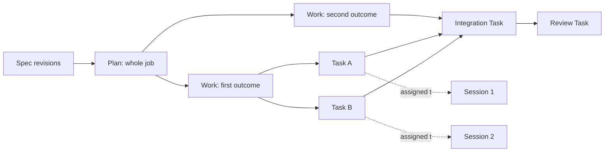
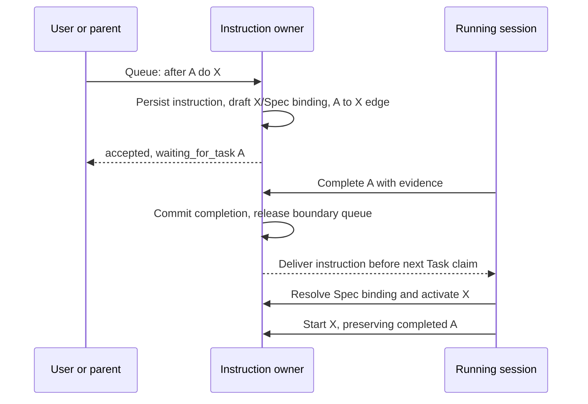

# Work model and session control

Status: **design proposal; coordinator review and owner approval required before implementation**.
Authority: owner's task dated 2026-10-03; baseline `10b68356da71fafdd3c5551ef7cb62d51ee35da3` (`origin/main`).
Deliverable: this document only. No runtime, UI, data migration, live installation or canonical Ledger publication is authorized by this branch.

## 1. Contract and evidence

Spec defines the outcome and acceptance. Plan describes the whole job; each Plan has one or more Works; each Work contains its concrete Tasks. The todo list is exactly those Tasks. Sessions execute assigned Tasks; session nesting must not create another Work hierarchy. Every structural or lifecycle mutation names its governing Spec revision and originating instruction.

Queue means after the **current Task**, not after the whole Turn or Work. Steer means at the next safe point, without waiting for Task completion. Both apply to user messages and parent instructions at every delegation depth. Parents can redirect, pause, stop and resume children through the same control protocol.

Evidence notation: `R/` = `packages/butler-agent/rust/`; `TS/` = `packages/butler-agent/src/`; `UI/` = `packages/butler-app/client/ui/src/`. Paths and line numbers below are source evidence, not claims of runtime reproduction. Historical references use `commit:path:line`; current references use the baseline above. The owner's live data and private conversation history were not read.

| Current observation | Verified source |
|---|---|
| Work owns a revisioned Plan containing actions and dependency keys; progress is keyed by action, not Ledger Task identity. | `R/crates/butler-turn/src/btcc/work/contracts/view.rs:49`, `:83`, `:113`; `work/policy.rs:13` |
| Work creation requires scope, mutation ID and objective, with no required Spec. Plan governing references are optional; dependency validation rejects missing/self references but has no general cycle check here. | `R/crates/butler-turn/src/btcc/work/validation.rs:26`, `:36`, `:65` |
| Six Work tools address the bound durable Work: start, continue, replace plan, checkpoint, review, disposition. | `R/crates/butler-agent/src/host/guided/work_tools.rs:25`, `:130` |
| Runtime todo JSON and WorkStream JSON are separate from durable Work. Updates materialize the submitted item array; existing ordinals are reused. | `R/crates/butler-agent/src/host/guided/work_streams/storage.rs:20`, `:114`; `work_streams/support.rs:61`; `work_streams/todo_view.rs:53` |
| Ledger Task template has a Work parent but no plan-action identity or required Spec revision; Work template has a textual Spec path. These are not one runtime Task list. | `packages/project-ledger/templates/task.md:1`; `packages/project-ledger/templates/work.md:1` |
| Storage already varies by scope: session repository versus Project Ledger repository. Project Work start publishes a manifest and binding records. | `R/crates/butler-agent/src/host/guided/scope_selected_work.rs:49`; `R/crates/butler-ledger/src/project_ledger/work/start.rs:16` |
| Delegation creates/binds a child root Work; it does not merely assign a Task in its parent's graph. | `R/crates/butler-turn/src/btcc/subsessions/service/lifecycle.rs:45` |
| Parent direction is stored and consumed before a model round; parent cancellation enqueues a turn cancellation. | `R/crates/butler-turn/src/btcc/subsessions/service/control.rs:115`, `:152`, `:214`; `R/crates/butler-agent/src/host/guided/steering.rs:43`, `:74` |
| User follow-ups are claimed FIFO, wait for no active Turn, then start a Turn. | `R/crates/butler-gateway/src/gateway/application/send.rs:224`, `:241`; `application/queue_dispatcher.rs:268`, `:314` |
| `follow_up_behavior` accepts/stores/projects queue or steer, but no execution consumer was found by repository-wide symbol search. | `R/crates/butler-gateway/src/gateway/application/settings/update/patch/sanitize.rs:127`; `settings/view.rs:227`; dispatch paths above |
| Summary currently renders safe progress rows, not canonical Tasks. Cursor-based SSE already exists. | `UI/components/inspector/SummaryPanel.tsx:28`; `R/crates/butler-gateway/src/gateway/http/read_routes.rs:112` |

### 1.1 History: distinguish removal before Rust from porting loss

Searched reachable local/remote Git refs, `plans/`, Project Ledger templates, TS planning/work/work-ledger/subsession/queue/settings code, and the Rust cutover. Pre-cutover snapshot `37a530825ea1f623184c52a99e6b735edc0da038` is `f1173515c^`; the cited TS files also match archive branch snapshot `e4d0cb40a49e49df31a70366f9c5682c53bf7b2e`. Git evidence cannot establish every prior owner discussion or uncommitted/private Spec.

| Period / commit | What existed; what happened; decision to reuse |
|---|---|
| `5af5d1f3a` (2026-07-24, R20) | Reviewed planning generated **Plan → Works → Tasks**, governing Spec revision refs, ordered dependency edges and acceptance refs. `TS/agent/btcc/planning/plan-graph/author-plan-candidate.ts:47–144`; `TS/agent/btcc/work-ledger/contracts.ts:16–84`. Required governing Spec was conditional on `requireGoverningSpec` (`:58`), so this is substantial prior implementation, not proof of the owner's universal invariant. Reuse revision-bound authority and Task graph semantics. |
| Same R20 | Publication checked observed manifest revision, accepted review, exact available Spec revisions and reviewed Work/Task refs: `TS/agent/btcc/work-ledger/program-authority.ts:51–120`. Reuse atomic revision checks; do not resurrect its entire program/frontier framework. |
| `74458781a` (before Guided cutover) | Replanning preserved unaffected accepted Tasks and their placement: `TS/agent/btcc/planning/plan-revision/preserve-unaffected-tasks.ts:10–43`. Reuse stable identity and retained completion/evidence. |
| `e349c1192` (2026-07-31) | Deleted the above `planning/`, `work-ledger/`, SQLite reviewed-graph installer and canonical-spec resolver. Introduced the Guided model. **The Spec-bound Plan/Work/Task graph was removed before the Rust port**, not first lost in Rust. |
| `fa25be794`, `0ad1c1998` (2026-08-25) | Re-established scoped Work Ledger operations and enabled the session-ledger binding path (`TS/agent/adapters/gateway/btcc/queued-inbound-session-binder.ts`, commit diff). This restored durable Work continuity, not R20's hierarchy. The Rust scope-selected repository above retains this split. |
| `018ffe33a` (2026-08-21), TS cutover parent | Stored parent steering and same-Work continuation existed. `TS/agent/btcc/subsessions/control.ts`; `TS/agent/btcc/agent-loop/guided-steward-direction.ts:19–38` checked **before model, before final acceptance, and before entering wait**. `TS/agent/btcc/subsessions/agent-hook.ts:38–55` handled both delegated roles. |
| `f1173515c8f4309ffb9fbe75153861705ce787cf` (2026-09-26, Rust cutover) | Ported Work-with-Plan-actions, scope-selected durability, separate todos, child root Work, durable user queue and parent direction. At this commit: `R/agent/src/host/guided_steering.rs:37–78`; `R/agent/src/btcc/agent_loop/guided_policy.rs:170–199`. **Source-level porting loss:** final/wait direction checks were absent from those hooks. Current `R/crates/butler-turn/src/btcc/agent_loop/guided_policy.rs:146–175` and `R/crates/butler-agent/src/host/guided/work.rs:142–149`, `:169–185` still route final/wait without that direction check. A late instruction can miss that boundary; this branch does not claim an executed race reproduction. Restore these checks with durable acknowledgement. |
| TS cutover parent, queue/settings | `TS/gateways/app/domain/sessions/session-queue-dispatcher.ts:116–142` already waited for a Turn. `TS/gateways/app/domain/settings/preferences-store.ts:187` stored `follow_up_behavior`; TS symbol search found settings/UI consumers, not routing. Unified user/parent Task-boundary Queue/Steer was **not found implemented**. It must be added, not described as a proven Rust regression. |
| `65b57977d` (2026-07-11), `11510ec62` (2026-07-12) | Runtime todos were explicitly distinguished from Ledger Tasks; sparse WorkStream amendments preserved completed items. At TS cutover parent: `TS/agent/work/work-stream-plan-store.ts:105–137`. Reuse preservation, replace the separate-list model. This is evidence for that amendment path, not universal preservation in every old todo update. |

Result: the owner remembers a real earlier Spec/Plan/Work/Task implementation. Its main removal was the TS Guided cutover. Rust carried forward much of the later model and narrowed parent-steering boundaries. No evidence found proves that the full owner model, especially universal Queue/Steer, ever shipped end to end.

## 2. Domain and one authority

### 2.1 Storage decision

Choose **`agent-runtime/btcc.sqlite` as the sole authoritative store** for Spec, Plan, Work, Task, dependency edges, instruction/control records, attempts and mutation audit. Use the existing BTCC SQLite owner/transaction lane, with indexed read-only WAL readers; no new database or JSON checklist. This is a proposed change to the current scope split, requiring approval with this design.

Project Ledger remains the public catalog/document/CLI interface. Its Work-model commands become adapters to the same service, including project and session scopes. Spec/Plan/Work/Task Markdown files become explicit export/import artifacts, not live writable authorities. Unrelated Ledger record kinds retain their existing owner. Repository `plans/` remains a review artifact until an authorized import; this branch does not update the real Ledger.

Why: graph edit + Task lease invalidation + instruction acknowledgement + event outbox must commit atomically. Making Markdown authoritative would require another cross-file commit protocol and runtime reconciliation store. Keeping project Work in files and session Work in SQLite preserves two implementations of the invariant. The cost of this decision is migrating the existing canonical Ledger interface and rejecting offline file edits until explicitly imported with an expected revision; do not silently watch/import them.

Ownership: `butler-turn::btcc::work` owns domain invariants and public typed commands/queries; BTCC storage owns SQL transactions. `butler-ledger` adapts document/CLI requests to that API; `butler-agent` binds it to model tools and existing session execution; `butler-gateway` authenticates ingress and projects views. Domain code does not depend on gateway/ledger/UI. Process cancellation and resource measurements cross `butler-platform` only. No parallel supervisor or scheduler: extend the existing execution/queue owners.



Containment and Task dependency edges are distinct relations. Review/integration are real Tasks when they are concrete work; a phase label is not a second checklist. Delegating a Task binds a child session to that identity, never creates a child root Work automatically.

### 2.2 Records

All entity IDs are immutable opaque IDs, scoped by installation; retain imported Ledger IDs as unique aliases `(source namespace, source ID)`. Every entity has `id`, `revision` (monotonic CAS), `created_at`, `updated_at`, `origin_instruction_id`, `created_by`, `title`, and `scope={project_id|session_id}`. Revisions and audit are append-only; current rows are transactionally maintained heads of the same authority, not separately writable stores.

| Record | Required fields beyond common fields |
|---|---|
| Spec / SpecRevision | `spec_id`, `spec_revision`, `body`, stable `requirements[{id,text,acceptance}]`, `source_refs`, `parent_revision`, `status`, `approved_by`, `approval_instruction_id`, `content_hash`. Draft revisions have no approval fields. |
| Plan | `spec_ref`, `requirement_ids`, `objective`, `approach`, `acceptance_refs`, `owner_session_id`, `graph_revision`, `status`, `alignment_revision`. It is the whole roadmap; executable items live only in Tasks. |
| Work | `plan_id`, `spec_ref`, `requirement_ids`, `outcome`, `acceptance_refs`, `rank`, `responsible_session_id`, `status`. Exactly one parent Plan. |
| Task | `work_id`, `plan_id`, `spec_ref`, `requirement_ids`, `description`, `acceptance_refs`, `kind=execute|integrate|review`, `rank`, `status`, `assignee_session_id?`, `result_refs`, `completion_revision?`, `blocked_reason?`, `supersedes_task_id?`. Exactly one Work; no content-derived identity. |
| Dependency | `(plan_id, predecessor_task_id, successor_task_id)`, `created_operation_id`. Directed prerequisite edge, unique, no implicit dependency from rank. |
| TaskAttempt | `attempt_id`, `task_id`, `task_revision`, `spec_ref`, `session_id`, `turn_id`, `lease_epoch`, `status`, `checkpoint_ref`, `tool_effect_refs`, `started_at`, `finished_at?`. Multiple sequential attempts; one executing lease per Task. |
| SessionExecution | `session_id`, `plan_id?`, `work_id?`, `current_task_id?`, `phase`, `control_state`, `control_epoch`, `parent_relation_id?`, `last_applied_instruction_seq`. Phase is `conception|planning|execution|review|validation|reporting`; it has no independent step list. |
| ParentRelation | `relation_id`, `parent_session_id`, `child_session_id`, `epoch`, `assigned_task_ids`, `mutation_scope`, `effect_scope`, `delegation_allowed`, `state`. Exactly one active parent per child. |

SQL: non-null FKs from Plan/Work/Task to existing Spec revisions, composite parent keys enforcing one Plan and Spec lineage, and FK-backed edges within that Plan. Requirement refs must resolve at the bound revision. A service transaction validates Spec approval/alignment and DAG constraints; direct SQL mutation is internal only. A missing Spec returns `spec_required` before any row/side effect. Drafts also require a real draft Spec, never a null or invented approved reference.

A Plan starts atomically with at least one Work; a Work may have zero Tasks while being planned but cannot run or complete until its Task/acceptance coverage is defined. One governing Spec lineage serves a Plan; external governing documents are exact revision references from that Spec. Plans sharing a Spec get propagation independently. Moving Work/Task between Plans is not a hidden reparent: create an explicitly linked replacement and retain the original history.

### 2.3 Lifecycle and propagation

- Spec revisions: `draft → approved → superseded`; `draft → withdrawn`. The lineage may be `retired`; referenced revisions are never deleted. Approval binds the exact content hash and instruction/grant. An agent can draft; it can activate only within an existing explicit authoring grant or an authorized user instruction. Routine in-scope updates do not ask again. New outcome/effect authority needs approval.
- Plan and Work: `draft → ready → running → completed`; `running → blocked|paused|stopped`; `blocked|paused|stopped → ready` via recorded resolution/resume. Cancellation is terminal `cancelled`, distinct from resumable stop. Completion requires acceptance evidence and completion of all required Tasks/Works; cancellation is not success.
- Task: `draft → pending → running → completed`; `running → blocked|paused|stopped`; these resumable states return to `pending` with checkpoint retained. `draft|pending|blocked|paused|stopped → cancelled` is removal. Failure records a failed attempt and blocks the Task with a reason. Ready is derived from prerequisites/alignment/control, not another independently updated status.
- Completed Tasks, their Spec revision, acceptance and result refs remain immutable. Amendments are appended as evidence annotations or new corrective Tasks linked by `supersedes_task_id`; completion is never erased by replacement, sparse updates or replan. Removed Tasks remain tombstones. A resumed parent does not restart its completed children.
- Activating Spec revision N atomically advances the Spec head/fence and records the change plus affected requirement IDs. All consumers compare bound revisions at effect admission; no new effects under stale authority. The UI immediately derives `needs_replan` by revision mismatch. This does not require rewriting every Task in the activation transaction.
- Indexed, resumable propagation visits affected active Plans, records impact mappings (`retain|edit|cancel|add|reverify`), revises pending Tasks and checkpoints active attempts at safe points. Even an unaffected open Task receives an explicit alignment operation. Preserve completed Tasks under their original revision; add revalidation Tasks if changed acceptance needs fresh proof. Historical completed Plans remain historical, with a visible supersession link.
- An atomic `replan` approves a reviewed delta and its requirement coverage, updates the graph/head and clears alignment holds only for validated entities. A stale model proposal returns current revisions and the conflicting IDs; it cannot overwrite newer instructions. Draft Spec changes do not fence the active approved revision.

### 2.4 Graph and mutation authority

The DAG spans all Works within one Plan. Cross-Plan references may be evidence links, not scheduler edges. Reject unknown, duplicate, self and cyclic edges. Validate the touched connected region with indexed adjacency; do not scan other Plans. Parallel execution requires all predecessors completed and a valid exclusive Task lease; joins wait for every required predecessor, including integration/review Tasks.

Rank orders equally ready Tasks and list presentation; changing rank never bypasses an edge. Removing a Task with live successors requires an explicit edge replacement/removal in the same operation batch and renewed requirement coverage; cancelled/skipped Tasks do not satisfy dependencies. A completed Task's historical edges are frozen. Editing an active Task's scope/dependencies first fences its lease and checkpoints it; it must become ready under the new graph before effects resume. Reorder of other pending Tasks does not interrupt the current Task.

| Actor | Authority |
|---|---|
| Owner/user | Mutates accessible Spec/Plan/Work/Task and controls own sessions under existing access/effect policy. An instruction is authority only for its actual scope. |
| Plan-owning session | Plans and assigns Tasks under the approved Spec/grant; may create Works or activate Spec edits only within that grant. |
| Parent session | Controls its active children and their assigned scope, including immediate steer/stop; expands scope only through an authorized relation amendment. |
| Assigned child, including a worker with its own workers | Starts/completes assigned Tasks; on instruction can add/edit/remove/reorder Tasks and edges within granted graph scope, select a step, pause/stop/resume, or propose replan. Nested delegation requires an explicit grant and inherits narrower effect/graph scopes. |
| Runtime | Owns IDs, bindings, ordering, leases, conflict checks, delivery and recovery. It never interprets prose as permission or invents Spec acceptance. |
| UI graph | Read-only; no drag to mutate, hidden checklist, or separate status authority. |

## 3. One session instruction protocol

### 3.1 Envelope and admission

All user messages and parent instructions use the same authenticated ingress. Existing transport IDs remain aliases for deduplication. Tool results and child result delivery remain result events; if they request new work they must enter through this instruction protocol.

```text
Instruction {
  id, idempotency_key, target_session_id,
  sender: user{principal_id} | parent{session_id, relation_id, relation_epoch},
  origin_message_id, origin_turn_id?, received_seq, received_at,
  mode: queue | steer, body_ref, attachments_refs[],
  scope: {plan_id?, work_id?, task_ids[], spec_ref?},
  expected: {graph_revision?, control_epoch?, entity_revisions?},
  anchor: {task_id?, attempt_id?, boundary_seq},
  command?: typed operation batch, supersedes_instruction_id?
}
```

Sender, grants, sequence, anchors and bindings are set/verified by runtime, never trusted from model JSON. Persist full instruction content once; audit and transcript point to it. Explicit per-message mode wins; otherwise user `follow_up_behavior` selects queue/steer and parent calls must specify mode. Persist the resolved mode so a later settings change cannot alter admitted messages.

At admission, atomically resolve the current Task and boundary sequence, deduplicate and persist the envelope. Structured operations validate expected revisions; free text records intent for interpretation by the receiving session. Admission returns a durable receipt, not a claim that the model obeyed.

### 3.2 Queue, including the required append case

Queue captures the current Task identity, not a mutable “current” pointer. Do not inject it into that Task's model context. A Work-bound actionable queue item appears as a **draft Task in the same Task list**, with the captured Task as predecessor; its original text and instruction ID remain visible. No second queued-todo store is created: the instruction row owns delivery, the Task row owns work.

For structured requests, use the supplied valid Spec requirement binding. For free text whose scope is not yet interpreted, atomically create a draft Spec amendment containing the exact request and a draft Task bound to it; do not invent approved requirements. Its Work/Plan stay in the same Spec lineage. After delivery the receiving model either binds the Task to an existing requirement or activates the necessary revision using the instruction's actual authority. Routine authorized additions need no repeat approval; missing authority leaves an explicit draft/approval state. Non-actionable messages and typed controls need no new Task; they still have the same queue boundary and receipt.

When the captured Task commits completion, deliver queued instructions FIFO **before claiming any next Task**, even within the same model Turn. Resolve draft Tasks and commit their executable dependency graph before dispatch. Turn rollover may change `turn_id`, never the Task/Work identity. If no Task is running, the boundary is already reached; ordinary conversation without managed work uses the current response boundary and creates no Work just to answer.

If the anchor is blocked, paused or stopped, keep queued instructions pending; expose the reason. Only its completion releases normal queue delivery. The sender can explicitly promote an instruction to steer or re-anchor it. Anchor cancellation/removal never silently releases it; return `anchor_cancelled` requiring a recorded redirect/cancel. Races with completion serialize on the session boundary: before completion binds that Task; after completion binds the current Task if one was already claimed, otherwise delivers immediately.



### 3.3 Steer, safe points, acknowledgement

Steer wakes the target immediately and fences admission of further effects from a stale model response. Drain admitted controls (1) before a model request, (2) after model response and before each tool dispatch, (3) after recording a tool result, (4) before wait/final/completion commit, and (5) when resuming from checkpoint. Final completion and the last inbox check share a transaction/boundary sequence, closing the historical late-direction race.

A parent need not wait for a child's Task/Turn to end. During an in-flight model request, set the control fence immediately; cancel the provider request when supported, otherwise retain its response as stale evidence and admit no stale tools. Structured control applies without a model round. Free text is interpreted at the next safe point using updated Spec/Task state; interpretation latency is not falsely reported as immediate application.

Receipt states: `accepted → waiting_for_task|pending_safe_point → delivered → applied|rejected|needs_input`; explicit replacement/cancellation records `superseded|cancelled`. `delivered` means durable injection into the session request segment, not consumption on read. `applied` names committed operation IDs and resulting revisions. A question may finish with `applied` plus its reply ref and no graph edit. A replan requiring approval stays `needs_input`, not applied. Crash recovery redelivers an unacknowledged segment idempotently; replay never repeats an applied mutation.

### 3.4 Operations, conflict and stop semantics

Every operation carries `operation_id`, `instruction_id`, `spec_ref`, `requirement_ids`, `reason`, expected entity/graph/control revisions, authenticated actor and scope. An ordered batch is all-or-nothing; bounds are transport pagination, never silent dropping. Results include before/after revision refs, affected IDs, boundary and event sequence, and a typed conflict/next action.

| Operation | Semantics |
|---|---|
| `task.add`, `task.edit` | Create identity and acceptance/spec links; edit only named fields. Draft instruction Tasks may be resolved. Active edits follow the effect fence rule. |
| `task.remove` | Recorded cancellation/tombstone plus explicit successor-edge treatment; completed Tasks cannot be removed. |
| `task.reorder` | Set ordered rank relative to named siblings with expected graph revision; retain unspecified/completed Tasks. |
| `dependency.edit` | Explicit edge additions/removals, validated against the entire resulting affected DAG. |
| `step.change` | Set phase and optionally select a ready Task. Current Task must be completed or explicitly checkpointed/paused/stopped. It cannot mark work complete or evade prerequisites. |
| `task.start`, `task.complete`, `task.block` | Claim lease/start attempt; commit evidence and acceptance; or preserve checkpoint with reason. Runtime verifies binding; it does not infer completion from final prose. |
| `session.pause` | Fence new model/effect work, let an active tool settle, checkpoint, then `paused`. Queue retained. Propagate a control hold to owned descendants. |
| `session.stop` | Fence immediately, cancel active computation/tools where supported, settle outcomes, then `stopped`. Task remains resumable. Stop owned descendants; do not affect unrelated sessions. |
| `session.resume` | Clear the named control hold with expected epoch; reconcile interrupted effect outcomes, continue the same Task with a new attempt if needed. Descendants resume only if they were held by this operation, not independently paused/stopped. |
| `plan.replan` | Commit an explicit delta of Spec bindings, Works, Tasks and edges after coverage/review checks; preserve identity, completed records and prior revisions. Includes `work.add|edit|cancel` with the same Spec trace. |
| `spec.propose`, `spec.activate`, `plan.create`, `work.complete`, `plan.complete` | Author/review the blueprint and approve exact Spec changes under grant; aggregate completion checks required evidence. No bypass creation path. |

One child has one active parent. A second parent is rejected `parent_conflict`; an authorized owner can transfer parenthood atomically, advancing relation/control epochs and fencing the old parent. Nested parents address their direct children; root control propagates through recorded descendant holds.

Within an authority epoch, normal instructions are applied by persisted sequence. Disjoint edits still use explicit current revisions; no last-writer-wins. If owner/user and parent arrive together, an unapplied user control supersedes conflicting parent control and increments the control epoch; revalidate pending parent instructions against it. Already committed effects are not undone. Independent instructions remain pending in order. Safety control holds compose: any active pause/stop holds execution; a parent's resume cannot clear an owner's hold. Conflicts return current revisions, affected IDs and the source instruction; reread/replan, never blindly retry.

An explicit Stop button sends `mode=steer`; a deliberately queued stop takes effect after the anchor Task. Stop acknowledgement distinguishes `stop_requested`, `cancelling_tool`, `reconciling_effect`, `stopped`. Cancellation is not rollback. A non-cancellable external effect may finish; record the result, prohibit successors, and report the real state. A tool with unknown outcome leaves the Task blocked for reconciliation; resume must inspect its receipt/idempotency key before deciding whether to execute again. Kill only owned child PIDs/process groups through `butler-platform`; no process-name kill or rollback claim. Pause waits for the active tool; stop requests its cancellation.

Audit commits with each mutation: immutable actor/grant/relation epoch, instruction hash/ref, Spec/requirement refs, before/after revision IDs, graph delta, attempt/effect refs, result/error and timestamp. Rejected authorized commands receive a receipt without mutating graph state. No hidden reasoning, credential values or raw sensitive tool payloads enter UI projections.

## 4. Model-facing surface and instruction contract

Use three grouped tools, progressively narrowed by role/phase. Retire the six Work tools and todo tools from the new session surface; do not expose both meanings. Keep existing effect/delegation tools, but bind them to canonical Task assignments rather than create Work. Runtime supplies actor/session/attempt identity.

```text
work_read {
  view: summary | tasks | graph | spec | audit | operations,
  plan_id?, work_id?, task_id?, revision?, cursor?
}
work_apply {
  instruction_id, spec_ref, expected_graph_revision,
  expected_control_epoch, expected_entity_revisions,
  reason, operations: [ discriminated Operation ]
}
session_control {
  target_session_id, relation_id?, mode: queue | steer,
  instruction: {text, attachment_refs?} | {operations},
  expected_control_epoch, idempotency_key
}
```

`Operation` is a closed tagged union, not arbitrary JSON/SQL: add requires `{op,work_id,description,kind,spec_ref,requirement_ids,acceptance_refs,after_task_ids,rank_after?}`; edit requires `{op,task_id,patch:{description?,acceptance_refs?,spec_ref?,requirement_ids?}}`; remove requires `{op,task_id,successor_edge_changes}`; reorder requires `{op,work_id,task_ids,rank_after?}`; dependency edit requires `{op,add:[{from,to}],remove:[{from,to}]}`; step change requires `{op,phase,task_id?,current_task_disposition?}`.

Start/complete/block require `{op,task_id,evidence_refs?,checkpoint_ref?,reason?}` with evidence mandatory for completion and reason for block. Session pause/stop/resume require `{op,session_id,hold_id?,reason}` (hold required on resume). Plan create requires `{op,spec_ref,objective,approach,requirements,works:[{outcome,requirements,acceptance_refs}]}`. Replan requires `{op,plan_id,impact_map,work_changes,task_changes,edge_changes,review_ref}`; work add/edit/cancel have explicit IDs or creation fields and Spec bindings. Spec propose requires `{op,spec_id?,base_revision?,body,requirements,source_refs}`; activate requires `{op,spec_id,spec_revision,content_hash,approval_instruction_id}`. Aggregate complete requires `{op,id,evidence_refs,review_ref}`. No field silently means “replace all”.

Expose only permitted variants for the current phase: execution gets start/complete/block and instructed graph edits; planning gets Spec/Plan/replan; a parent gets child control. `work_read(view=operations)` describes unavailable variants on demand and requests a surface refresh; it cannot grant permission. Strict schemas reject unknown fields. Runtime authorization remains identical even if the model emits a hidden variant. Response: `{ok,operation_ids,entity_revisions,graph_revision,control_epoch,event_seq,changed,remaining,conflict?,next_action?}`; paginated reads return exact totals and revision-bound cursors.

Prompt rules, enforced at the relevant runtime boundary:

1. Read the governing Spec and current assigned Task before work; create a small Spec/Plan/Work/Task bundle if managed work has none. A direct answer need not create managed work.
2. Call Task start before Task effects, complete with evidence immediately after acceptance is met, and claim the next ready Task only after boundary instructions are resolved. An active Task may span many model calls and Turns.
3. Keep Tasks current as instructions change the job. Add/edit/remove/reorder/change edges with operations, never by merely narrating a new plan. Resolve a queued draft's Spec binding before starting it.
4. Preserve completed Tasks. Report blocked/paused/stopped truthfully. Do not complete a Work because the model is ending a Turn; return a concise outcome tied to its Task result.
5. Interpret free-text scope semantically; runtime enforces structural identity/authority. Escalate only missing authority or genuinely ambiguous outcomes, not ordinary in-scope execution decisions.

Prompt budget: replace old schemas/instructions instead of appending another family. Capture canonical serialized system/tool bytes and estimated tokens for the same direct/planning/worker/replan fixtures on the implementation base. The new surface must stay at or below that baseline and any existing coordinator prompt-budget ratchet; never raise its ceiling. Progressive reads omit unloaded history explicitly with counts/cursors, not truncate Task content or acceptance needed for the current decision. No measured prompt saving is claimed by this design branch.

## 5. UI read model and events

Summary card list and graph read the **same revisioned Task projection**. Proposed gateway queries: `GET /sessions/{id}/work-summary` and `GET /plans/{id}/task-graph?revision=&cursor=`. They enter the Work query API; they do not read todos, transcripts or Markdown. Existing Summary safe activity rows remain supplementary activity, not another completion list.

Summary contains Plan/Work/Spec IDs and revisions, ordered Work cards, exact Task totals by state, current Task(s), pending instruction receipts, blocked reason and acceptance/evidence links. Completed/cancelled Tasks stay accessible and counted. Card expansion uses cursor pages. No stale counts while details silently show another revision; changed revision invalidates only affected pages.

Graph nodes are Task IDs with Work grouping, Task kind/status/assignee and Spec requirement links; edges are canonical prerequisites. Independent worker branches fan out, then join at integration/review Tasks. A session overlay shows who is executing, not fake Work nodes. Desktop uses a left-to-right canvas with horizontal scroll; mobile uses top-to-bottom ranks. Both have readable node details and keyboard navigation; graph editing is disabled. Canvas virtualization is rendering only: all nodes/edges remain fetchable with exact totals and a stable revision; no hidden top-N graph.

Publish after commit through the existing `/events/live` stream: `work_model.changed{plan_id,graph_revision,entity_changes,counts,event_seq}`, `instruction.updated{instruction_id,status,operation_ids,event_seq}`, `session.control_changed{session_id,control_epoch,state,hold_ids,event_seq}`. Changes include stable IDs and field deltas or explicit invalidations for a bounded re-read. The transaction's durable outbox is replayed using the stream cursor; acknowledgements/deduplication preserve order. The App may hold disposable projections, never accept writes as authority.

Snapshot includes its event cursor. Subscribe/replay after that cursor to avoid fetch/subscribe gaps. Reconnect replays changes; an expired cursor gets one explicit snapshot reset. No interval polling, per-client DB heartbeat writes or idle “last viewed” updates. SSE keepalive is memory/network only. UI reads, graph pan and resize produce zero Work-model disk writes.

Compose UI from `@/butler-ds`; keep current composer controls. User labels: `대기열`, `지금 반영`, `일시정지`, `중지`, `재개`, `위임 작업`; schedules are `예약 작업` / `schedule`. Never surface `Steward` or `스튜어드` in product copy. Pending state plus a short tooltip/toast suffices; no implementation banners.

## 6. Migration and compatibility

Migration is explicit, resumable and version-gated. The new mode is opt-in until owner acceptance; it never silently rewrites the owner's existing installation. Old binary startup must reject a cut-over writer epoch rather than overwrite new data. Each installation uses one active Work-model writer mode; feature flags must not allow old/new writers for the same graph.

1. Inventory **authorized copies**: BTCC Work/Plan/checkpoint/review tables, scope bindings, Project Ledger Spec/Plan/Work/Task records, todos/WorkStreams, delegation packets, pending user queue and direction rows. Record counts, IDs, revisions, sizes and hashes in a migration manifest. Source classification and read-only compatibility do not require transcript parsing. Reconcile any legacy partially committed file journals through their existing recovery first.
2. Add additive tables/indexes and a durable migration cursor. Do not rebuild/vacuum the 2.6 GB DB or rewrite 1.5 GB of transcripts. Test the larger repository baseline too (7 GB BTCC, 1.3 GB App DB, 2,440 transcripts, largest 290 MB; `plans/README.md:26–30`). These are supplied scale fixtures, not measurements of the owner's current disk.
3. Import real Specs and revisions first, retaining aliases, exact content and approval provenance. Legacy Work with no verifiable Spec remains a **legacy record**, not a valid new Work. Expose it read-only with `needs_spec`; draft a source-linked Spec from the original objective and evidence, without fabricating historical approval. Resume conversion only when an authorized instruction approves/binds it. Apply the same rule to orphan Tasks/todos.
4. Import each old Work as a new Work beneath a Plan, with old WorkPlan actions becoming stable Task IDs and dependency edges. Group multiple Works into one Plan only with explicit historical relationship evidence or an authorized mapping; otherwise use one Plan per Work. Preserve all plan/checkpoint/review/disposition revisions as provenance. Use existing Spec references when resolvable; do not equate a textual path with approval.
5. Map Ledger Tasks, action keys and todo IDs by explicit links/receipts. Never merge by similar title or ordinal. On an ambiguous overlap preserve both source records in the manifest/legacy view and require mapping before that Work executes; do not create duplicate executable Tasks. Completed source items and results cannot disappear. Completed legacy evidence lacking acceptance stays labelled historical until reviewed.
6. Convert child root Work/delegation records to Task assignments when packet IDs prove the mapping; retain old child Work aliases, attempts and results. Unresolved relations stay stopped/read-only. Nested delegation uses the same parent relation contract, not imported role-name privilege.
7. Quiesce admissions at safe points, reconcile in-flight effects, retain paused/stopped state and checkpoint active Tasks. Migrate the **active turn plus all queued follow-ups** and unconsumed directions. Preserve original IDs/order/dedup receipts; attach queue anchors to mapped Tasks. If a legacy queue has only a Turn anchor, hold it until that Turn settles, then require Task binding before managed continuation; do not guess its “current Task”. Already delivered directions remain delivered, not automatically applied.
8. Import in keyset batches of at most 500 records or 1 MiB decoded metadata per transaction (large records stream individually); store progress and source hash after each batch. A changed source invalidates that batch. Hash large source artifacts incrementally; raw transcripts and tool outputs remain in place with references, never copied into audit. Bound memory, resume from cursor, and show unresolved records/counts.
9. At cutover, atomically switch the installation writer epoch and gateway/tool routing. All Ledger Work-model mutation entrypoints forward to the new service; filesystem mutation of exported records is refused with an import instruction. Legacy `start_work` requires a bound Spec; legacy plan/todo updates translate ID-preserving deltas, preserve omitted completed items, and reject ambiguous mappings. Compatibility names are accepted by adapters only, not advertised alongside new tools. The old direction/user queues become read-only import sources after pending receipts transfer.
10. Verify count/hash/alias parity, all completed records, edges, pending instructions and effect receipts before enabling execution. Retain original stores as read-only rollback evidence; they are not queried as current state. Before new writes, rollback can revert the writer epoch. After new writes, an older binary cannot safely resume: restore an explicit snapshot with disclosed loss or forward-fix; never auto-downgrade. Remove old writers/tools after compatibility acceptance, with no timer-driven mirror updates. Archive deletion requires a separate retention decision.

## 7. Performance and SSD budgets

The following are **proposed acceptance budgets, not measurements**. Existing stricter budgets/ratchets continue to apply. Measure release builds on the fixed batch-CI owner-scale runner, report p50/p95, CPU, peak RSS, SQL counts and bytes read/written together with complete-response assertions. Model/network/tool duration is reported separately from control admission/application latency.

Fixture: supplied 2.6 GB DB and 1.5 GB transcripts, plus the larger README scale above; seed 600+ sessions, 300k events, 100k Tasks across Plans, a 10k-Task/30k-edge Plan, 32 active sessions with eight parallel workers, and realistic completed history. No real owner data or credentials required.

| Path | Budget and completeness assertion |
|---|---|
| Summary, first page (50 cards) | p95 ≤100 ms warm / ≤250 ms cold; exact state counts, deterministic order, current revision, every page retrievable. No transcript/whole-Ledger scan. |
| Graph (500 nodes/page) | p95 ≤150 ms warm / ≤300 ms cold; full 10k-node/30k-edge graph ≤2 s server processing; union of pages exactly matches nodes/edges at one revision. No reduced fidelity to pass. |
| Typed edit/control admission | p95 ≤100 ms warm / ≤250 ms cold, durable receipt and correct revision; affected-region DAG edit ≤200 ms p95 on 10k/30k fixture. |
| Steer/stop after commit | fence/wake ≤50 ms p95; structured application ≤100 ms p95 once safe point is available; publish-to-UI ≤200 ms p95 locally. Report separately time waiting for non-cancellable tool/model; do not claim a universal stop-completion deadline. |
| Scheduler boundary | ≤50 ms p95 from Task completion commit to queued delivery/next eligible claim, excluding model interpretation; exactly one lease and no skipped queue item. |
| Idle, three 60 s windows after settling | **0 Work-model DB/file write bytes**, 0 graph/queue polling queries and no empty durable events; existing whole-process PERF-IDLE read/RSS gates unchanged (`R/crates/butler-e2e/tests/idle_resources.rs:23–24`, `:59–67`). |
| Mutation writes | For ≤4 KiB metadata input, average ≤128 KiB attributable SQLite/WAL+checkpoint writes per operation over 1,000 varied operations; no whole-graph snapshots. Large bodies counted separately, written once and referenced. Ack/projection delivery included; no deferred write burst hidden outside the sample. |
| Sustained activity | ≤128 MiB Work-model writes per 1,000 bounded operations, incremental peak RSS ≤32 MiB over same idle fixture; exact Task/evidence/queue parity after restart. |
| Migration | ≤64 MiB incremental RSS; steady import ≥500 metadata records/s; final quiesced switch ≤2 s after import/reconciliation, excluding outstanding external tools. Incremental writes ≤2× imported metadata bytes +64 MiB for schema/index/WAL overhead; no whole-DB/transcript rewrite. Report preflight/import/quiescence separately. |

Index entity parent/scope/status/rank, both edge directions, Spec requirement consumers, active leases, pending instructions by `(session,state,seq)`, and outbox cursor. Keep typed counters in the same transaction. No full-history rebuild on request paths, no blocking I/O on Tokio workers; use the existing blocking SQLite/file lanes or `spawn_blocking`. Run timers only for actual pending deadlines, not idle sweeps. Resource counters/OS cancellation live exclusively in `butler-platform`; unsupported metrics are `unavailable`, never substituted with a fabricated pass.

## 8. Test plan: public paths first

Implementation starts with stub E2Es in `R/crates/butler-e2e`; run through real gateway, agent tools, durable storage and event stream, not a test-only reducer. Replay validates model instruction/tool behavior using committed cassettes; no live model calls in routine CI. New recordings, if separately needed, use only `openai/gpt-6-luna`. Every assertion includes Spec/Task identity, audit and visible read model, not just HTTP success.

| ID | Scenario and required observable result |
|---|---|
| WM-01 | Reject Plan/Work/Task creation without a real Spec, foreign Spec revision, unauthorized activation, cross-Plan/dangling/cyclic edges. Zero partial graph writes. Cover Ledger CLI, model tool and gateway entrypoints. |
| WM-02 | Keep A running; user says “after that do X” with queue; draft X appears with A→X and truthful Spec binding; A receives no mid-Task instruction; completion releases queue within same Turn; resolve binding, run X exactly once. Preserve completed A. |
| WM-03 | Steer reorders pending B/C while A runs; next safe point applies revisioned rank/edge edits, preserving A unless explicitly redirected. Stale model tools are fenced; graph and list agree. |
| WM-04 | Parent stops child with active tool plus two queued follow-ups; include cancellable and unknown-effect tools. Stop acknowledgement is truthful; resume same Task/Work, retain both queued messages and completed children, reconcile rather than duplicate effect. |
| WM-05 | Butler→child→worker→own worker: each receives queue and steer; assigned worker adds/edits/removes/reorders Tasks and dependencies under an instruction. Fan-out/join stays correct; outside-scope mutation rejected. |
| WM-06 | Instruction arrives during provider response, immediately before final acceptance and immediately before wait. It is applied or explicitly pending, never consumed without application or stranded until unrelated activity. |
| WM-07 | Concurrent owner/parent instructions, two parents, parent transfer, stale relation epoch, duplicate request ID with same/different payload. Deterministic receipts, no overwritten user hold or lost disjoint edit. |
| WM-08 | Activate Spec revision during parallel effects. Fence new stale effects, preserve current results, propagate impact to every active consumer, retain completed Tasks and create needed revalidation Tasks. |
| WM-09 | Remove/replan/sparse legacy update preserves completed Tasks; dependent cancellation requires explicit rewiring. Pause/stop/resume and step change record every operation; no dependency bypass. |
| WM-10 | Restart after admission, durable injection, mutation-before-ack, Task completion, outbox commit and tool-result persistence. Same IDs/receipt, no duplicate effect; recover active turn **and entire follow-up queue**. |
| WM-11 | Migration mixed project/session data, orphan Spec, conflicting mappings, partial journal and mid-batch interruption. Source hashes/complete counts match, unknowns remain visible, old writer refused, no 1.5 GB transcript rewrite. |
| WM-12 | SSE disconnect/reconnect and snapshot race; list/graph reach same latest revision without polling. Desktop horizontal and mobile vertical smoke checks fan-out/join, all completed items, keyboard details and read-only graph. |
| WM-13 | Run every budget in §7 with count/order/latest-state assertions; measure idle reads/writes and all pages, including after Spec propagation/reconnect. Preserve existing prompt/static-schema and source-check ratchets. |

Replay fixtures cover WM-02/03/05/08/09 and show the model starting/completing each Task and applying instructions through operations. Stub fault injection covers concurrency/durability and effect outcomes deterministically. Reuse existing `queue_shutdown`, `queue_admission_shutdown`, `queue_pause`, `subsession_legacy` and settings coverage when those paths change; do not run only new tests.

Non-E2E exceptions only: `// test-category: pure-logic` for DAG/cycle algebra, `race` for the final-admission CAS, `security` for relation grants, `format-pin` for wire/schema fixtures. Stay within `source-check-tests.txt`; do not bless count increases. UI gets behavior smokes/harness only, no new unit tests or recordings. Browser smokes here pass `--single-process` without weakening assertions.

Every test/check uses a fresh temporary HOME/BUTLER_DATA via `crates/butler-e2e/scripts/isolated-run.sh`, stub/replay only, no port 18765 or live service. Each implementation branch runs focused existing coverage, fmt, touched-crate clippy `-D warnings`, source-check, and frozen Bun install/check if TS/UI changed. Coordinator runs batch CI once; failures are not skipped, retried to green, or hidden by raised budgets. Search matching open issues before reporting a pre-existing failure.

## 9. Implementation branches and acceptance

These are independently reviewable, shippable vertical branches, each based on the integrated predecessor where noted; “independent” does not mean they may invent incompatible concurrent schemas. One integration owner controls Work/control contracts. All phases are blocked on owner approval of this document. No phase ships a second writable checklist. Opt-in mode uses one writer epoch and is unavailable for unresolved legacy active work.

| Branch / dependency | Slice and acceptance |
|---|---|
| `codex/work-model-core` / approved design | New/empty opt-in installation: gateway/typed tools→Spec/Plan/Work/Task transaction→Task execution→Summary API. Required Spec, evidence completion, DAG fan-out/join, stable IDs; WM-01/09 plus core WM-13. Include minimal template updates and canonical Ledger API adapter; no prototype-only storage API. |
| `codex/work-model-instructions` / core | Unified envelope from user and every parent ingress, working follow-up setting, queue Task boundary and steer safe points; exact receipts and narrow grouped tools. WM-02/03/05/06/07/10 plus queue/settings/subsession regression suites. |
| `codex/work-model-controls` / instructions | Pause/stop/resume, descendant holds, current-step selection, owned-tool cancellation and recovery. WM-04 and stop/queue/restart subset of WM-07/10; preserve real effect outcomes on all supported platforms. |
| `codex/work-model-spec-replan` / controls | Revision activation, propagation, graph edits under instruction and reviewed replan. WM-08/09 plus replay confirms retained completions and essential execution path; no unnecessary approvals. |
| `codex/work-model-migration` / spec-replan | Resumable inventory/import, old tool adapters, Ledger writer cutover, queue/direction/child mapping, downgrade fence. WM-11 and full migration budgets on both owner-scale fixtures; report every unresolved record before opt-in cutover. |
| `codex/work-model-view` / stable read contract; integrates after migration | Summary cards and read-only responsive graph from one projection, cursor SSE/reconnect, terse localized control receipts. WM-12 and UI/read/idle budgets; no polling or mutation graph gestures. |
| `codex/work-model-acceptance` / all | Combined stub/replay and batch CI, prompt/schema ratchet, owner-scale correctness/resource evidence, platform residuals and owner walkthrough. Enable by default only with a separate owner rollout decision. |

Production files ≤500 lines, functions ≤80 lines; group by the existing domain owner rather than split into forwarding wrappers. Each branch must deliver its public-path acceptance and list any unavailable platform proof. Coordinator batches branches into one PR; this design branch opens no PR, tags nothing and merges nothing.

## 10. Decisions for owner review and design completeness

The storage and behavior choices above are concrete proposals. Only these owner choices remain:

1. Approve making BTCC SQLite canonical for Work-model Spec/Plan/Work/Task while Project Ledger becomes its document/API facade. This intentionally ends automatic authority of directly edited Work-model Markdown; explicit revision-checked import preserves authoring.
2. Approve the proposed distinction between resumable **중지** and terminal Task/Work cancellation/removal, including parent-stop descendant holds. It makes the required “stop then resume” behavior explicit.
3. Legacy Work without a verifiable Spec cannot execute in the new model until bound to an authorized Spec. Approve this visible migration hold; no mass synthetic approval or silent deletion is proposed.

No further decision is needed on hierarchy, Task/todo identity, all-depth user/parent Queue/Steer, completed Task preservation, graph direction/read-only behavior or Korean terminology: those are binding owner requirements. Performance values require measured implementation evidence, not owner guesses.

Design review completed against the requested scope: hierarchy/authority, lifecycle, DAG, safe-point races, in-flight effects, tools, UI/events, migration, budgets, E2Es and phased delivery are specified here. **Still pending:** coordinator review, owner approval, implementation, replay/runtime/performance/platform verification and rollout. Historical claims are source-backed; performance numbers are targets. This document does not claim any of those pending results.
